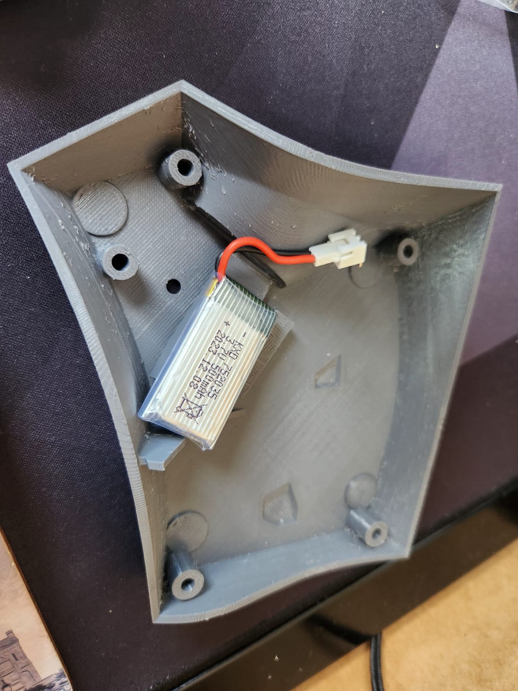
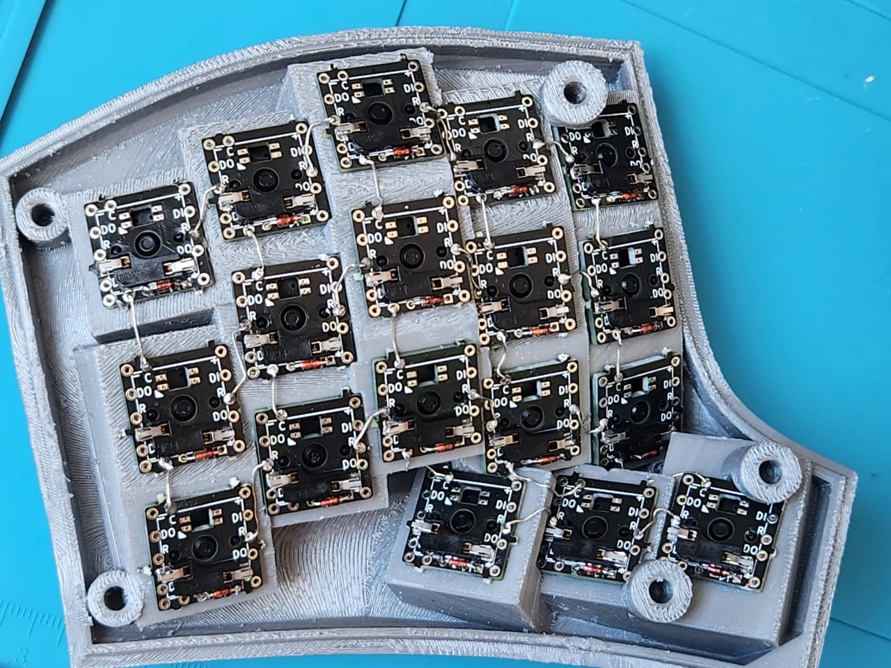
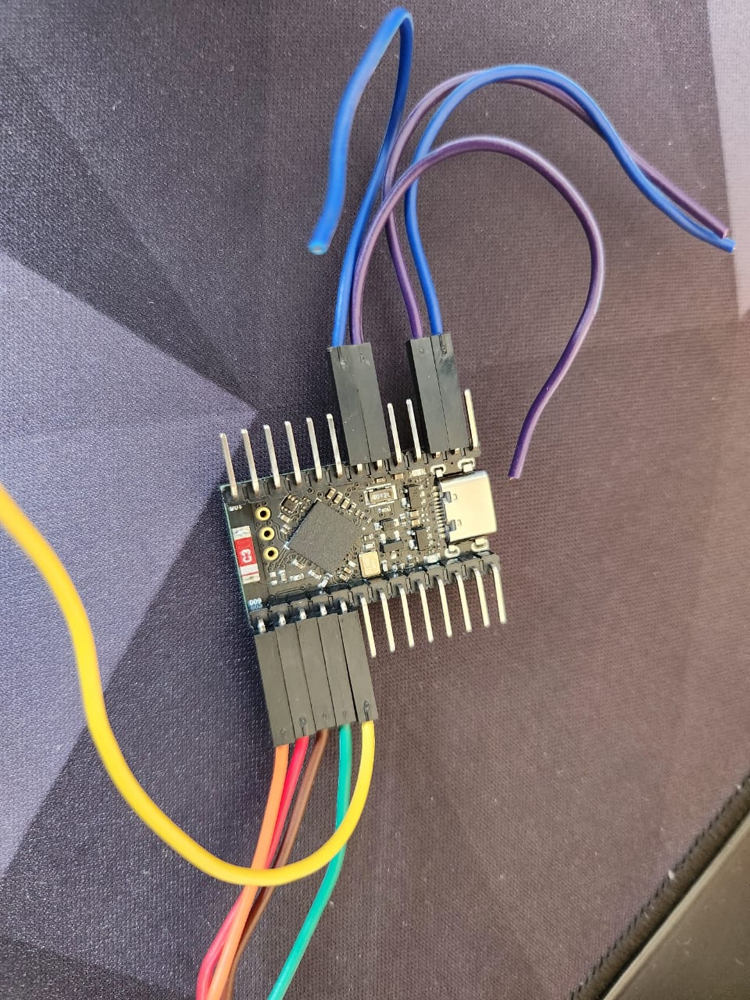
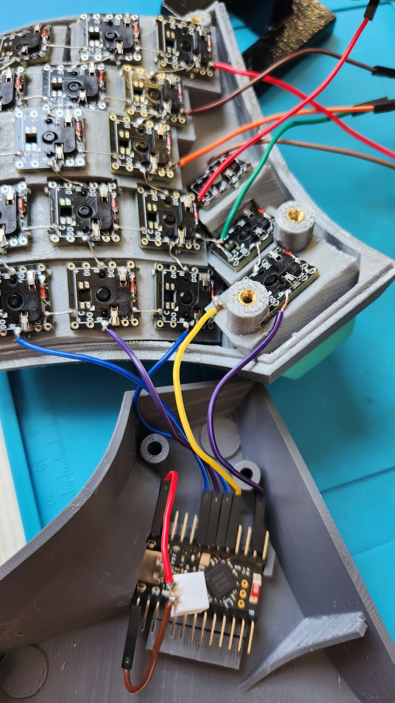
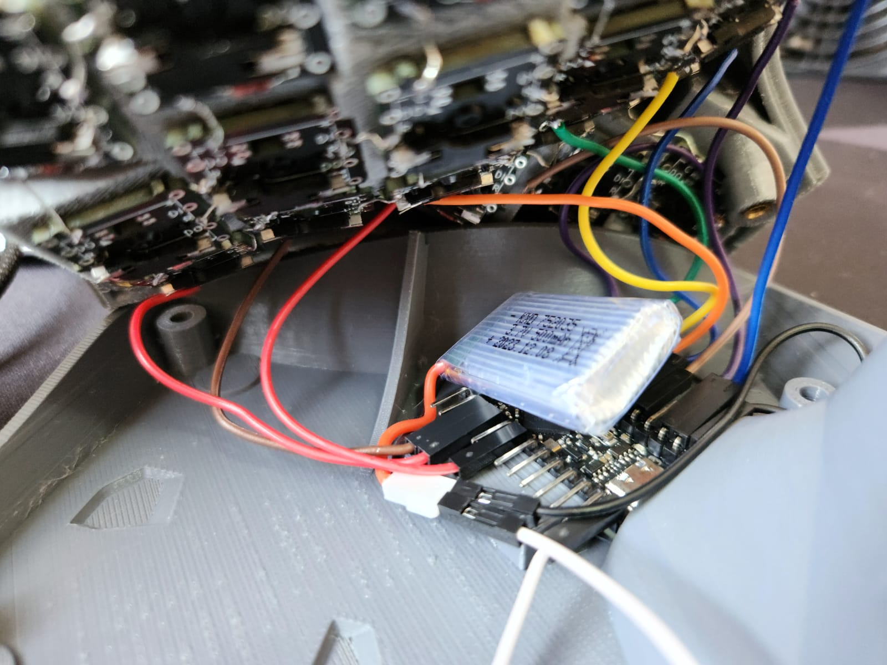
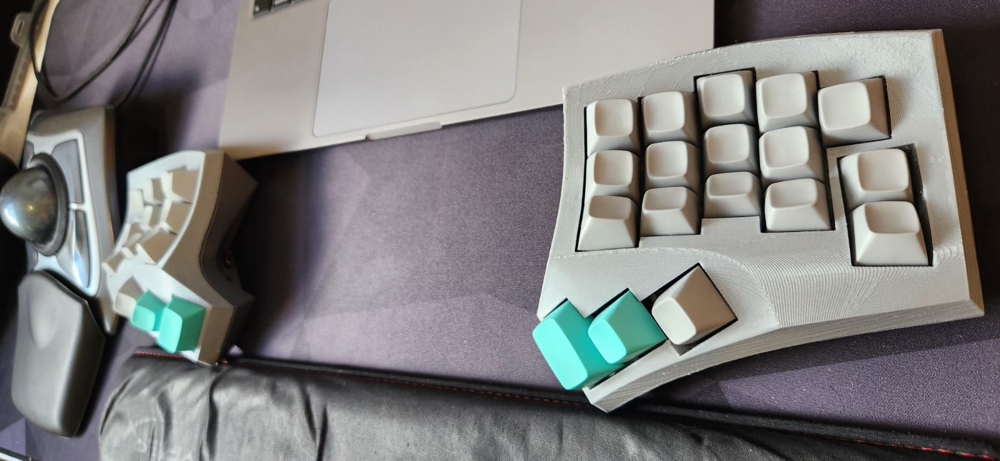

# Dactyl Cygnus
### A 36 keys handwired split keyboard.

For the complete documentation and source files, go to [this page](../../src/zmk/keyboards/cygnus/boards/shields/cygnus).

## The pictures below show some steps in the handwiring process of this board.

For better handwiring instructions, see [this video](https://youtu.be/h_ex-oMVOrI) of the creator of the board.

### Some build images

Where the battery would go

Single Switch PCBs soldered (inner thumb would later be disconnected from the matrix to implement a dedicated soft-off button)

Preparing the MCU (final pinout would be different)

Connecting the rows (final pinout would be different. I also removed the battery connector and used F-M dupont cables instead)

Final connections for the right side

Final Build

