# Diamond
### A 24 keys handwired split keyboard.

For the complete documentation and source files, go to [this page](../../src/zmk/keyboards/diamond/boards/shields/diamond).

## Some build pictures:

Right Side - PCBs before wiring
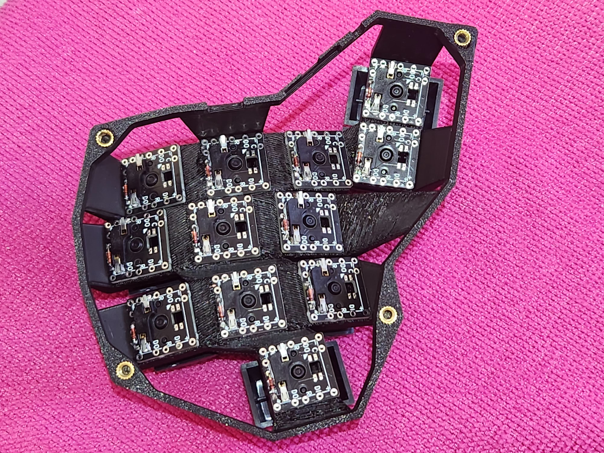

Left Side - Components detail
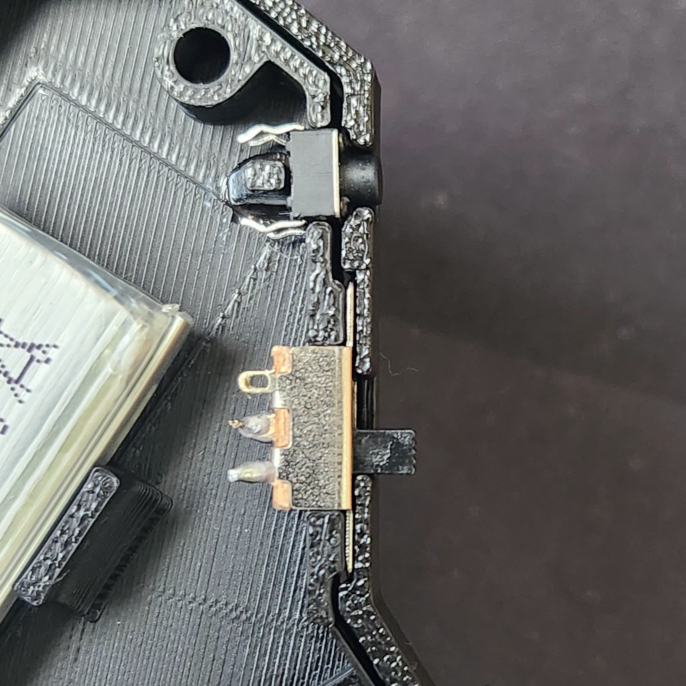

Left Side - Components wired
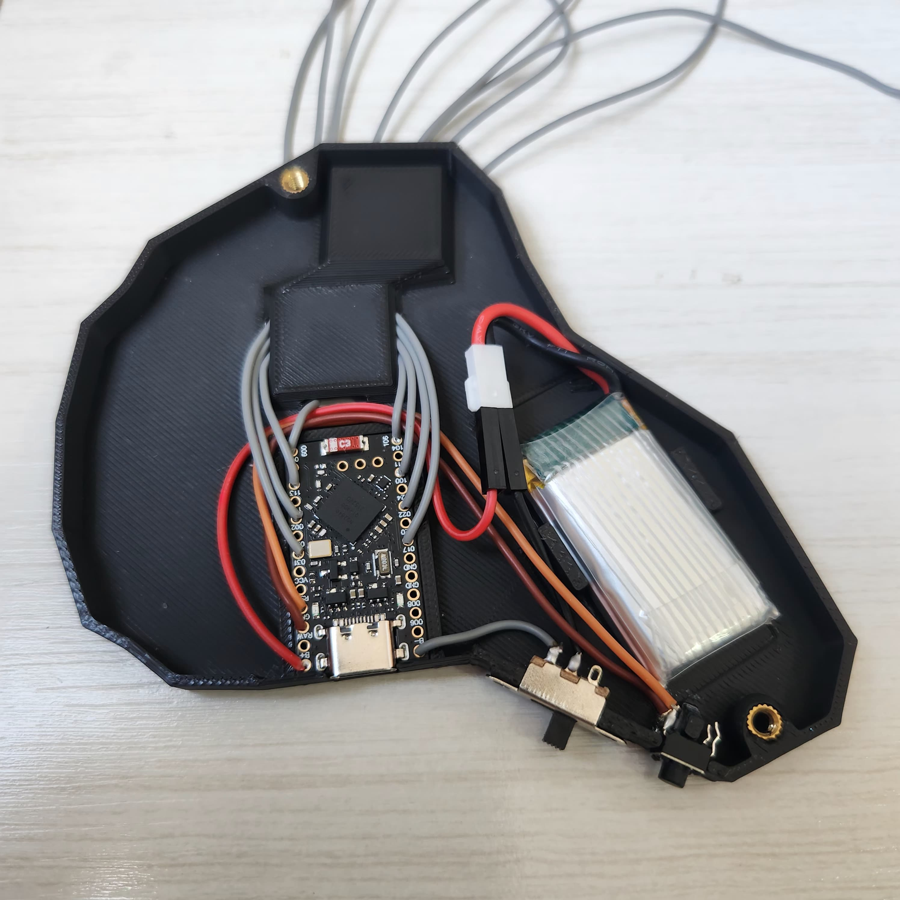

Right Side - Wiring complete
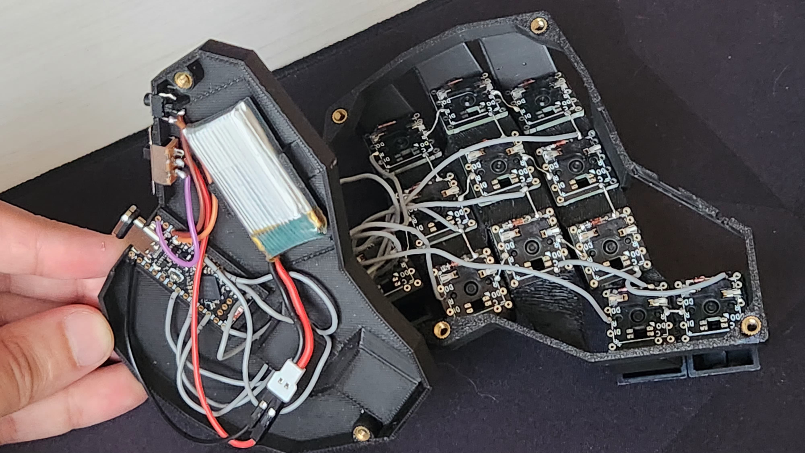

Left Side - Cover and Base
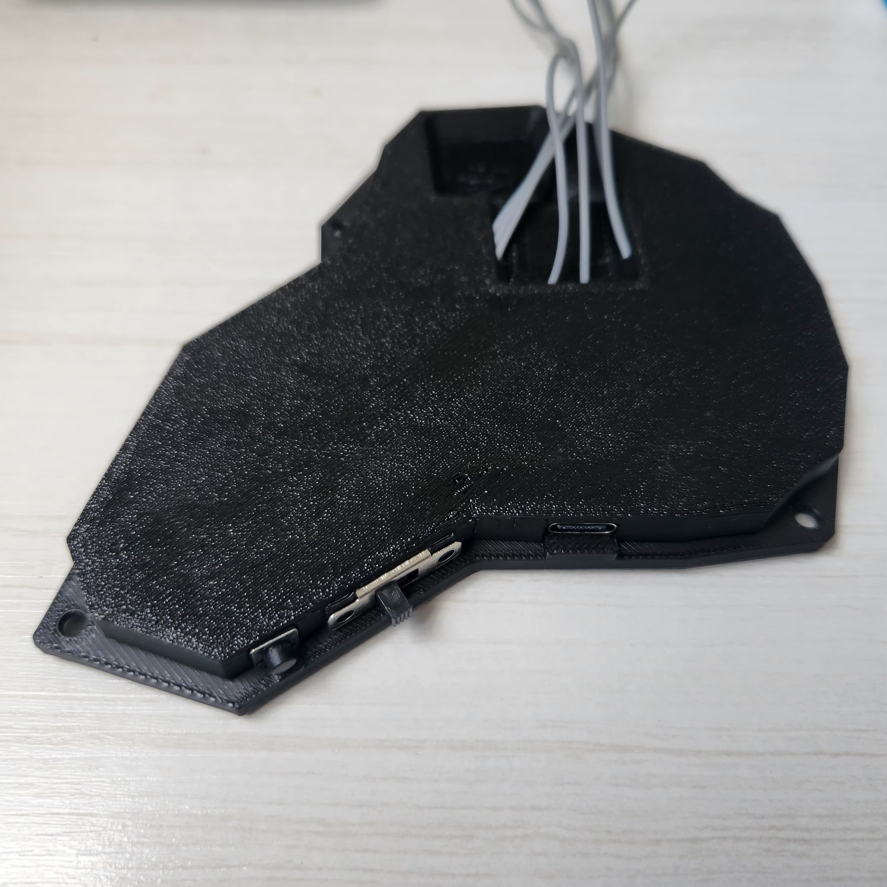

Left Side - Cable Management
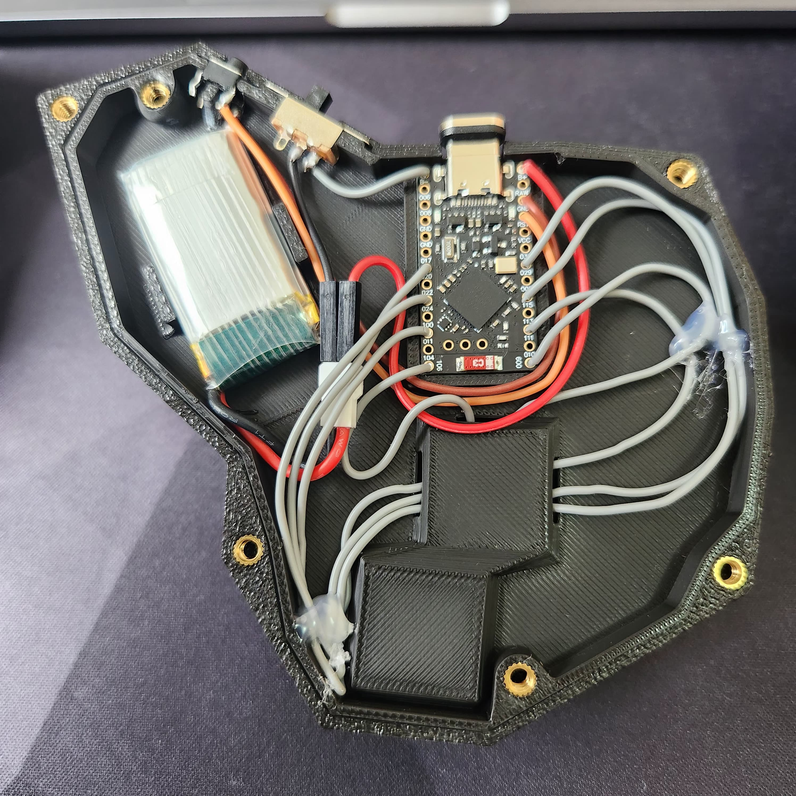

Back View
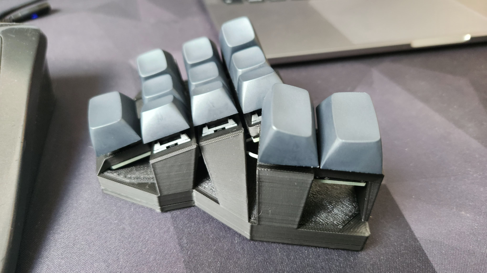

Inner Side View
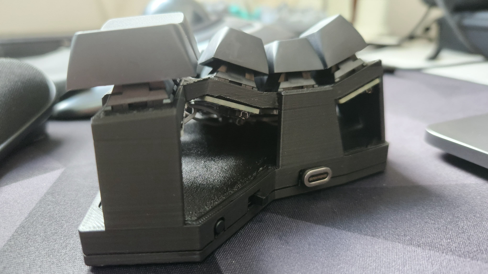

Outer Side View
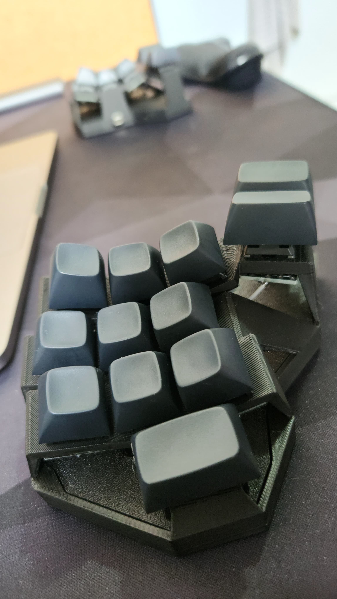

Top View
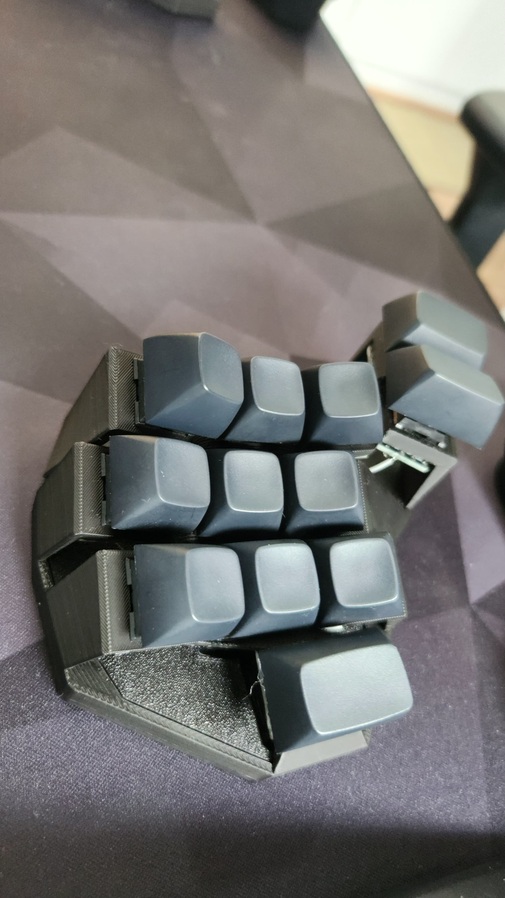

Bottom View
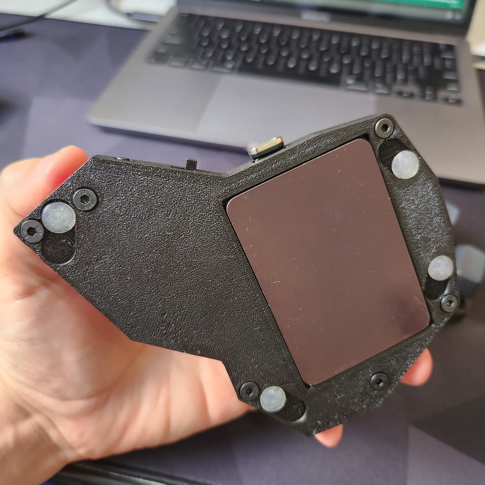

Final Build
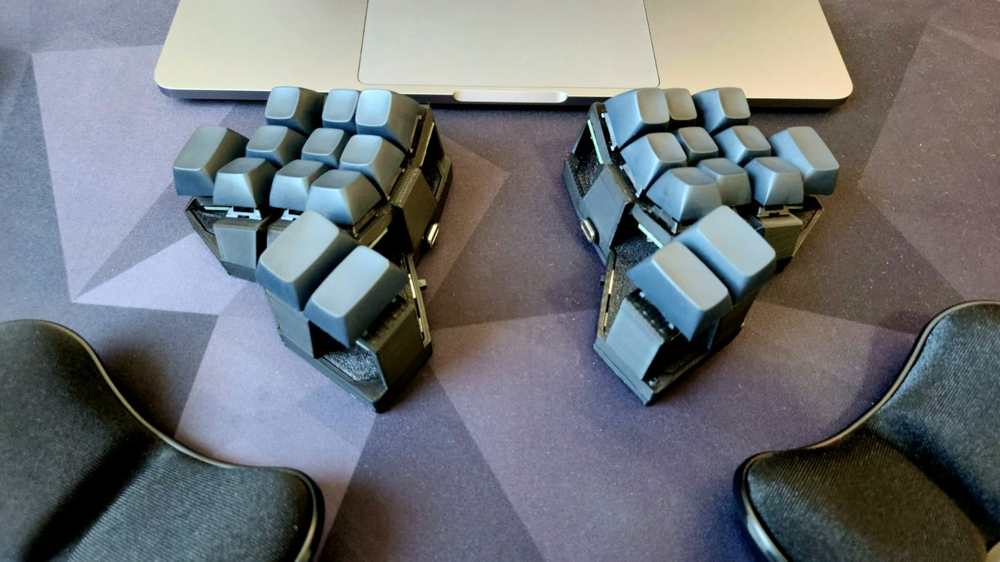

Final build
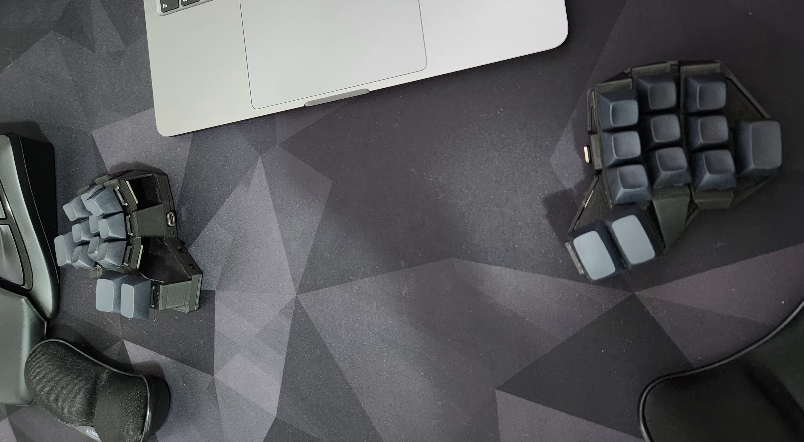
