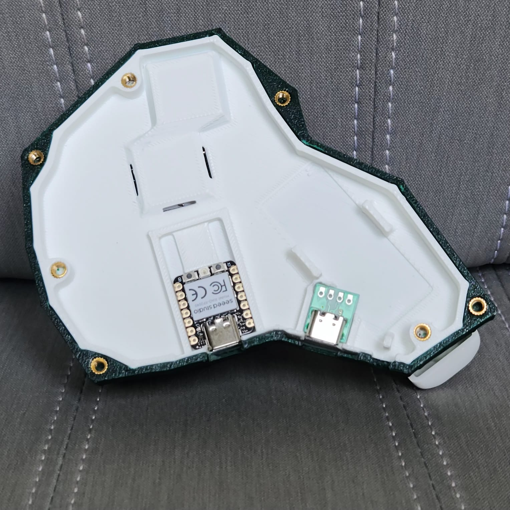
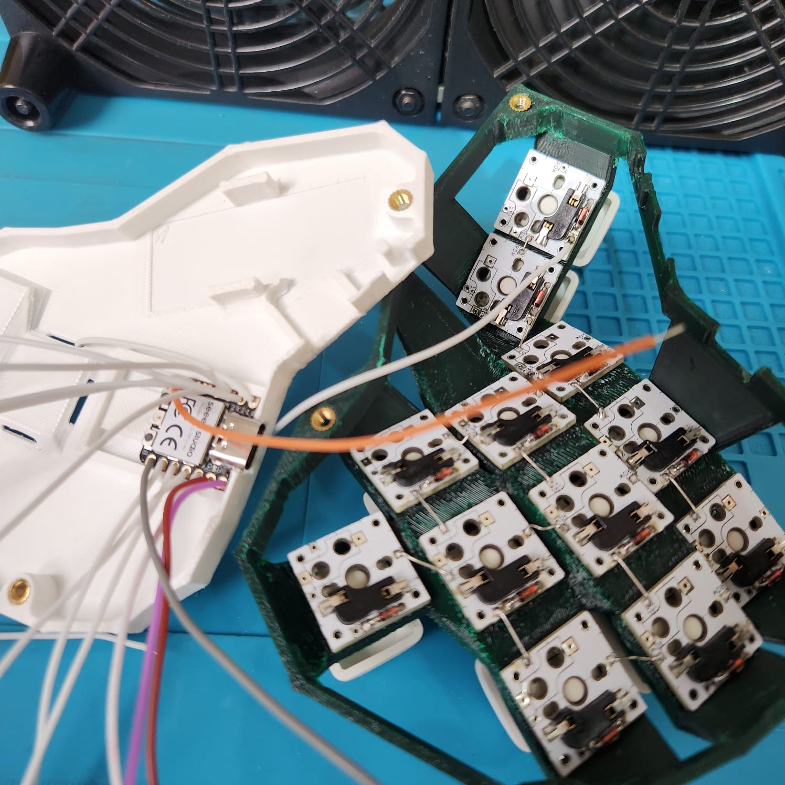
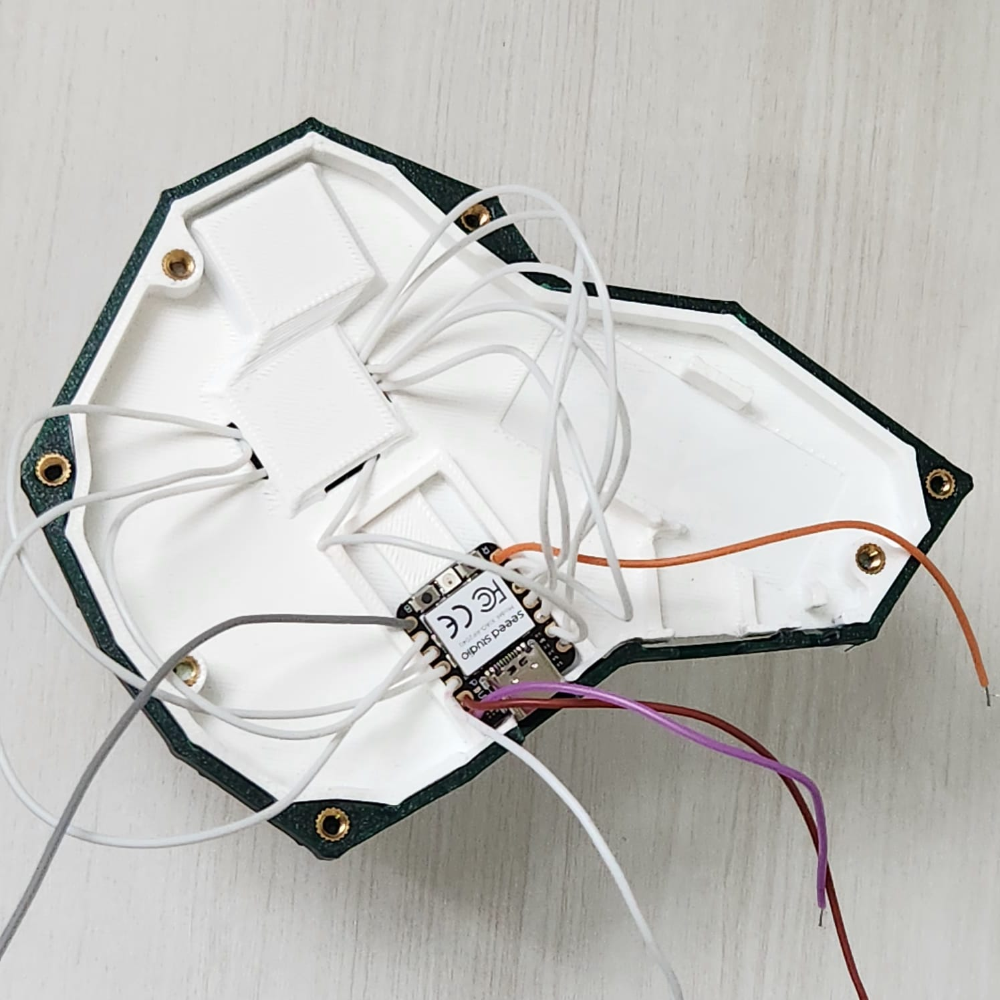
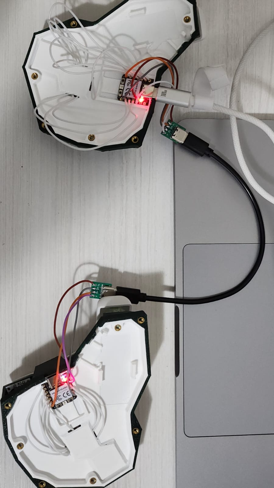
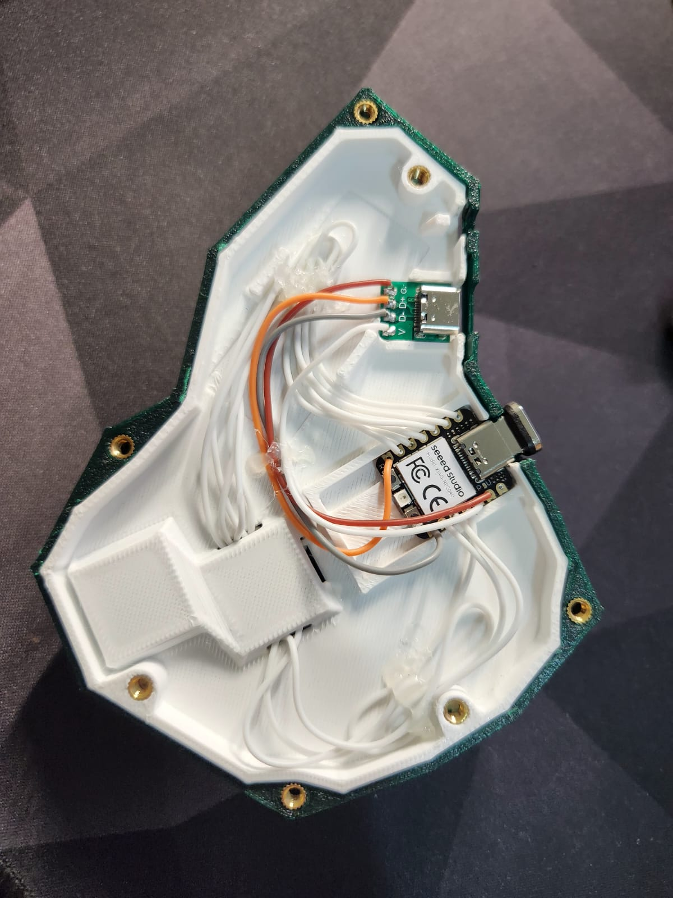
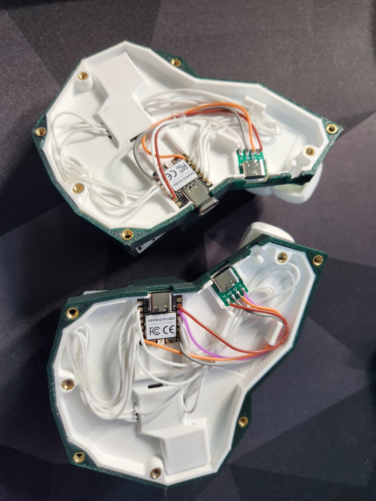
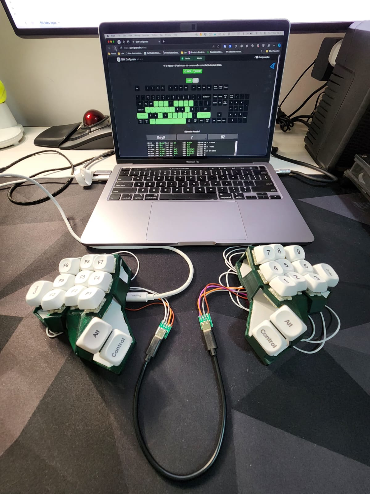
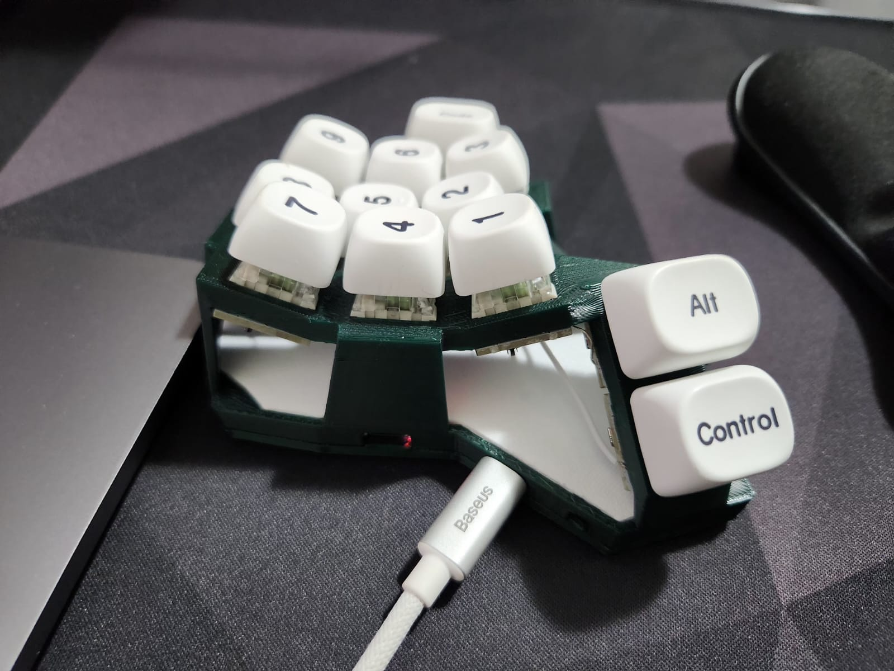
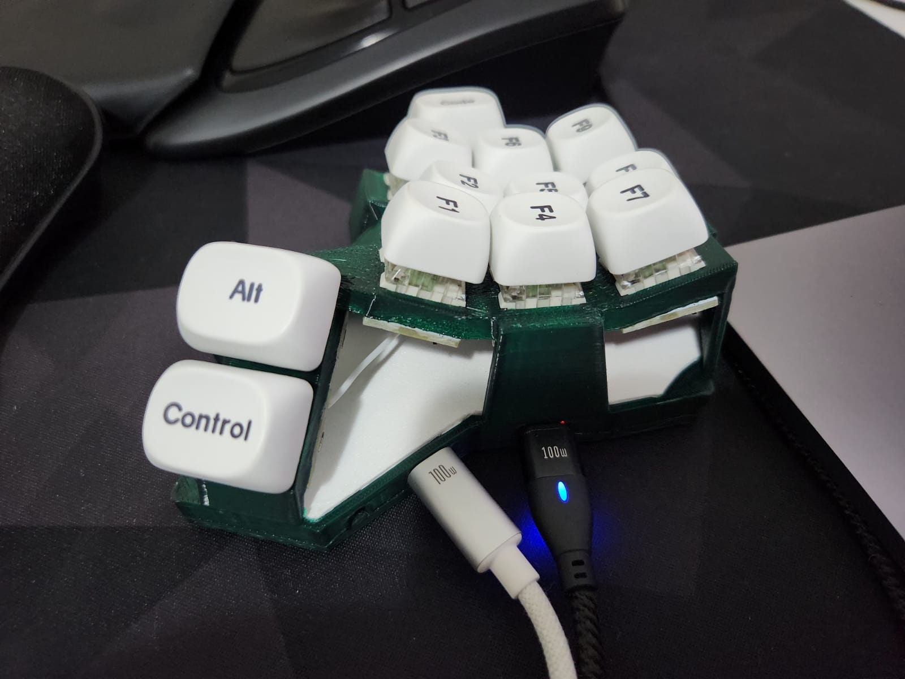
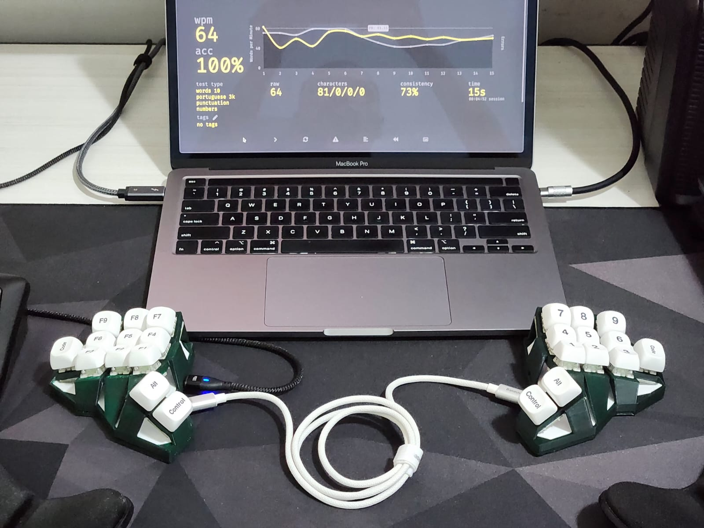

# Wired Diamond
### A 24 keys handwired split keyboard.

For the complete documentation and source files, go to [this page](../../src/zmk/keyboards/wired_diamond/boards/shields/wired_diamond).

## Some build pictures:

USB-C Breakout and MCU placement

Wiring the PCBs to the MCU

Rows and columns wired to the MCU

Testing the USB connection between the halves

Left side cable management

Cable management on both sides

Final tests

Right side completed

Left side completed

Final build
