# FauxBerry
### A handwired unibody split keyboard.

For the complete documentation and source files, go to [this page](../src/qmk/keyboards/handwired/rafaelromao/fauxberry).

## The pictures below show some steps in the handwiring process of this board.

Plain case with switches and keycaps.
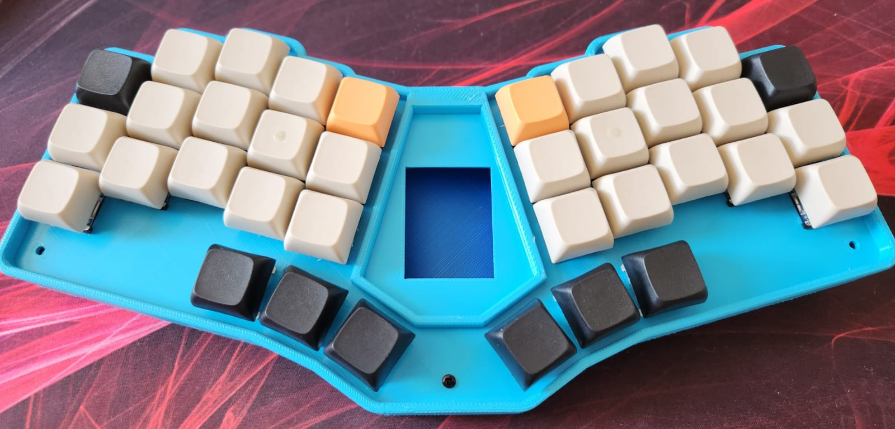

Plain case with switches, hotswap sockets and encoders.
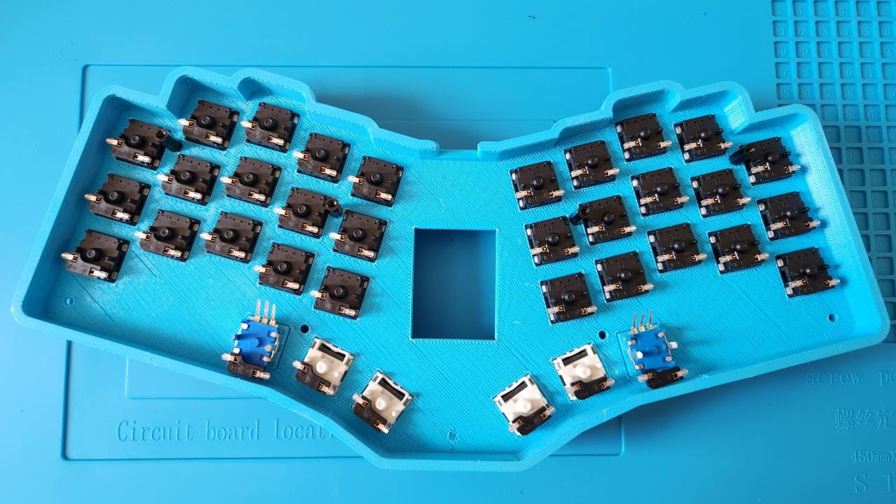

RP2040 with angled pins soldered.
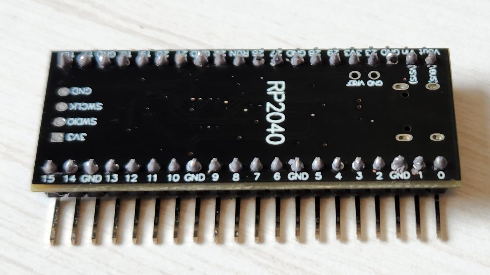

Some switches with the hotswap socket holder glued.
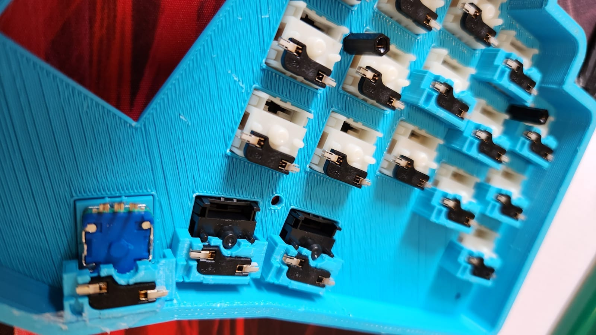

Top view of the hotswap socket holders.
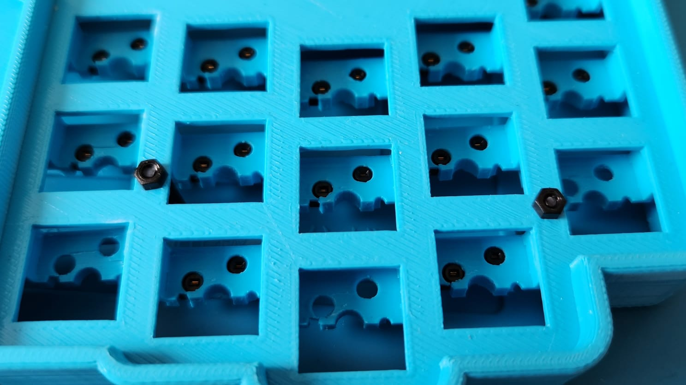

First diode row, not soldered yet.
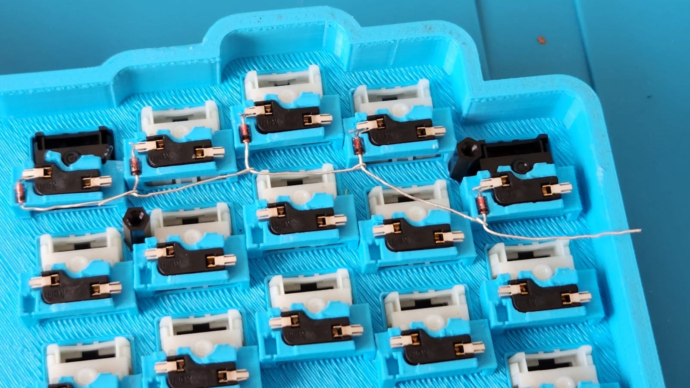

Thumb row soldered.
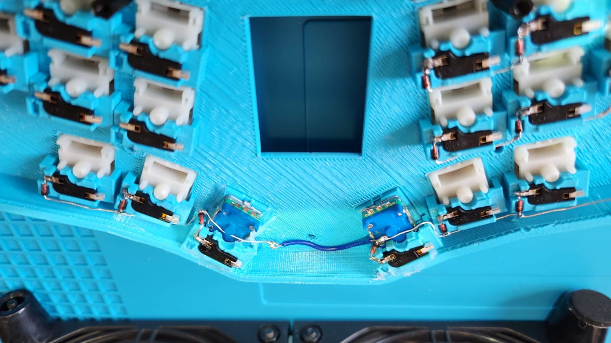

First column soldered, along with all rows on the same side.
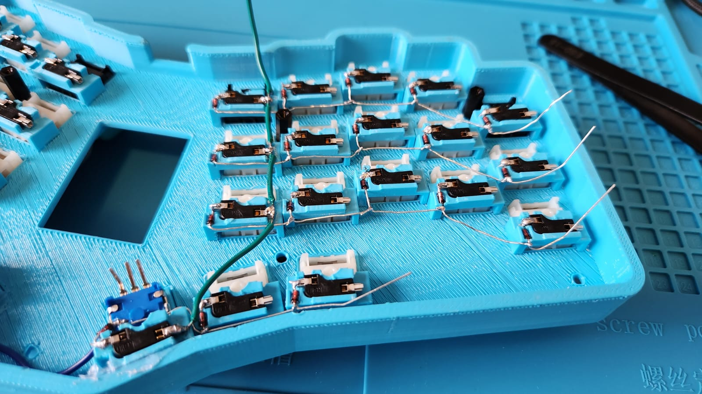

All rows and columns soldered.
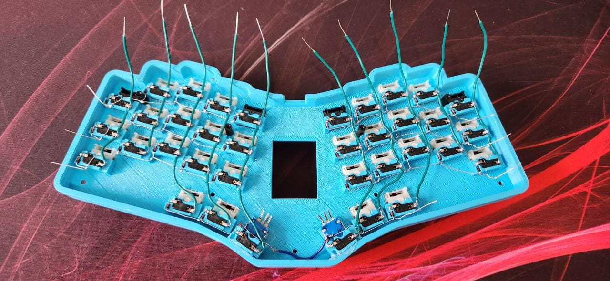

Testing the connections with the RP2040.
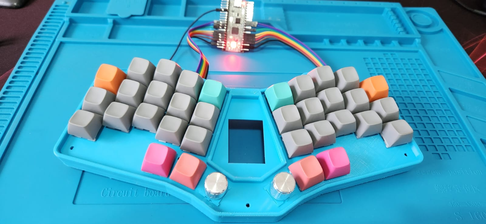

Showing the connections with the RP2040.
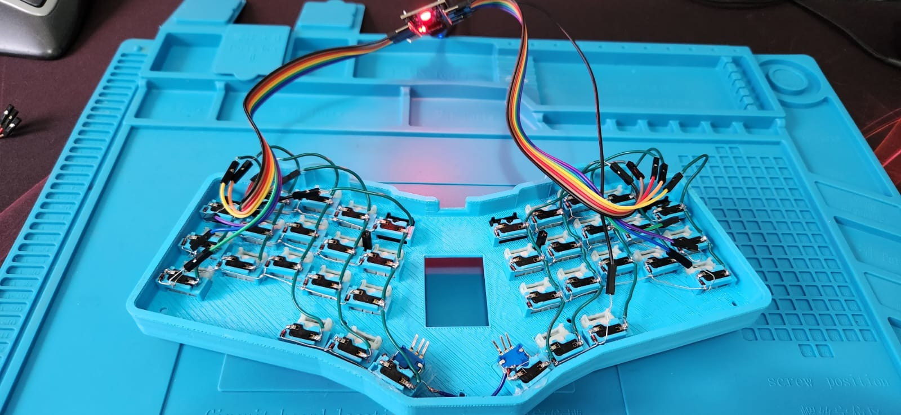

Showing the RP2040 and cables in place.
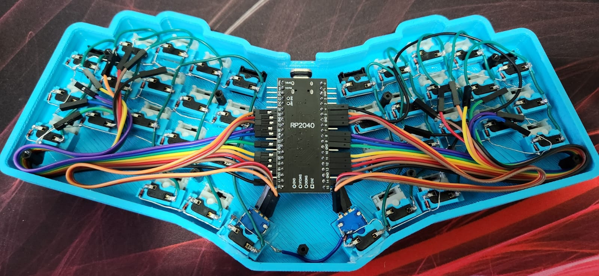

Now with the protection to avoid shorts.
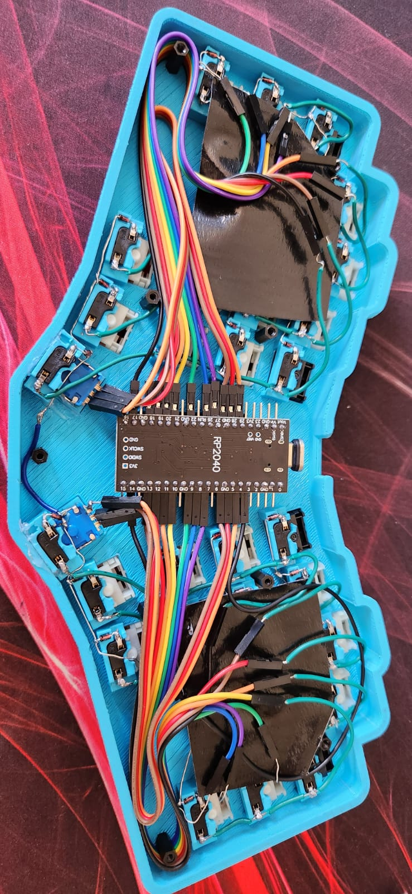

Final build, without the center cover.

Final build, with the center cover.
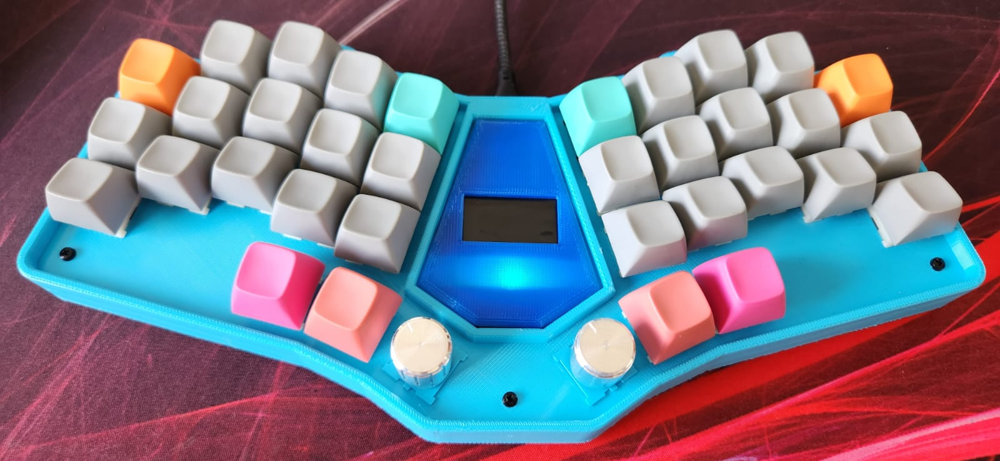