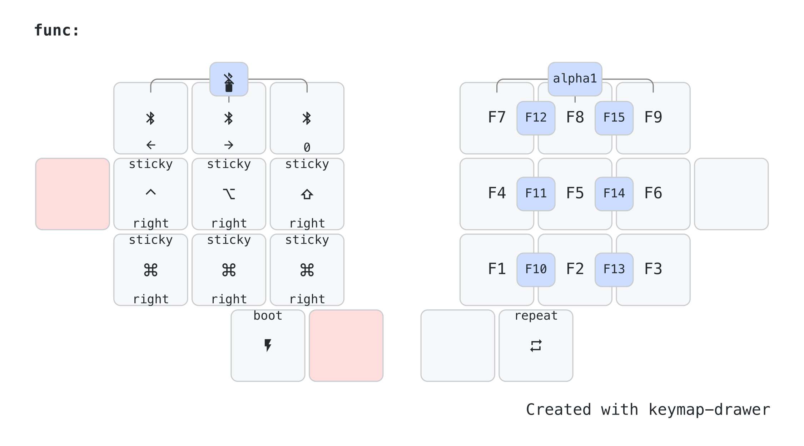

# rafaelromao's keyboard layout

## Functions

The Functions layer is activated holding the C key in the base layer.
- It will give access to the traditional Function keys, plus others behaviors described below.

## Smart Cases

The Smart Cases layer is activated holding the Comma key in the base layer.
- Smart Cases are special layer where the space key is replaced by another keycode, like dash, underscore, slash or even one-shot shift.
- Smart Cases are particulary useful for coding.
- Double tapping space exits the Smart Case, as well as using the panic mode combo.

## Leader Key

- The Leader Key is available in both these layers. It gives easy access to some useful macros, like typing an internet domain or recurring terminal commands.

## System Settings

These two layers also allows to:
- Put the keyboard in bootloader mode. 
- Reset the keyboard memory.
- Configure Bluetooth lights.
- Put the host computer in sleep mode or lock it.