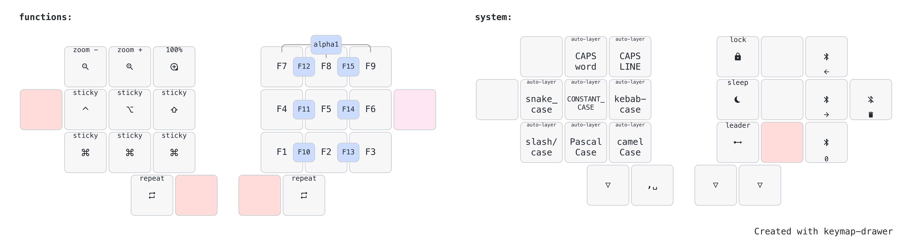

# rafaelromao's keyboard layout

## Functions

The Functions layer is activated holding the left home row pinky key in the Navigation layer or holding the left outer thumb key in the shortcut layer (or both these keys together in the base layer).
- It will give access to the traditional Function keys, well as to one shot mods.

#### One Shot Mods

- One Shot modifiers are available in Functions the layer.

## Sytem

The Sytem layer is activated holding the Comma key in the base layer.

### Smart Cases
- Smart Cases are special layers where the space key is replaced by another keycode, like dash, underscore, slash or even one-shot shift.
- Smart Cases are particulary useful for coding.
- Double tapping space exits the Smart Case, as well as using the panic mode combo.

### System Settings

- Put the keyboard in bootloader mode. 
- Configure Bluetooth.
- Put the host computer in sleep mode or lock it.

## Leader Key

- The Leader Key is available in both these layers. It gives easy access to some useful macros, like typing an internet domain or recurring terminal commands.

