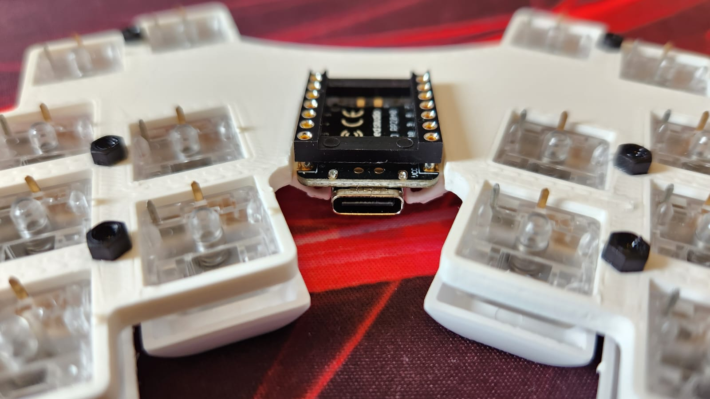
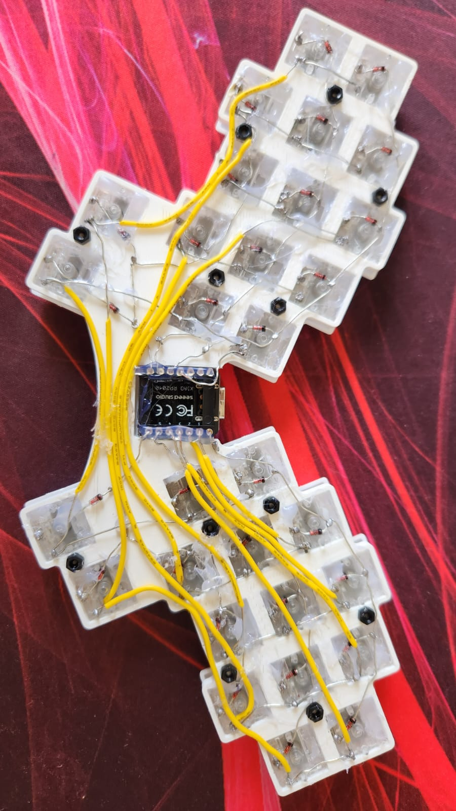

# hummingbird
### A 30 keys handwired split keyboard.

This board is not currently working, due to some problems after converting it to Wireless. Below you can find some pictures of the original wired version. I will update it latter when I put it to work again.

## The pictures below show some steps in the handwiring process of this board.

Switches and stand offs in place

Testing MCU socket position

All lines soldered and switches fixed with hot glue

Testing bottom plate fitting

All columns soldered, with provisory isolation

Testing MCU connections

Hot gluing everything to avoid shorts and keep things in place

Final tests

Fixing the bottom plate with double side tape

Final build

