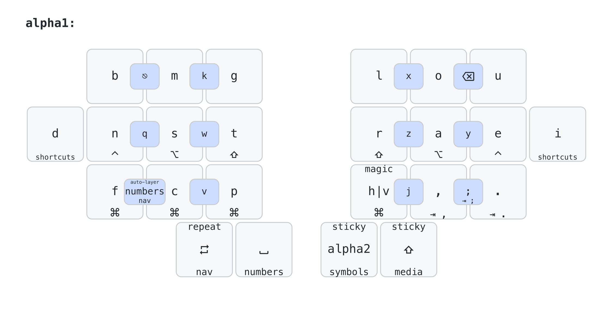
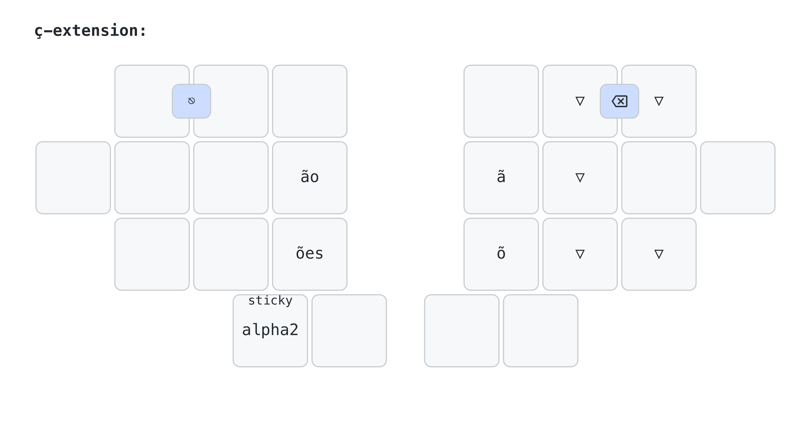
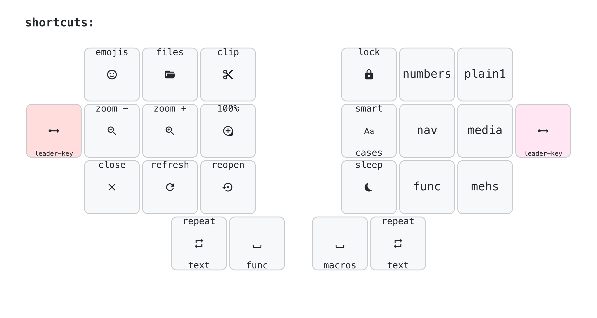
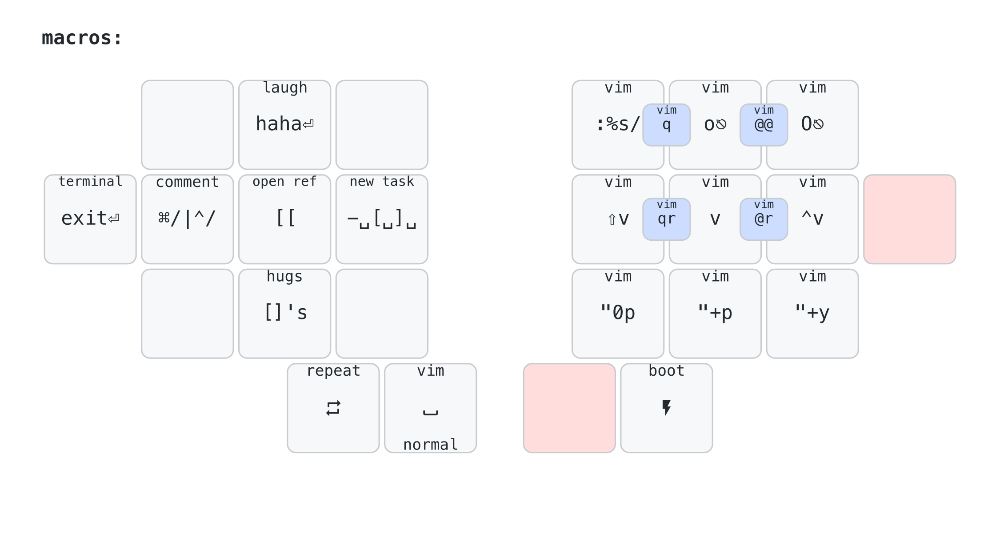
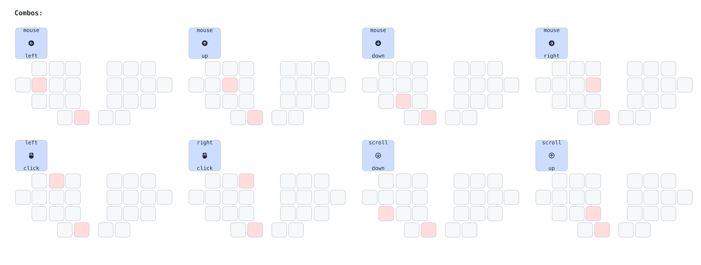

# Rafael Romão's Keyboard Layout

A split keyboard layout optimized for Portuguese, English, working with numbers and software programming with VIM plugins.

To see the implementation of this keymap, using ZMK, check the [GitHub Repo](https://github.com/rafaelromao/keyboards).

# Overview

This keymap is the result of a few years of iterative improvements with my keyboard layout, targeting what is best for my workflows.


## My Keyboards

<table>
  <tr>
    <td><a href="https://github.com/rafaelromao/diamond">Diamond</a></td>
    <td><a href="https://github.com/rafaelromao/diamond">Wired Diamond</a></td>
    <td><a href="https://github.com/rafaelromao/diamond">Choc Diamond</a></td>
  </tr>
  <tr>
    <td><a href="img/builds/Diamond.jpeg"></a></td>
    <td><a href="img/builds/Wired%20Diamond.jpeg"></a></td>
    <td><a href="img/builds/Choc%20Diamond.jpeg"></a></td>
  </tr>
  <tr>
    <td><a href="https://github.com/rafaelromao/rommana-remix">Rommana Remix</a></td>
    <td><a href="https://github.com/AlaaSaadAbdo/Rommana">Wired Rommana</a></td>
    <td><a href="https://lowprokb.ca/collections/keyboards/products/corne-ish-zen">Corne-ish Zen</a></td>
  </tr>
  <tr>
    <td><a href="img/builds/Rommana.jpeg"></a></td>
    <td><a href="img/builds/Wired%20Rommana.jpeg"></a></td>
    <td><a href="img/builds/Corne-ish%20Zen.jpeg"></a></td>
  </tr>
</table>

# Directives

The following directives guided my choices when defining how this keymap should look:

## Ergonomics

**Split and Columnar Stagger**: This keymap is designed for ergonomic keyboards. This means split, wireless or not, and columnar stagger, with at least 4 columns and 3 rows, plus 2 thumb keys on each side. It is also implemented on top of ZMK, using features like home row mods, sticky shift on a thumb key, caps word, macros, adaptive keys, and plenty of layers and combos.

## Finger Effort

**No lateral movements or uncomfortable stretches**: The main objective of this keymap, and the keyboards I've built to use with it, is comfort when typing. Lateral movements with the pinky or index fingers are not comfortable for me, as well as using the pinky finger to reach keys in the top or bottom rows. As a result, such keys were removed and the keyboards, layout, and keymap evolved to have only 24 keys, in the format 1333+2.

## Easy of Use

**If it is frequent, it should be easy**: Symbols and commands that are frequently used should be easy to type. This also applies to sequences of symbols or commands. Combos and macros can be used to facilitate this. For example, a macro can be created to type `:%s/`, or a combo can be used to type `~/`.

## Handness

**Trackball in the left hand, heavy load in the right hand**: Although I'm not a left-handed person, I got used to using a Kensington Expert Mouse (actually a trackball) with my left hand, so my right hand is free most of the time to take notes, drink some coffee, or perform common actions, like copy and paste, using only the right side of the keyboard.

## Workflows

**English, but also Portuguese, plus VIM and Spreadsheets**: I type in English for at least a few hours per day, but Brazilian Portuguese is my home language, so I had to find, or design, an alpha layout that would work well for both languages. I also use VIM in all my editors (VSCode, IntelliJ, and Obsidian), so it also has a huge influence in this keymap. I don't code very often today, but I write some Java code eventually, so good bindings for IntelliJ are also important. And finally, spreadsheets should be easy to use, since I had to work with them for a significant portion of my week.

# Workflows

In the sections below, you can see my most common workflows and how this keymap is used for them.

## Typing

Typing is obviously the most basic function of any keyboard, and there should be no surprises here, but given the directives above, it's not that simple. This keymap uses the Magic Romak layout, which uses two alpha layers. Other features like adaptive and repeat keys, sticky shift, caps word, and sentence case will make the typing experience with this keymap pretty unique.

### Two Alpha Layers

The concept of two alpha layers for typing became famous with [Ben Vallack's](https://www.youtube.com/watch?v=dg2TT1OJlQs&list=PLCZYyvXAdQpsEWfa6OEBOhHn48SWgneoD) videos, which show the concept as an alternative for typing with tiny boards, in his case, with only 16 keys.


This approach is based on the idea of using a sticky layer to get access to alphas that are least common, like q, z, and j, for example. The alpha layout is divided into two layers, and when tapping a home thumb key in the base layer, the secondary alpha layer is activated for one shot, which means the keyboard will return to the base layer automatically after the next key is released.

The alternative to this approach is using combos for these uncommon letters, but it only works when you have just a few of them, and it is far less fluid, which may break the typing flow or cause other problems like unintended triggers.

In practice, using a sticky layer is not much different than using a dead key. With a dead key, which is pretty common in Portuguese, we type `'` and then `a` to get `á`, for example. With two alpha layers, I can have a macro that produces `á` in the secondary alpha layer, so that to get `á`, I also have to tap just two keys. The first one would be the home thumb key that activates the secondary alpha layer, and the second one could be the same key used to type `a`. This familiarity with dead keys made the transition to two alpha layers pretty easy for me.

### Alpha Combos



All alphas moved to the secondary alpha layer are also available as combos in the base layer, but they are not usually used for typing, but for commands instead, like VIM bindings, for example.

### Magic Romak

[Romak](https://rafaelromao.github.io/romak) is an alpha layout designed from scratch to be easy to use for both English and Portuguese, aiming to minimize the use of the inner index columns and pinky keys. As a result, it became easy to port it to 24 keys, using two alpha layers. As a further enhancement, adaptive keys were used to make V and H easier to type in both languages, since V is more common in Portuguese while H is more common in English. The end result is [Magic Romak](https://rafaelromao.github.io/romak).

#### Adaptive Keys

Adaptive Keys send different outputs depending on the previously typed keycode. For example, if the last keycode is a vowel, it outputs V, but if the last keycode is a consonant, it outputs H.

The example above is exactly what the main Magic Key does in Magic Romak. This key replaces the H key in regular Romak and makes it easier to type most words containing V or H, since V is predominant after vowels while H is predominant after consonants.

In Magic Romak, there is also a Reversed Magic Key, which does the opposite, H after vowels and V after consonants. This key replaces the V key in regular Romak.

These Adaptive Keys are implemented using the [zmk-adaptive-key](https://github.com/urob/zmk-adaptive-key) module and can be found in some other places in this keymap to implement other smart behaviors, like the Alternate Repeat Key.

#### Repeat Keys

Repeat Key is [available in ZMK](https://zmk.dev/docs/keymaps/behaviors/key-repeat) as a behavior that repeats the last typed key or shortcut. It is super helpful to avoid [SFBs](https://semilin.github.io/blog/2023/layout_quality.html#h:e46323dd-62d8-4361-a0f9-039b31efe7aa) when typing words that contain repeated keys. But it can be made even more powerful if implemented as an adaptive key that will repeat the last key or shortcut by default, but produce another output when repeating the last one does not make sense. For example, if tapped after `I`, the repeat key will produce `'` instead. To see more about the Adaptive Repeat Key in this keymap, check the [Magic Romak](https://rafaelromao.github.io/romak) page.

#### Ç Extension

Cedilla `Ç` is pretty common in Portuguese, but it always comes before a vowel, usually `ã` or `õ`. Both are available as macros in the secondary alpha layer, as well as `ç`, so normally it would require two consecutive activations of the secondary alpha layer to type `çã` or `çõ`.

To avoid that, a third alpha layer, containing macros for these two accented vowels, is automatically activated for one shot after `ç`. This is what I call the *Ç Extension* layer. The keys for all other vowels are transparent in this layer, so it is still possible to type words like `açude` without any problem. For words like `açúcar`, on the other hand, a secondary activation of the secondary alpha layer would still be required.



It is also quite common to have it followed by either `ão` or `ões`, so macros can be used to type these two sentences easier as ç extensions.

### Sticky Shift

*Sticky Shift*, also known as One Shot Shift, is a shift key that is activated by tapping, instead of holding. It works like a dead key: we tap it and the next key we tap will be capitalized. It is much more fluid and faster than holding shift down.

In this keymap, the Sticky Shift is present in a thumb key, on the right side of the board.

#### Shifted layers

Due to a limitation of ZMK, a *sticky layer* does not work well in conjunction with a *sticky shift*, so I had to use a layer to bypass this limitation. For capitalizing the *alpha1* layer, the regular *sticky shift* is used, but for capitalizing the *alpha2* layer, I used a separate layer where all alphas are already capitalized. This was also necessary to implement some other capitalization behaviors, like CAPS word and CAPS LINE.


### CAPS word and CAPS LINE

*CAPS word* is a behavior that works like traditional Caps Lock, but it will be automatically deactivated when the current word ends. It can be activated by double-tapping the Sticky Shift key.

*CAPS LINE* is between *CAPS word* and the traditional Caps Lock, since it will also be automatically deactivated but only when the current line ends, usually with the Return key. It is activated tapping the Repeat key after the Sticky Shift key.

### Punctuation

`.` and `,` are available in the base layer, while `?`, `!`, and `:` are easily reachable in the *symbols* layer, accessed only with the right hand. `;` is available in a combo of `,` and `.`.
There are also combos in the secondary alpha layer for `_`, `?`, `!`, and `-` too. Brackets are available in the *numbers* layer. More on that later.

### Sentence Case

*Sentence Case* is a feature that automatically capitalizes the next word after `space` if it is preceded by `.`, `?`, or `!`. If the *Sticky Shift* is tapped after this `space`, it will be ignored. This feature makes it much easier to start new sentences and reduces the use of the *Sticky Shift* key a lot. This feature is implemented using adaptive keys to trigger it and a layer to execute the capitalization.

## Numbers

The *numbers* layer contains not only numbers but also some symbols commonly used along with numbers.


### NumPad

Numbers are arranged as a classic numpad, with 0 in the thumb. It might not be the optimal configuration, considering which numbers are the most frequent, but it allows me to use my 20+ years of muscle memory.

The *numbers* layer can be toggled on permanently using the *toggles* layer.

### NumWord

NumWord, a.k.a. *auto-layer numbers*, is a smart behavior that allows me to type a sequence of numbers and automatically return to the base layer after pressing a word-breaking key, like space or enter.

It is triggered using a combo in the base layer, so it is quite fast to activate.

### Brackets

Brackets are commonly used for two different workflows: working with numbers and programming. Placing them on the left side of the *numbers* layer makes it easier to work with spreadsheets.

### Math Operators

Math Operators must be easily accessible from the *numbers* layer, and I find it particularly helpful if I can do it using only my right hand, so I put them on the right side of my *symbols* layer.


### Currencies

In the *symbols* layer, there are also combos to type the 3 most common currency symbols for me, `R$`, `US$`, and `€`, as well as their nominal versions, `BRL`, `USD`, and `EUR` by holding the same combos.

## Shortcuts

### Home Row Mods


[Home Row Mods](https://precondition.github.io/home-row-mods) are well known by most keyboard enthusiasts and are also available in this keymap. Their disposition is: Ctrl, Alt, and Shift in the home row, and Gui (Command / Super) in the bottom row index key, mirrored on the right side.

To make combinations of Ctrl, Alt, and/or Shift with Gui easier, Gui is replicated for the middle and ring fingers on the left side.

### Meh and Hyper

Meh and Hyper are special modifiers, triggered by the combination of three or four of them: Meh = Ctrl + Alt + Shift, and Hyper: Meh + Gui (Command / Windows).

Meh can be triggered by holding the 3 mods in the home row, while holding the 3 equivalent keys in the bottom row will trigger Hyper.

Meh and Hyper shortcuts are mapped in software to make custom actions easier to trigger and memorize.

In some cases, a lot of consecutive uses of Mehs and Hyper shortcuts are necessary, and for this reason, there is a *mehs* layer that can be toggled on as well.


In this layer, or while holding *meh* in the base layer, accessing the Hyper version of the shortcut is as simple as holding a thumb key before pressing it.


### Common Apps Shortcuts

Holding any of the pinky keys will activate the *shortcuts* layer, which gives access to common shortcuts like opening the file explorer, taking a screenshot, and managing zoom and tabs in a browser.



### Common Shortcuts Combos

Common shortcuts can also be activated using combos, in most layers. These combos are designed to be easy to trigger and hard to misfire.

They allow actions like copy, paste, select all, enter, tab, among others.


### Navigation Shortcuts

There are some special navigation shortcuts, available in the *nav* layer to allow me to use the arrow keys along with them.


The first one is usually known as swapper, and it allows switching between the current running apps. The actual implementation depends on the Operating System. For example, in MacOS, I use Raycast's *Switch to Windows* function to implement this functionality.

The second navigation shortcut allows me to open a new app by searching for its name. I also use Raycast to implement it in MacOS.

The third navigation shortcut depends on the context of the currently running app. It will list the currently open files or tabs and allow me to search and switch between them. It is implemented for apps like Brave, VS Code, IntelliJ, and Obsidian.

There is also a shortcut to open the system menu.

### Shortcut Redirection

Whenever possible, I use the standard shortcuts in my keyboards, but in some cases, it is necessary to send a different shortcut to the host, intercept it with some software, and redirect it using a different shortcut to the target app.

In MacOS, I use a combination of [Hammerspoon](https://www.hammerspoon.org/) and [Better Touch Tool](https://folivora.ai/) to intercept the shortcuts sent by my keyboards to the host. Linux and Windows are less used, so I only map a few shortcuts there.

### Leader Key

*Leader Key* is available through an external module, [zmk-leader-key](https://github.com/urob/zmk-leader-key), and allows macros to be triggered through a sequence of keystrokes.

The *Leader Key* is placed in the *shortcuts* layer.


## Toggles

From the *shortcuts* layer, the *toggles* layer can be activated. It allows some layers to be toggled on permanently, like the *numbers*, *nav*, and *media* layers.

Here we also have convenient shortcuts to *lock* the computer or put it to *sleep*, as well as *Bluetooth* controls, *num lock* and *caps lock*.


## Macros

There is a *macros* layer dedicated to Macros, which will give access to recurrent text blocks and commands.



## Navigation

Arrow keys are available in the 4 home row keys on the right side, in the *navigation* layer, in a VIM style. Del, Home, End, and Tab complement the right side of this layer.


The *navigation* layer can also be toggled on permanently using the *toggles* layer.

### One Shot Modified Numbers

In the *nav* layer, holding the modifier keys work as expected, and they are normally used for Window Management along with arrow key, but if I tap them instead, it will activate the tapped mod for one shot, along with the *numbers* layer, also for one shot. This means, for example, that if I hold the *nav* layer activation key, tap `Command` and then the key where `4` would be in my *numbers* layer, it will send `LG(4)`. This is quite useful for fast tool window activation, in IDEs, or workspace navigation.


#### Navigation Combos

All navigation bindings can be activated from any layer using the same key combined with the right home thumb key.


### Window Management

Window Management is performed using a combination of modifiers and navigation keys, so there is no need for custom shortcut bindings. The combination of modifiers was selected based on how easy they become to activate, and sometimes holding more than one modifier key is actually easier than holding a single one.


### Text Navigation

Text Navigation is an extremely important workflow. Navigating between words, selecting a whole word or line, and having a consistent way to do it in any OS is key. For that reason, there is a dedicated layer for that. Holding the pinky key while on the Navigation layer will activate it and send the appropriate shortcut for the desired action.


#### Sticky Mods

The same modifiers available as home how mods are activation in the *func* layer, but in their *sticky* version. It makes the use of modified function keys easier, and they also work as standard modifiers when held.

### Mouse Emulation

On the left side of the *media* layer, I can control the mouse movement, scroll, and clicks.


#### Mouse Emulation Combos

All mouse emulation bindings can be activated from any layer using the same key combined with the left home thumb key.



### Media Controls

On the right side of the *media* layer, I have my media controls, which include custom shortcuts to toggle my Microphone and Camera during calls and also to Raise My Hand. These shortcuts are mapped in software to both Google Meet and Microsoft Teams, using [Better Touch Tool](https://folivora.ai/).

## Programming

Most of my keymap was designed to allow an easy workflow for programming, with languages like Java and Elixir.


### Brackets

On the left side of my *numbers* layer, I have parentheses, square brackets, and curly braces, and there are many optimizations on how they can be used:
- Holding any of them will append it to the current line.
- A combo of open and close curly braces will append the opening one and add a new row, which is used to add a new block of code.
- A combo of open and close parenthesis or brackets will add both symbols in order.
- Holding the combo for open and close parenthesis will append both symbols to the current line.
- A combo with the index, middle, and ring fingers in the home row of the right side will append open and close parenthesis to the current line and add a new line.

### Semicolon

Semicolon is extremely important in C-like languages, and it is available as a primary combo in the base layer, tapping both comma and dot at the same time.

Holding these two keys will append it to the current line, which also works in the *numbers* layer. Also in the *numbers* layer, a combo with the 3 bottom row keys of the right side will append a semicolon and add a new line.

### Conditional Operators

On the left side of the *numbers* layer are the two symbols used for conditional operators, `&` and `|`. Combing the keys that type them with their neighbor key will add a pair of these symbols instead. Holding the combo will append the pair to the current line.

### Strings

Quotes are available on the left side of the *symbols* layer, along with other text related symbols, like `"""`, used to delimit text blocks in Java.


### Ligatures

A lot of common programming ligatures are also available as combos, like `==`, `!=`, `->`, `=>`, `::`, `|>`, `<-`, `${`, `#{`, and `%{`.


### Markdown

Symbols used in markdown notation, like `#`, and ` ``` `, are also present in the *symbols* layer.

Macros are used to complement, typing symbols like `- [ ] ` and `[[]]`, commonly used in Obsidian notes.

### Function Keys


Function keys are commonly used for debugging, and they are available in a dedicated layer, but since most IDE shortcuts will be mapped to Meh and Hyper shortcuts, function keys are rarely necessary in my workflows.

### VIM

I have used VIM since 2017, and it is an essential plugin for all my text editors.

#### VIM Mode

After a few years remapping my VIM bindings to work well with my alpha layout, I've decided to implement a VIM Mode into my keymap. It is composed by a set of layers that mimic the vim modes in the keyboard, so that it changes between VIM optimized layers, for normal and visual modes, for example, and typing layers, for insert and replace modes, for example.

There is also a listener that activates or deactivates this VIM Mode when NUM_LOCK is toggled on or off, respectively.

In the host side, I have scripts that toggle NUM_LOCK when I enter or leave VIM to allow a seamless integration between VIM and my keyboard VIM Mode.


In my *numbers* layer, I also have some combos to make it easier to move between rows and columns without changing the layer.


In the *symbols* layer, many symbols were positioned considering how they are used in VIM. See the `^` and `$` as an example. They are positioned side by side, and holding or double-tapping `^` will actually type `0`, to allow easy transition between the two `beginning of line` options.


And finally, there are a few macros defined specifically for VIM in my *macros* layer, also easy to trigger using only my right hand.


### Directory Navigation

In the *macros* layer, there are also some macros used to navigate directories in a terminal shell, like `~/`, `./` and `../`.

### IDEs

My most used shortcuts in IntelliJ IDEA and other IDEs were remapped to use Meh and Hyper shortcuts too.


# General

## Cancel

A combo with the 3 top row keys on the right side can be used anytime to cancel the active mode or layers and return to the base.

## Bluetooth

Bluetooth controls are available in the *toggles* layer and allow swapping between profiles, returning to the first one, and clearing the current one.


## Bootloader

Most of my boards have an easily accessible physical reset button, but not all of them. And even for those, sometimes it will be easier to use a shortcut to put the board in bootloader mode to update its keymap.

This bootloader shortcut must be available independently in both halves of the board and should not be easy to trigger by accident, so I put them in a hard to reach position in the *toggles* layer.


## Operating System

All shortcuts and macros in this keymap are Operating System aware, but a different version of the firmware must be built for MACOS and LINUX. The LINUX version can also be used for ANDROID and WINDOWS.

