# Layout de Teclado de Rafael Romão

Um layout de teclado dividido otimizado para português, inglês, trabalho com números e programação de software com plugins VIM.

Para ver a implementação deste keymap, usando ZMK, verifique o [Repositório do GitHub](https://github.com/rafaelromao/keyboards).

# Visão Geral

Este keymap é o resultado de alguns anos de melhorias iterativas com meu layout de teclado, visando o que é melhor para meus fluxos de trabalho.


# Diretrizes

As seguintes diretrizes guiaram minhas escolhas ao definir como este keymap deveria ser:

## Ergonomia

**Dividido e com colunas paralelas**: Este keymap foi projetado para teclados ergonômicos. Isso significa dividido, sem fio ou não, com colunas paralelas (columnar stagger), com pelo menos 4 colunas e 3 linhas, mais 2 teclas de polegar de cada lado. Ele também é implementado em cima do ZMK, usando recursos como home row mods, *Shift Aderente* em uma tecla de polegar, caps word, macros, teclas adaptativas e muitas camadas e combos.

## Esforço

**Sem movimentos laterais ou desconfortáveis**: O principal objetivo deste keymap, e dos teclados que construí para usá-lo, é o conforto ao digitar. Movimentos laterais com os dedos mindinhos ou indicadores não são confortáveis para mim, assim como usar o dedo mindinho para alcançar teclas nas linhas superior ou inferior. Como resultado, tais teclas foram removidas e os teclados, layout e keymap evoluíram para ter apenas 24 teclas, no formato 1333+2.

## Facilidade de Uso

**Se é frequente, deve ser fácil**: Símbolos e comandos que são usados com frequência devem ser fáceis de digitar. Isso também se aplica a sequências de símbolos ou comandos. Combos e macros podem ser usados para facilitar isso. Por exemplo, uma macro pode ser criada para digitar `:%s/`, ou um combo pode ser usado para digitar `~/`.

## Lateralidade

**Trackball na mão esquerda, carga pesada na mão direita**: Embora eu não seja canhoto, acostumei-me a usar um Kensington Expert Mouse (na verdade, um trackball) com a mão esquerda, então minha mão direita fica livre na maior parte do tempo para fazer anotações, tomar um café ou realizar ações comuns, como copiar e colar, usando apenas o lado direito do teclado.

## Fluxos de Trabalho

**Inglês, mas também português, VIM e planilhas**: Eu digito em inglês por pelo menos algumas horas por dia, mas o português brasileiro é minha língua nativa, então tive que encontrar, ou projetar, um layout de letras que funcionasse bem para ambos os idiomas. Eu também uso o VIM em todos os meus editores (VSCode, IntelliJ e Obsidian), então ele também tem uma grande influência neste keymap. Eu não programo com muita frequência hoje em dia, mas escrevo algum código Java eventualmente, então bons atalhos para o IntelliJ também são importantes. E, finalmente, as planilhas devem ser fáceis de usar, já que tive que trabalhar com elas por uma parte significativa da minha semana.

# Fluxos de Trabalho

Nas seções abaixo, você pode ver meus fluxos de trabalho mais comuns e como este keymap é usado para eles.

## Digitação

A digitação é obviamente a função mais básica de qualquer teclado, e não deveria haver surpresas aqui, mas dadas as diretrizes acima, não é tão simples. Este keymap usa o layout Magic Romak, que usa duas camadas de letras. Outros recursos como teclas adaptativas e de repetição, *Shift Aderente*, caps word e sentence case tornarão a experiência de digitação com este keymap bastante única.

### Duas Camadas de Letras

O conceito de duas camadas de letras para digitação ficou famoso com os vídeos de [Ben Vallack](https://www.youtube.com/watch?v=dg2TT1OJlQs&list=PLCZYyvXAdQpsEWfa6OEBOhHn48SWgneoD), que mostram o conceito como uma alternativa para digitar com teclados minúsculos, no caso dele, com apenas 16 teclas.

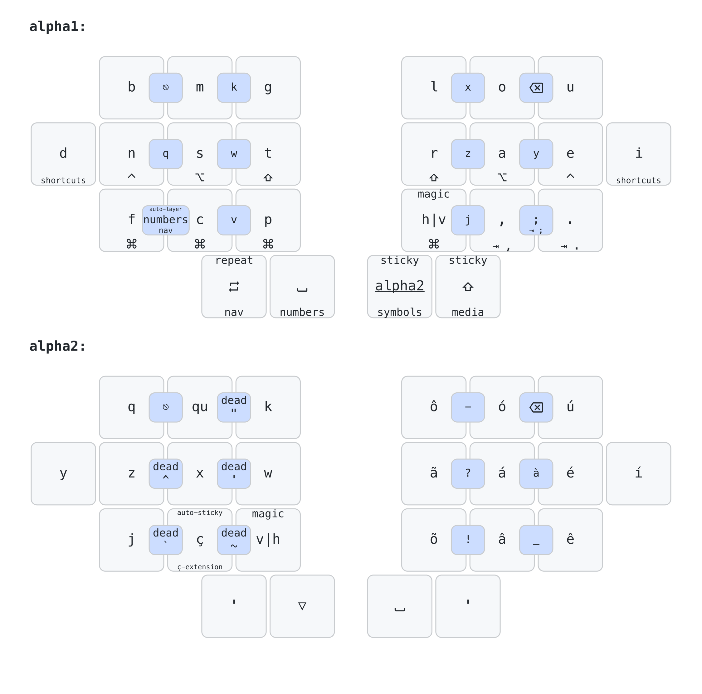

Essa abordagem é baseada na ideia de usar uma camada aderente para obter acesso a letras que são menos comuns, como q, z e j, por exemplo. O layout de letras é dividido em duas camadas, e ao pressionar uma tecla de polegar na camada base, a camada de letras secundária é ativada por um toque, o que significa que o teclado retornará à camada base automaticamente após a próxima tecla ser liberada.

A alternativa a essa abordagem é usar combos para essas letras incomuns, mas só funciona quando você tem apenas algumas delas, e é muito menos fluido, o que pode quebrar o fluxo de digitação ou causar outros problemas como acionamentos não intencionais.

Na prática, usar uma camada aderente não é muito diferente de usar uma tecla morta. Com uma tecla morta, que é muito comum em português, digitamos `´` e depois `a` para obter `á`, por exemplo. Com duas camadas de letras, posso ter uma macro que produz `á` na camada de letras secundária, de modo que para obter `á`, também tenho que pressionar apenas duas teclas. A primeira seria a tecla do polegar que ativa a camada de letras secundária, e a segunda poderia ser a mesma tecla usada para digitar `a`. Essa familiaridade com as teclas mortas tornou a transição para duas camadas de letras bastante fácil para mim.

### Combos de Letras


Todos as letras movidos para a camada de letras secundária também estão disponíveis como combos na camada base, mas geralmente não são usados para digitação, mas sim para comandos, como atalhos do VIM, por exemplo.

### Magic Romak

[Romak](https://rafaelromao.github.io/romak) é um layout de letras projetado do zero para ser fácil de usar tanto em inglês quanto em português, visando minimizar o uso das colunas internas do indicador e das teclas mindinhas. Como resultado, tornou-se fácil portá-lo para 24 teclas, usando duas camadas de letras. Como um aprimoramento adicional, teclas adaptativas foram usadas para tornar V e H mais fáceis de digitar em ambos os idiomas, já que V é mais comum em português, enquanto H é mais comum em inglês. O resultado final é o [Magic Romak](https://rafaelromao.github.io/romak).

#### Teclas Adaptativas

As Teclas Adaptativas enviam saídas diferentes dependendo do código da tecla digitada anteriormente. Por exemplo, se o último código de tecla for uma vogal, ele produz V, mas se o último código de tecla for uma consoante, ele produz H.

O exemplo acima é exatamente o que a Tecla Mágica principal faz no Magic Romak. Essa tecla substitui a tecla H no Romak regular e torna mais fácil digitar a maioria das palavras que contêm V ou H, já que V é predominante após vogais, enquanto H é predominante após consoantes.

No Magic Romak, há também uma Tecla Mágica Invertida, que faz o oposto, H após vogais e V após consoantes. Essa tecla substitui a tecla V no Romak regular.

Essas Teclas Adaptativas são implementadas usando o módulo [zmk-adaptive-key](https://github.com/urob/zmk-adaptive-key) e podem ser encontradas em alguns outros lugares neste keymap para implementar outros comportamentos inteligentes, como a Tecla de Repetição Alternativa.

#### Teclas de Repetição

A Tecla de Repetição está [disponível no ZMK](https://zmk.dev/docs/keymaps/behaviors/key-repeat) como um comportamento que repete a última tecla ou atalho digitado. É super útil para evitar [SFBs](https://semilin.github.io/blog/2023/layout_quality.html#h:e46323dd-62d8-4361-a0f9-039b31efe7aa) ao digitar palavras que contêm teclas repetidas. Mas pode ser ainda mais poderosa se implementada como uma tecla adaptativa que repetirá a última tecla ou atalho por padrão, mas produzirá outra saída quando repetir a última não fizer sentido. Por exemplo, se pressionada após `I`, a tecla de repetição produzirá `´` em vez disso. Para saber mais sobre a Tecla de Repetição Adaptativa neste keymap, consulte a página [Magic Romak](https://github.com/rafaelromao/romak/blob/main/MagicRomak.md).

#### Extensão do Ç

A cedilha `Ç` é muito comum em português, mas sempre vem antes de uma vogal, geralmente `ã` ou `õ`. Ambas estão disponíveis como macros na camada de letras secundária, assim como `ç`, então normalmente exigiria duas ativações consecutivas da camada de letras secundária para digitar `çã` ou `çõ`.

Para evitar isso, uma terceira camada de letras, contendo macros para essas duas vogais acentuadas, é ativada automaticamente por um toque após `ç`. É o que eu chamo de camada de *Extensão do Ç*. As teclas para todas as outras vogais são transparentes nesta camada, então ainda é possível digitar palavras como `açude` sem nenhum problema. Para palavras como `açúcar`, por outro lado, uma ativação secundária da camada de letras secundária ainda seria necessária.


Também é muito comum que seja seguido por `ão` ou `ões`, então macros podem ser usadas para digitar essas duas sentenças mais facilmente como extensões de ç.

### Shift Aderente

*Shift Aderente*, também conhecido como One Shot Shift ou Sticky Shift, é uma tecla shift que é ativada apertando, em vez de segurar. Funciona como uma tecla morta: após apertá-la, a próxima tecla que apertarmos será maiúscula. É muito mais fluido e rápido do que segurar o shift.

Neste keymap, o Shift Aderente está presente em uma tecla de polegar, no lado direito do teclado.

#### Camadas Shiftadas

Devido a uma limitação do ZMK, uma *camada aderente* não funciona bem em conjunto com um *Shift Aderente*, então tive que usar uma camada para contornar essa limitação. Para capitalizar a camada *alpha1*, o *Shift Aderente* regular é usado, mas para capitalizar a camada *alpha2*, usei uma camada separada onde todos as letras já estão em maiúsculas. Isso também foi necessário para implementar alguns outros comportamentos de capitalização, como CAPS word e CAPS LINE.

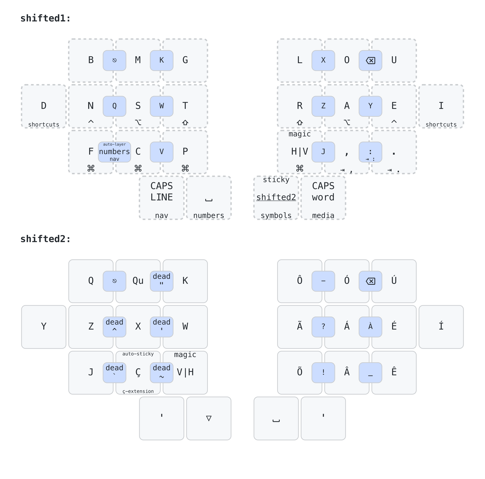

### CAPS word e CAPS LINE

*CAPS word* é um comportamento que funciona como o Caps Lock tradicional, mas será desativado automaticamente quando a palavra atual terminar. Pode ser ativado apertando duas vezes na tecla *Shift Aderente* ou através da Camada Inteligente.

*CAPS LINE* está entre o *CAPS word* e o Caps Lock tradicional, pois também será desativado automaticamente, mas apenas quando a linha atual terminar, geralmente com a tecla Enter.

### Pontuação

`.` e `,` estão disponíveis na camada base, enquanto `?`, `!` e `:` são facilmente alcançáveis na camada de *símbolos*, acessada apenas com a mão direita. `;` está disponível em um combo de `,` e `.`.
Também existem combos na camada de letras secundária para `_`, `?`, `!` e `-`. Colchetes estão disponíveis na camada de *números*. Mais sobre isso depois.

### Sentence Case

*Sentence Case* é um recurso que capitaliza automaticamente a próxima palavra após `espaço` se for precedida por `.`, `?` ou `!`. Se o *Shift Aderente* for pressionado após este `espaço`, ele será ignorado. Este recurso torna muito mais fácil iniciar novas frases e reduz muito o uso da tecla *Shift Aderente*. Este recurso é implementado usando teclas adaptativas para acioná-lo e uma camada para executar a capitalização.

## Números

A camada de *números* contém não apenas números, mas também alguns símbolos comumente usados junto com números.

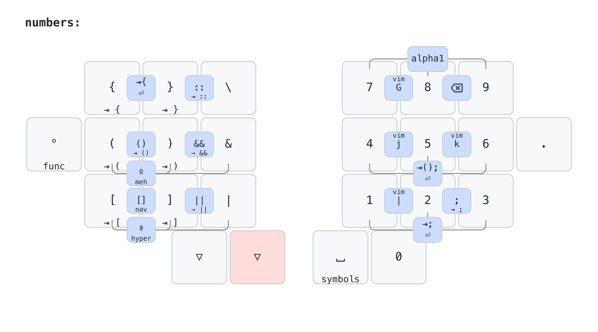

### NumPad

Os números são organizados como um numpad clássico, com 0 no polegar. Pode não ser a configuração ideal, considerando quais números são os mais frequentes, mas me permite usar meus mais de 20 anos de memória muscular.

A camada de *números* pode ser ativada permanentemente usando a camada de *atalhos*.

### NumWord

NumWord, também conhecido como *números de camada automática*, é um comportamento inteligente que me permite digitar uma sequência de números e retornar automaticamente à camada base após pressionar uma tecla de quebra de palavra, como espaço ou enter.

É acionado usando um combo na camada base, por isso é muito rápido de ativar.

### Colchetes

Colchetes são comumente usados para dois fluxos de trabalho diferentes: trabalhar com números e programação. Colocá-los no lado esquerdo da camada de *números* facilita o trabalho com planilhas.

### Operadores Matemáticos

Os operadores matemáticos devem ser facilmente acessíveis a partir da camada de *números*, e acho particularmente útil se eu puder fazer isso usando apenas a mão direita, então os coloquei no lado direito da minha camada de *símbolos*.

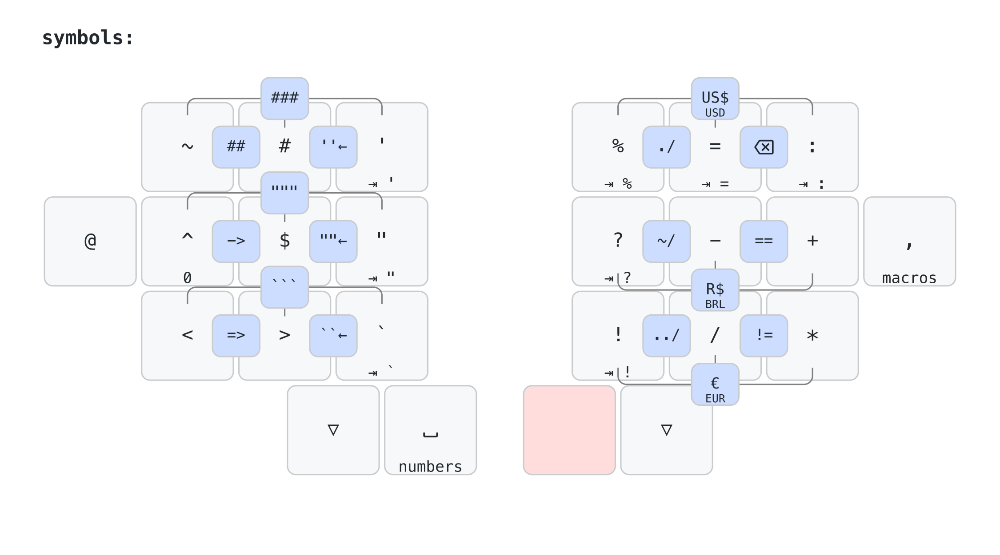

### Moedas

Na camada de *símbolos*, também há combos para digitar os 3 símbolos de moeda mais comuns para mim, `R$`, `US$` e `€`, bem como suas versões nominais, `BRL`, `USD` e `EUR` segurando os mesmos combos.

## Atalhos

### Home Row Mods


[Home Row Mods](https://precondition.github.io/home-row-mods) são bem conhecidos pela maioria dos entusiastas de teclado e também estão disponíveis neste keymap. Sua disposição é: Ctrl, Alt e Shift na linha inicial, e Gui (Command / Windows) na tecla do indicador da linha inferior, espelhada no lado direito.

Para facilitar as combinações de Ctrl, Alt e/ou Shift com Gui, o Gui é replicado para os dedos médio e anelar do lado esquerdo.

#### Camadas de Letras Simplificadas

Para os casos raros em que os Home Row Mods causam problemas, existe um par de camadas de letras chamadas *plain1* e *plain2* que não possuem home row mods ou quaisquer outros comportamentos de hold-tap. Essas camadas também são usadas para trazer uma camada de letras sobre a camada *mehs*, para inserir texto enquanto esta camada está fixa.

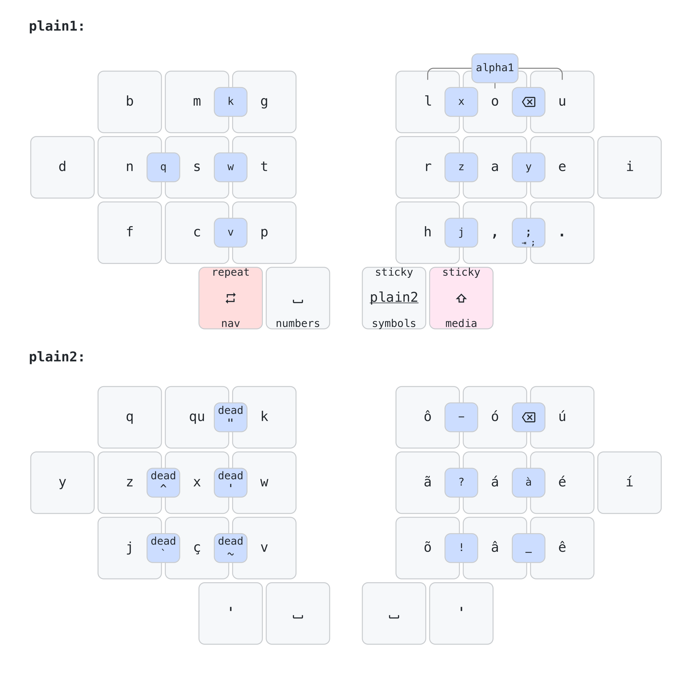

### Meh e Hyper

Meh e Hyper são modificadores especiais, acionados pela combinação de três ou quatro deles: Meh = Ctrl + Alt + Shift e Hyper: Meh + Gui (Command / Windows).

Meh pode ser acionado segurando os 3 mods na linha inicial, enquanto segurar as 3 teclas equivalentes na linha inferior acionará o Hyper.

Os atalhos Meh e Hyper são mapeados em software para tornar as ações personalizadas mais fáceis de acionar e memorizar.

Em alguns casos, muitos usos consecutivos de atalhos Mehs e Hyper são necessários e, por esse motivo, existe uma camada *mehs* que também pode ser ativada.

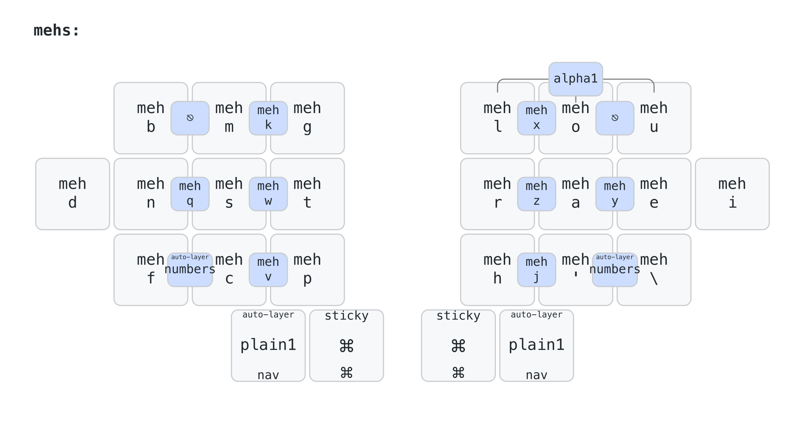

Nesta camada, ou enquanto segura *meh* na camada base, acessar a versão Hyper do atalho é tão simples quanto segurar uma tecla de polegar antes de pressioná-la.


### Atalhos de Aplicativos Comuns

Segurar qualquer uma das teclas mindinhas ativará a camada de *atalhos*, que dá acesso a atalhos comuns como abrir o explorador de arquivos, tirar uma captura de tela e gerenciar o zoom e as abas em um navegador.

Também permitirá que algumas camadas sejam ativadas permanentemente, como as camadas de *números*, *navegação* e *mídia*.


### Combos de Atalhos Comuns

Atalhos comuns também podem ser ativados usando combos, na maioria das camadas. Esses combos são projetados para serem fáceis de acionar e difíceis de disparar acidentalmente.

Eles permitem ações como copiar, colar, selecionar tudo, enter, tab, entre outras.

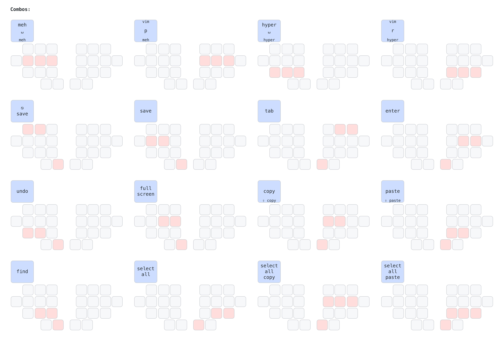

### Leader Key

A *Leader Key* está disponível através de um módulo externo, [zmk-leader-key](https://github.com/urob/zmk-leader-key), e permite que macros sejam acionadas através de uma sequência de toques de tecla.

A *Leader Key* é colocada no dedo indicador da linha inferior na camada de *atalhos*, ao lado da tecla que digita *vírgula* na camada base.

Segurar a *vírgula* também dará acesso às camadas de *atalhos*, tornando mais fácil ativar a *Leader Key*, com um bigrama in-roll. E como a *vírgula* é quase sempre seguida por *espaço*, essa ação de segurar pode ser o comportamento preferido, o que significa que a ação de segurar é mais fácil de acionar do que a ação de pressionar, tornando esse roll ainda mais fácil.

A tecla que contém *espaço*, na camada de *atalhos*, digitará *vírgula + espaço*, para mitigar eventuais disparos acidentais da ação de segurar quando um toque é desejado.

### Atalhos de Navegação

Existem três atalhos de navegação especiais, disponíveis na camada de *navegação* para me permitir usar as teclas de seta junto com eles.

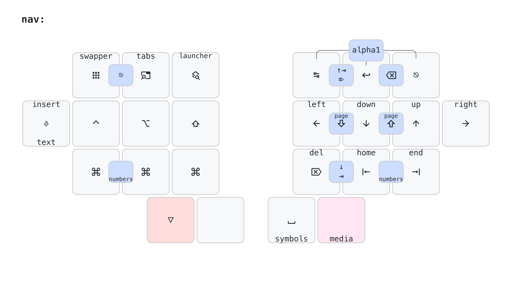

O primeiro é geralmente conhecido como swapper e permite alternar entre os aplicativos em execução. A implementação real depende do sistema operacional. Por exemplo, no MacOS, eu uso a função *Switch to Windows* do Raycast para implementar essa funcionalidade.

O segundo atalho de navegação me permite abrir um novo aplicativo pesquisando seu nome. Eu também uso o Raycast para implementá-lo no MacOS.

O terceiro atalho de navegação depende do contexto do aplicativo em execução. Ele listará os arquivos ou abas abertos no momento e me permitirá pesquisar e alternar entre eles. É implementado para aplicativos como Microsoft Edge, VS Code, IntelliJ e Obsidian.

### Redirecionamento de Atalhos

Sempre que possível, uso os atalhos padrão em meus teclados, mas em alguns casos, é necessário enviar um atalho diferente para o host, interceptá-lo com algum software e redirecioná-lo usando um atalho diferente para o aplicativo de destino.

No MacOS, eu uso uma combinação de [Hammerspoon](https://www.hammerspoon.org/) e [Better Touch Tool](https://folivora.ai/) para interceptar os atalhos enviados pelos meus teclados para o host. Linux e Windows são menos usados, então eu apenas mapeio alguns atalhos lá.

## Navegação

As teclas de seta estão disponíveis nas 4 teclas da linha inicial do lado direito, na camada de *navegação*, em um estilo VIM. Del, Home, End e Tab complementam o lado direito desta camada.


No lado esquerdo, existem teclas modificadoras, a tecla Insert raramente útil e os *atalhos de navegação* mencionados anteriormente.

A camada de *navegação* também pode ser ativada permanentemente usando a camada de *atalhos*.

#### Combos de Navegação

Todos os atalhos de navegação podem ser ativados de qualquer camada usando a mesma tecla combinada com a tecla do polegar direito.


### Gerenciamento de Janelas

O gerenciamento de janelas é realizado usando uma combinação de modificadores e teclas de navegação, portanto, não há necessidade de atalhos personalizados. A combinação de modificadores foi selecionada com base em quão fáceis eles se tornam para ativar, e às vezes segurar mais de uma tecla modificadora é realmente mais fácil do que segurar uma única.

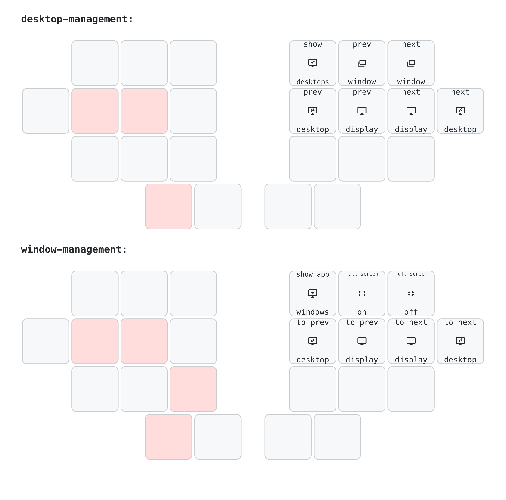

### Navegação de Texto

A navegação de texto é um fluxo de trabalho extremamente importante. Navegar entre palavras, selecionar uma palavra ou linha inteira e ter uma maneira consistente de fazer isso em qualquer sistema operacional é fundamental. Por esse motivo, existe uma camada dedicada para isso. Segurar a tecla mindinha enquanto na camada de Navegação a ativará e enviará o atalho apropriado para a ação desejada.

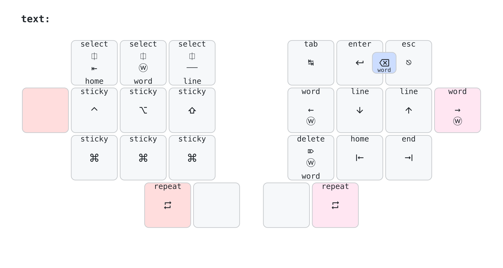

#### Modificadores Aderentes

Os mesmos modificadores disponíveis na camada de *navegação* também estão disponíveis na camada de *texto*, mas em sua versão *aderentes*. Eles também funcionam como modificadores padrão se forem segurados.

### Emulação de Mouse

No lado esquerdo da camada de *mídia*, posso controlar o movimento do mouse, a rolagem e os cliques.

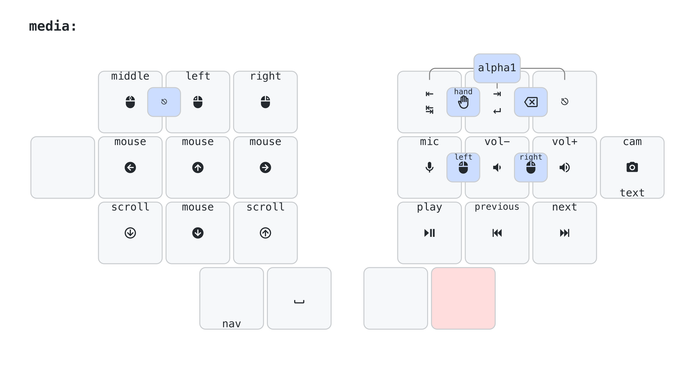

#### Combos de Emulação de Mouse

Todos os atalhos de emulação de mouse podem ser ativados de qualquer camada usando a mesma tecla combinada com a tecla do polegar esquerdo.


### Controles de Mídia

No lado direito da camada de *mídia*, tenho meus controles de mídia, que incluem atalhos personalizados para alternar meu microfone e câmera durante as chamadas e também para levantar a mão. Esses atalhos são mapeados em software para o Google Meet e o Microsoft Teams, usando o [Better Touch Tool](https://folivora.ai/).

## Programação

Embora eu não seja mais um desenvolvedor de software, passei mais de 20 anos da minha vida programando e ainda escrevo algum código eventualmente, então ter meu teclado otimizado para isso também era um dos meus objetivos.


### Colchetes

No lado esquerdo da minha camada de *números*, tenho parênteses, colchetes e chaves, e há muitas otimizações sobre como eles podem ser usados:
- Segurar qualquer um deles o anexará à linha atual.
- Um combo de chaves de abertura e fechamento anexará a de abertura e adicionará uma nova linha, que é usada para adicionar um novo bloco de código.
- Um combo de parênteses ou colchetes de abertura e fechamento adicionará ambos os símbolos em ordem.
- Segurar o combo para parênteses de abertura e fechamento anexará ambos os símbolos à linha atual.
- Um combo com os dedos indicador, médio e anelar na linha inicial do lado direito anexará parênteses de abertura e fechamento à linha atual e adicionará uma nova linha.

### Ponto e vírgula

O ponto e vírgula é extremamente importante em linguagens do tipo C e está disponível como um combo primário na camada base, apertando vírgula e ponto ao mesmo tempo.

Segurar essas duas teclas o anexará à linha atual, o que também funciona na camada de *números*. Também na camada de *números*, um combo com as 3 teclas da linha inferior do lado direito anexará um ponto e vírgula e adicionará uma nova linha.

### Operadores Condicionais

No lado esquerdo da camada de *números* estão os dois símbolos usados para operadores condicionais, `&` e `|`. Combinar as teclas que os digitam com a tecla vizinha adicionará um par desses símbolos. Segurar o combo anexará o par à linha atual.

### Strings e Setas


As aspas estão disponíveis no lado esquerdo da camada de *símbolos*, e há combos para digitar um par delas, movendo o cursor para o meio. Há também um combo para `"""`, usado para delimitar blocos de texto em Java.

Operadores condicionais também são colocados nesta camada, bem como combos para digitar `->` e `=>`, usados em expressões lambda em Java e C#, respectivamente.

### Markdown

Símbolos usados na notação markdown, como `#`, `##`, `###` e ` ``` `, também estão presentes na camada de *símbolos*.

Sequências de líder são usadas para complementar, digitando símbolos como `- [ ] ` e `[[]]`, comumente usados em notas do Obsidian.

### Teclas de Função


As teclas de função são comumente usadas para depuração e estão disponíveis em uma camada dedicada, mas como a maioria dos atalhos do IDE será mapeada para atalhos Meh e Hyper, as teclas de função raramente são necessárias.

#### Modificadores Persintentes da Direita

A camada *func* também terá versões do *lado direito* dos modificadores, em sua variante aderente caso sejam eventualmente necessários.

### VIM

Eu uso o VIM desde 2017 e é um plugin essencial para todos os meus editores de texto. Eu não uso recursos avançados, no entanto, e pude remapear facilmente meus atalhos de teclado para funcionar bem com meu layout personalizado.

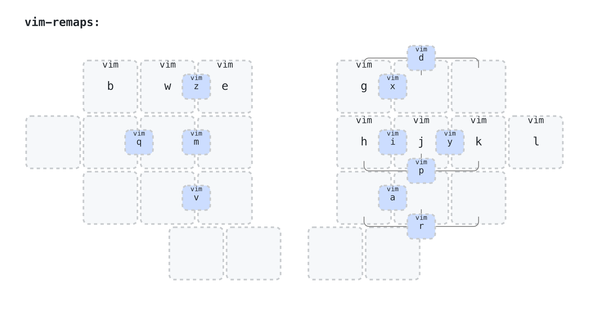

Eu também faço uso de combos da camada base para acionar alguns atalhos de teclado mais facilmente, como `y`, `p`, `x` e `d`, bem como `r`, `i` e `a`, que não seriam tão fáceis de outra forma, devido a como meu layout e remapeamentos os posicionam.

Na minha camada de *números*, também tenho alguns combos para facilitar a movimentação entre linhas e colunas sem mudar de camada.


Na camada de *símbolos*, muitos símbolos foram posicionados considerando como são usados no VIM. Veja o `^` e `$` como exemplo. Eles estão posicionados lado a lado, e segurar ou pressionar duas vezes em `^` na verdade digitará `0`, para permitir uma transição fácil entre as duas opções de `início de linha`.


E, finalmente, existem algumas macros definidas especificamente para o VIM na minha camada *inteligente*, também fáceis de acionar usando apenas a mão direita.


### Navegação de Diretório

Na camada de *símbolos*, também existem algumas macros usadas para navegar em diretórios em um shell de terminal, como `~/`, `./` e `../`.

### Java

Java é minha principal linguagem de programação hoje, e a maioria das minhas camadas de *símbolos* e *números* foi projetada com Java em mente, além de combos para digitar `==`, `!=`, `->` e `::`, por exemplo.


### IntelliJ IDEA

Meus atalhos mais usados no IntelliJ IDEA foram remapeados para usar também os atalhos Meh e Hyper.

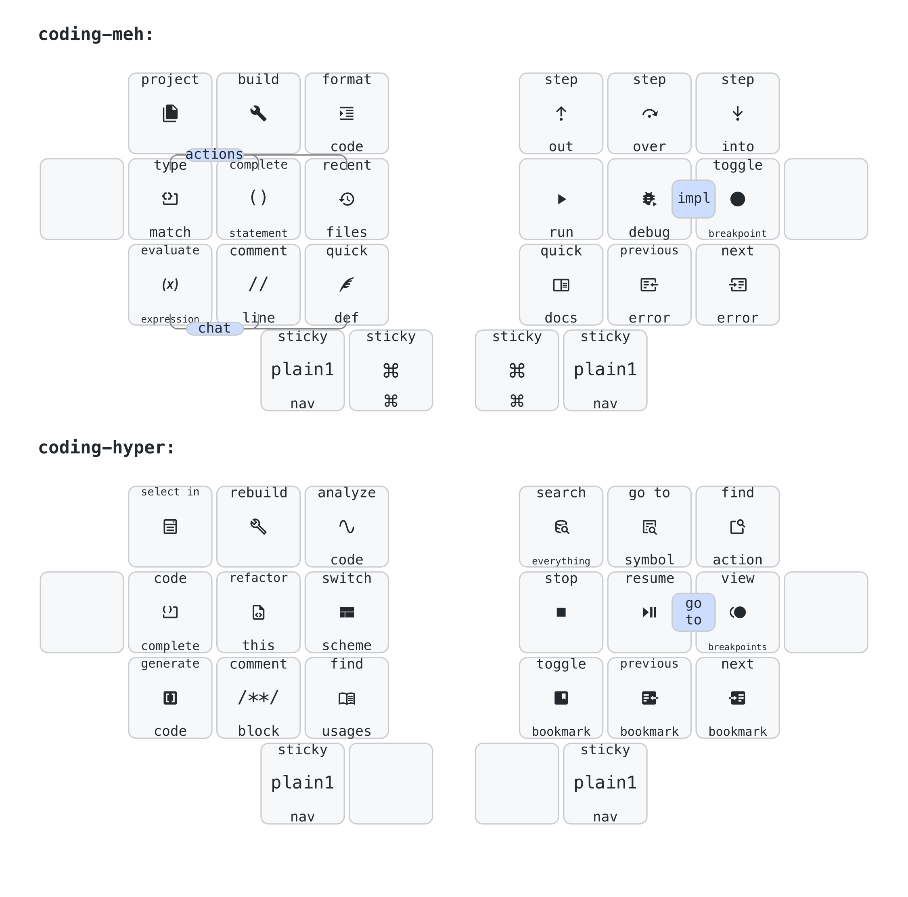

### Casos Inteligentes

Casos Inteligentes são modos de digitação especiais onde o `espaço` é substituído por `-` ou `_`, por exemplo, para digitar coisas como nomes de métodos, nomes de variáveis, nomes de constantes e assim por diante, suportando os casos mais comuns, como CONSTANT_CASE, kebab-case, camelCase, PascalCase e slash/case.

Os Casos Inteligentes estão disponíveis através da camada *inteligente* e podem ser ativados segurando a tecla do polegar direito e a tecla mindinha direita e apertando na tecla equivalente do lado esquerdo. Ele foi projetado para ser rápido de ativar.

Quando um Caso Inteligente é ativado, pressionar espaço duas vezes seguidas o desativará, e o segundo espaço será ignorado.


# Geral

## Modo Pânico

Um combo com as 3 teclas da linha superior do lado direito pode ser usado a qualquer momento para retornar à camada base.

## Bluetooth

Os controles de Bluetooth estão disponíveis na camada de funções e permitem alternar entre perfis, retornar ao primeiro e limpar o atual.


## Bootloader

A maioria das minhas placas tem um botão de reset físico de fácil acesso, mas nem todas. E mesmo para aquelas, às vezes será mais fácil usar um atalho para colocar a placa em modo bootloader para atualizar seu keymap (algo que faço algumas vezes por semana).

Este atalho do bootloader deve estar disponível independentemente em ambas as metades da placa e não deve ser fácil de acionar por acidente, então eu os coloquei em um segundo polegar de uma camada que é ativada segurando o outro polegar e a tecla mindinha do mesmo lado. Essas camadas são as camadas *func* e *smart*.

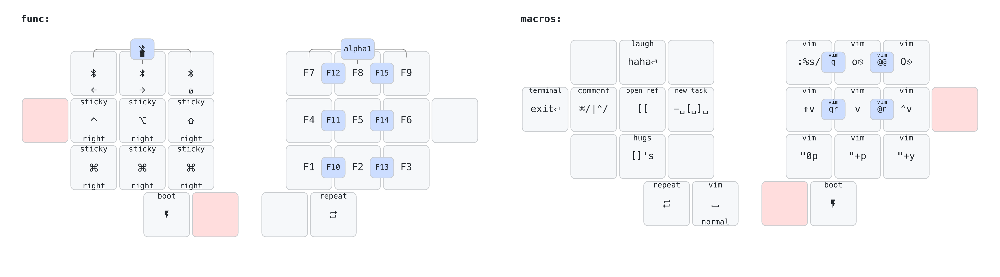

## Sistema Operacional

Todos os atalhos e macros neste keymap são cientes do sistema operacional, mas uma versão diferente do firmware deve ser compilada para MACOS e LINUX. A versão LINUX também pode ser usada para ANDROID e WINDOWS.
