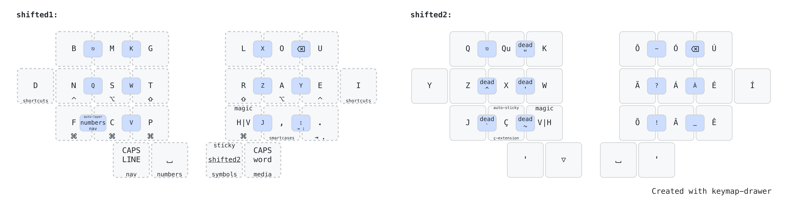
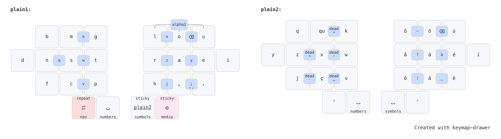
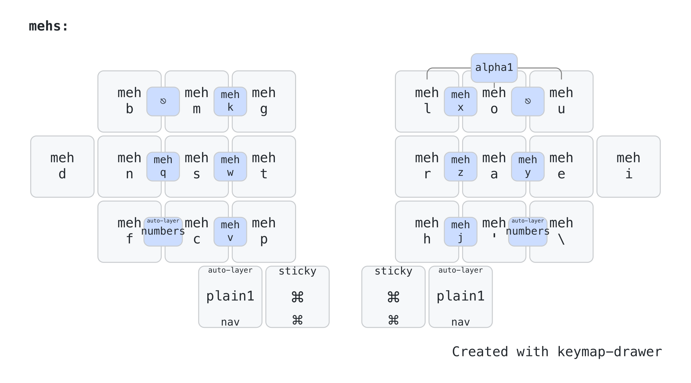
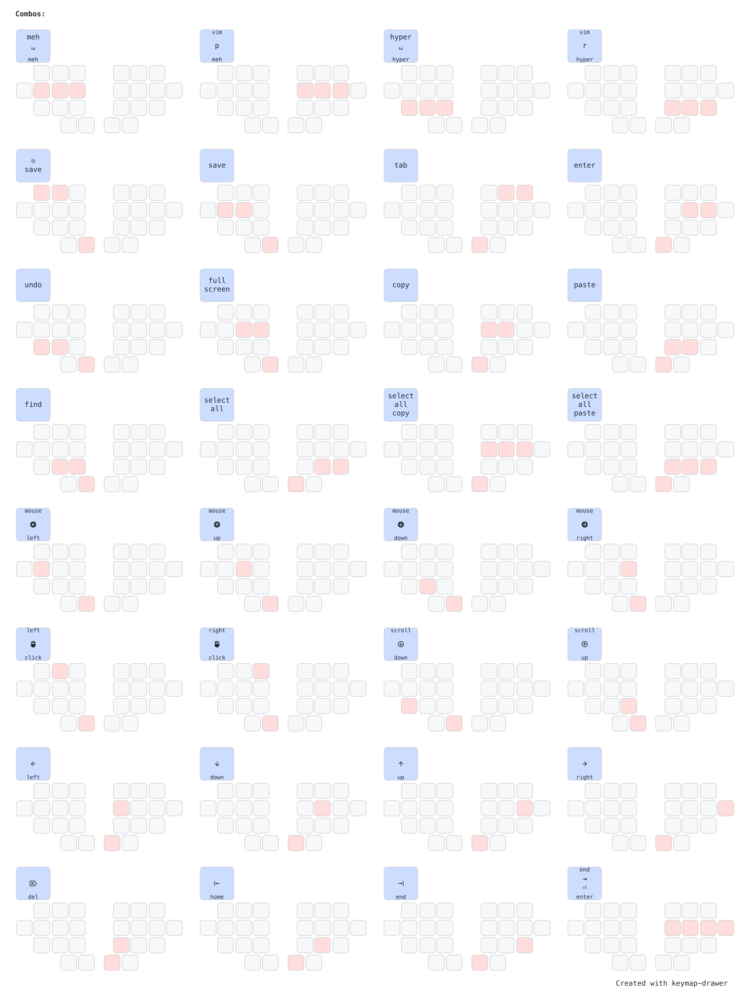
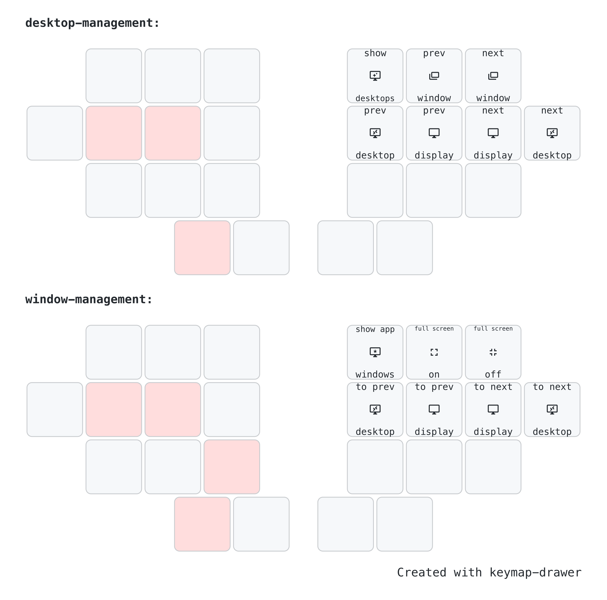
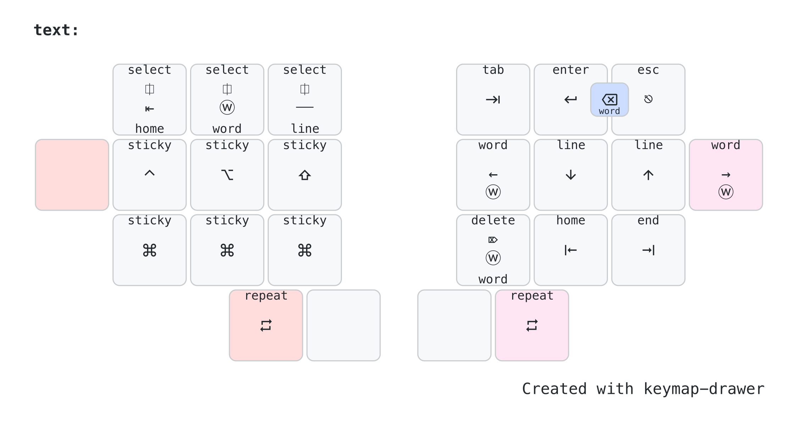

## Introduction

This keymap is a result of a few years of iteractive improvements, targeting what is best for my workflows. And as such, it probably won't be a good fit for most people. Feel free to get inspiration from it anyway.

In the sections below, you can see my most common workflows and how this keymap is used for them.

## Directives

The following directives drove my choices when defining how this keymap should look like:

#### Ergonomic, Split, Columnar Stagger

This keymap is designed for ergonomic keyboards. It means, split, wireless or not, and columnar stagger, with at least 4 columns and 3 rows, plus 2 thumb keys on each side. It is also implemented on top of ZMK, using features like home row mods, sticky shift on a thumb key, caps word, macros, adaptive keys, and plenty of layers and combos.

#### No lateral movements or uncomfortable stretches

The main objective of this keymap, and the keyboards that I've built to use with it, is the comfort when typing. Lateral movements with the pinky or index fingers are not comfortable to me, as well as using the pinky finger to reach keys in the top or bottom rows. As a result, such keys were removed and the keyboards, layout and keymap evolved to have only 24 keys, in the format 1333+2.

#### Trackball in the left hand, heavy load in the right hand

Although I'm not a left-handed person, I got used to drive a Kensington Expert Mouse (actually a trackball) with my left hand, so I got my right hand free for most of the time, to take notes, drink some coffee or perform common actions, like copy and paste, using only the right side of the keyboard.

#### English, but also Portuguese, plus VIM and Spreadsheets

I type in English for at least a few hours per day, but Brazilian Portuguese is my home language, so I had to find, or design, an alpha layout that would work well for both languages. I also use VIM in all my editors (VSCode, Windsurf, IntelliJ and Obsidian), so it also has a huge influence in this keymap. I don't code very often today, but I write some Java code eventually, so good bindings for IntelliJ is also important. And finally, spreadsheets should be easy to use, since I had to work with them for a big portion of my week.

## Typing

Typing is obviously the most basic function of any keyboard, and there should be no surprises here, but given the directives above, it is not so simple. This keymap uses the Magic Romak layout, which uses two alpha layers. Other features like adaptive and repeat keys, sticky shift, caps word and sentence case will make the typing experience with this keymap pretty unique.

### Two Alpha Layers

The concept of two alpha layers for typing got famous with [Ben Vallack](https://www.youtube.com/watch?v=dg2TT1OJlQs&list=PLCZYyvXAdQpsEWfa6OEBOhHn48SWgneoD) videos, which show the concept as an alternative for typing with tiny boards, in his case, 16 keys only.

This approach is based on the idea of using a sticky layer to get access to alphas that are least common, like q, z and j, for example. The alpha layout is divided into two layers and when tapping a home thumb key in the base layer, the secondary alpha layer is activated for one shot, which means the keyboard will return to the base layer automatically after the next key is released.

The alternative to this approach is using combos for these uncommon letters, but it only works when you have just a few of them and it is far less fluid, which may break the typing flow or cause other problems like unintended triggers.

In practice, using a sticky layer is not much different than using a dead key. With a dead key, pretty common in Portuguese, we type `'` and then `a` to get `á`, for example. With two alpha layers, I can have a macro that produces `á` in the secondary alpha layer, so that to get `á`, I also have to tap just two keys, the first one would be the home thumb key that activates the secondary alpha layer, and the second one could be the same key used to type `a`. This familiarity with dead keys made the transition to two alpha layers pretty easy for me.

### Alpha Combos

All alphas moved to the secondary alpha layer are also available as combos in the base layer, but they are not usually used for typing, but for commands instead, like VIM bindings for example.

### Magic Romak

[Romak](https://github.com/rafaelromao/romak) is an alpha layout designed from scratch to be easy to use for both English and Portuguese, aiming to minimize the use of the inner index columns and pinky keys. As a result, it became easy to port it to 24 keys, using two alpha layers. As a further enhancement, adaptive keys where used to make V and H easier to type in both languages, since V is more common in Portuguese while H is more common in English. The end result is [Magic Romak](https://github.com/rafaelromao/romak/blob/main/MagicRomak.md).

#### Adaptive Keys

Adaptive Keys send different outputs depending on the previous typed keycode. For example, if the last keycode is a vowel, it outputs V, but if the last keycode is a consonant, it outputs H.

The example above is exactly what the main Magic Key does in Magic Romak. This key replaces the H key in regular Romak, and makes it easier to type most words containing V or H, since V is predominant after vowels while H is predominant after consonants.

In Magic Romak, there is also Reversed Magic Key, which does the oposite, H after vowels and V after consonants. This key replaces the V key in regular Romak.

These Adaptive Keys are implemented using the [zmk-adaptive-key](https://github.com/urob/zmk-adaptive-key) module, and can be found in some other places in this keymap, to implement other smart behahiors, like the Alternate Repeat Key.

#### Repeat Keys

Repeat Key is [available in ZMK](https://zmk.dev/docs/keymaps/behaviors/key-repeat) as a behavior that repeats the last typed key or shortcut. It is super helpful to avoid [SFBs](https://semilin.github.io/blog/2023/layout_quality.html#h:e46323dd-62d8-4361-a0f9-039b31efe7aa) when typing words that contain repeated keys. But it can be made even more powerful if implemented as an adaptive key that will repeat the last key or shortcut by default, but produce another output when repeating the last one does not make sense. Example, if tapped after `I`, the repeat key will produce `'` instead. To see more about the Adaptive Repeat Key in this keymap, check the [Magic Romak](https://github.com/rafaelromao/romak/blob/main/MagicRomak.md) page. 

#### Ç-Extensions

Cedila `Ç` is pretty common in Portuguese, but always comes before a vowel, usually `ã` or `õ`. Both are available as macros in the secondary alpha layer, as well as `ç`, so normally it would require two consecutive activations of the secondary alpha layer to type `çã` or `çõ`.
i
To avoid that, a third alpha layer, containing macros for these two accented vowels, is automatically activated for one shot after `ç`. This is what I call the *Ç-Extension* layer. The keys for all other vowels are transparent in this layer, so it is still possible to type words like `açude` without any problem. For words like `açúcar`, on the other hand, a secondary activation of the secondary alpha layer would still be required though.

It is also quite common to have it followed by either `ão` or `ões`, so macros can be used to type these two sentences easier as ç extentions.

### Sticky Shift

*Sticky Shift*, also known as One Shot Shift, is a shift key that is activated tapping, instead of holding. It works like a dead key, we tap it and the next key we tap will be capitalized. It is much fluid and fast than holding shift down.

In this keymap, the Sticky Shift is present in a thumb key, in the right side of the board.

#### Shifted layers

Due to a limitation of ZMK, a *sticky layer* does not work well in conjunction with a *sticky shift*, so I had to use a layer to bypass this limitation. For capitalizing the *alpha1* layer, the regular *sticky shift* is used, but for capitalizing the *alpha2* layer, I used a separate layer where all alphas are alreay capitalized. This was also necessary to implement some other captalization behaviors, like CAPS word and CAPS LINE.

### CAPS word and CAPS LINE

*CAPS word* is a behavior that works like traditional Caps Lock, but it will be automatically deactivated when the current word ends. It can be activated double tapping the Sticky Shift key or through the Smart Layer.

*CAPS LINE* is between *CAPS word* and the traditional Caps Lock, since it will also be automatically deactivated but only when the current line ends, usually with the Return key.

### Punctuation

`.` and `,` are available in the base layer, while `?`, `!` and `:` are easily reachable in the *symbols* layer, accessed only with the right hand. `;` is available in a combo of `,` and `.`.
There also combos in the secondary alpha layer for `_`, `?`, `!`, `-` too. Brakets are available in the *numbers* layer. More on that later.

### Sentence Case

*Sentence Case* is a feature that automatically capitalize the next word after `space` in case it is preceeded by `.`, `?` or `!`. In case the *Sticky Shift* is tapped after this `space`, it will be ignored. This feature makes it much easier to start new sentences and reduce a lot the use of the *Sticky Shift* key. This feature is implemented using adaptive keys to trigger it and a layer to execute the capitalization.

## Numbers

The *numbers* layer contains not only numbers but also some symbols commonly used along with numbers.

### NumPad

Numbers are arranged as a classic numpad, with 0 in the thumb. It might not be the optimal configuration, considering what numbers are the most frequent, but allows me to use my 20+ years of muscle memory.

The *numbers* layer can be toggled on permanently using the *shortcuts* layer.

### NumWord

NumWord, a.k.a. *auto-layer numbers*, is a smart behavior that allows me to type a sequence of numbers and automatically return to the base layer after pressing a word breaking key, like space or enter.

It is triggered using a combo in the base layer, so it is quite fast to activate. 

### Brackets

Brackets are commonly used for two different workflows, working with numbers and programming. Placing them in the left side of the *numbers* layer makes it easier to work with spreadsheets.

### Math Operators

Math Operators must be easily accessible from the *numbers* layer, and I find it particularly helpful if I can do it using only my right hand, so I put them in the right side of my *symbols* layer.

## Shortcuts

### Home Row Mods

[Home Row Mods](https://precondition.github.io/home-row-mods) are well know by most keyboard enthusiants and are also available in this keymap. Their disposition is: Ctrl, Alt and Shift in the home row, and Gui (Command / Windows) in the bottom row index key, mirrored in the right side.

To make combinations of Ctrl, Alt and/or Shift with Gui easier, Gui is replicated for the middle and ring  fingers in the left side.

#### Plain Layers

For the rare cases when Home Row Mods cause problems, there is a pair of alpha layers called *plain1* and *plain2* that does not have home row mods or any other tap-hold behaviors. This layers are also used for bringing and alpha layer on top of the *mehs* layer, for inputing text while this layer is fixed.

### Meh and Hyper

Meh and Hyper are special modidifers, triggered by the combination of three or four of them: Meh = Ctrl + Alt + Shift, and Hyper : Meh + Gui (Command / Windows).

Meh can be triggered holding the 3 mods in the home row, while holding the 3 equivalent keys in the bottom row will trigger Hyper.

Meh and Hyper shortcuts are mapped in software to make custom actions easier to trigger and memorize.

In some cases, a lot of consecutive uses of Mehs and Hyper shortcuts are necessary, and for this reason there is a *mehs* layer that can be toggled on as well. 

In this layer, or while holding *meh* in the base layer, accessing the Hyper version of the shortcut is as simple as holding a thumb key before pressing it.

### Common Apps Shortcuts

Holding any of the pinky keys will activate the *shortcuts* layer, which gives access to common shortcuts like open the file explorer, take a screenshot, manage zoom and tabs in a browser.

It will also allow some layers to be toggled on permanently, like the *numbers*, *nav* and *media* layers.

### Common Shortcuts Combos

Common shortcuts can also be activated using combos, in most layers. These combos are designed to be easy to trigger and hard to misfire.

They allow actions like, copy, paste, select all, enter, tab and navigation keys, among others.

### Leader Key

*Leader Key* is available through an external module, [zmk-leader-key](https://github.com/urob/zmk-leader-key) and allow macros to be triggered through a sequence of key strokes.

The *Leader Key* is placed in the bottom row index finger in the *shortcuts* layer, beside the key that types *comma* in the base layer. 

Holding *comma* will also give access to the *shortcuts* layers, making it easier to activate the *Leader Key*, with an inroll bigram. And since *comma* is almost always followed by *space*, this hold action can be the preferred behavior, which means that the hold action is easier to trigger than the tap action, making this roll even easier. 

The key that contains *space*, in the *shortcuts* layer, will type *comma + space*, to migitate eventual missfire of the hold action when a tap is desired.

### Navigation Shortcuts

There are three special navigation shortcuts, available in the *nav* layer to allow me to use the arrow keys along with them.

The first one is usually known as swapper, and allows switching between the current running apps. The actual implementation depends on the Operating System. For example, in MacOS, I use Raycast's *Switch to Windows* function to implement this functionality.

The second navigation shortcut allows me to open a new app by searching for its name. I also use Raycast to implement it in MacOS.

The third navigation shortcut depends on the context of the currently running app. It will list the currently open files or tabs and allow me to search and switch between them. It is implemented for apps like Microsoft Edge, VS Code, IntelliJ and Obsidian.

### Shortcut Redirection

Whenever possible, I use the standart shortcuts in my keyboards, but in some cases it is necessary to send a different shortcut to the host, intercept it with some software and redirect in using a different shortcut to the target app.

In MacOS, I use a combination of [Hammerspoon](https://www.hammerspoon.org/) and [Better Touch Tool](https://folivora.ai/) to intercept the shortcuts sent by my keyboards to the host. Linux and Windows are less used, so I only map a few shortcuts there.

## Navigation

Arrow keys are available in the 4 home row keys in the right side, in the *navigation* layer, in a VIM style. Del, Home, End and Tab complement the right side of this layer.

On the left side, there are modifier keys, the rarely usefull Insert key, and the *navigation shortcuts* mentioned before.

The *navigation* layer can also be toggled on permanently using the *shortcuts* layer.

### Window Management

Window Management in performed using a combination of modifiers and navigation keys, so there is no need for custom shortcut bindings. The combination of modifiers was selected based on how easy they become to activate, and sometimes holding more than one modifier key is actually easier than holding a single one.

### Text Navigation

Text Navigation in an extremely important workflow. Navigating between words, selecting a whole word or line and having a consistent way to do it in any OS is key. For that reason, there is a dedicated layer for that. Holding the pinky key while on the Navigation layer will activate it and send the appropriate shortcut for the desired action.

#### Sticky Mods

The same modifiers available in the *navigation* layer are also available in the *text* layer, but in their *sticky* version. They also work as standard modifiers if held.

### Mouse Emulation

On the left side of the *media* layer, I can control the mouse movement, scroll and clicks.

### Media Controls

On the right side of the *media* layer, I have my media controls, which includes custom shortcuts to toggle my Microfone and Camera during calls and also to Raise My Hand. These shortcuts are mapped in software to both Google Meet and Microsoft Teams, using [Better Touch Tool](https://folivora.ai/).

## Programming

Although I'm not a software developer anymore, I spend 20+ years of my life programming, and I still do some coding eventually, so having my keyboard optimized for that was also one of my goals.

### Brackets

If the left side of my *numbers* layer, I have parenthesis, square brackets and curly braces, and there are many optimization on how they can be used:
- Holding any of them will append it to the current line.
- A combo of open and close curly braces will append the opening one and add a new row, which is used to add a new block of code.
- A combo of open and close parenthesis or brackets will add both symbols in order.
- Holding the combo for open and close parenthesis will append both symbols to the current line.
- A combo with the index, middle and ring fingers in the home row of the right side will append open and close parenthesis to the current line and add a new line.

### Semicolon

Semicolon is extremely important in C-like languages, and it is available as a primery combo in the base layer, tapping both comma and dot at the same time.

Holding these two keys will append it to the current line, which also works in the *numbers* layer. Also in the *numbers* layer, a combo with the 3 bottom row keys of the right side will append a semicolon and add a new line.

### Conditional Operators

On the left side of the *numbers* layer are the two symbols used for conditional operatiors, `&` and `|`. Comboing the keys that types them with their neighbor key will add a pair of these symbols instead. Holding the combo will append the pair to the current line.

### Strings and Arrows

Quotes are available in the left side of the *symbols* layer, and there are combos for typing a pair of them, moving the cursor to the middle.

Conditional operators are also placed in this layer, and there are combos for typing `->` and `=>`, usually used in lambda expressions, as well as some symbols and commons commonly used in *markdown* notation.

### Function Keys

Function keys are commonly used for debugging, and they are available in a dedicated layer, but since most IDE shortcuts will be mapped to Meh and Hyper shortcuts, function keys are rarely necessary.

#### Sticky Right Mods

The *func* layer will also have *right side* versions of the modifiers, in their sticky variant, in case they are eventually needed.

### VIM

I use VIM since 2017 and it is an essential plugin for all my text editors. I do not use advanced features though, and could easily remap my keybindings to work well with my custom layout.

I also make use of base layer combos to trigger some keybindings easier, like `y`, `p`, `x` and `d`, as well as `r`, `i` and `a`, which would not be so easy otherwise, due to how my layout and remaps place them.

In my *numbers* layer, I also have some combos to make it easier to move between rows and columns without changing layer.

And finally, there are a few macros defined specifically for VIM in my *smart* layer, also easy to trigger using only my right hand.

### Java

Java is may main programming language today and most of my *symbols* and *numbers* layer were designed with Java in mind.

#### Directory Navigation

In this *symbols* layer, there are also some macros used to navigate directories in a terminal shell.

### IntelliJ IDEA

My most used shortcuts in IntelliJ IDEA were remapped to use Meh and Hyper shortcuts too.

### Smart Cases

Smart Cases are special typing modes where the `space` is replaced by `-` or `_`, for example, to type things like method names, variable names, constant names and so on, supporting the most common casings, like CONSTANT_CASE, kebab-case, camelCase, PascalCase and slash/case.

Smart Cases are available through the 

## General

### Panic Mode

A combo with the 3 top row keys in the right side can be used anytime to return to the base layer.

### Bluetooth

Bluetooth controls are available in the functions layer and allow to swap between profiles, return to the first one and clear the current one.

### Bootloader

Most of my boards have an easily accessible physical reset button, but not all of them. And even for those, sometimes it will be easier to use a shortcut to put the board in boatloader mode to updates its keymap (something I do a few times in a week).

This bootloader shortcut must be available independently in both halves of the board and should not be easier to trigger by accident, so I put them in a second thumb of a layer that is activated holding both the other thumb and the pinky key on the same side. Those layers are the *func* and *smart* layers.

### Operating System

All shortcuts and macros in this keymap are Operating System aware, but a different version of the firmware must be built for MACOS and LINUX. The LINUX version can also be used for ANDROID and WINDOWS.

