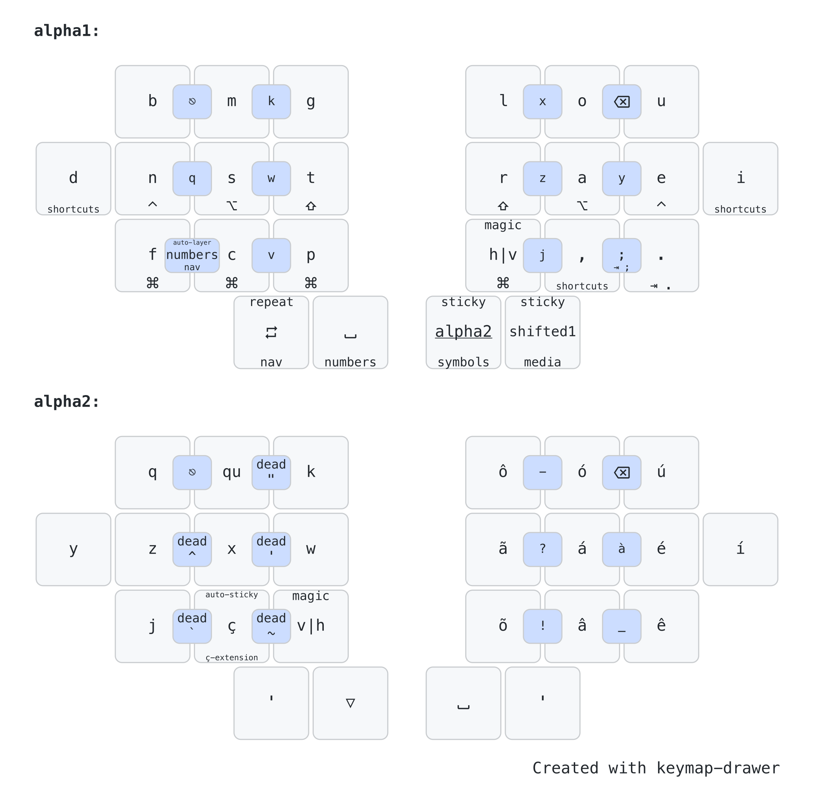

## Introduction

This keymap is a result of a few years of iteractive improvements, targeting what is best for my workflows. And as such, it probably won't be a good fit for most people. Feel free to get inspiration from it anyway.

In the sections below, you can see my most common workflows and how this keymap is used for them.

## Directives

The following directives drove my choices when defining how this keymap should look like:
#### The basics: Ergonomic, Split, Columnar Stagger
This keymap is designed for ergonomic keyboards. It means, split, wireless or not, and columnar stagger, with at least 4 columns and 3 rows, plus 2 thumb keys on each side. It is also implemented on top of ZMK, using features like home row mods, sticky shift on a thumb key, caps word, macros, adaptive keys, and plenty of layers and combos.
#### No lateral movements or uncomfortable stretches
The main objective of this keymap, and the keyboards that I've built to use with it, is the comfort when typing. Lateral movements with the pinky or index fingers are not comfortable to me, as well as using the pinky finger to reach keys in the top or bottom rows. As a result, such keys were removed and the keyboards, layout and keymap evolved to have only 24 keys, in the format 1333+2.
#### Trackball in the left hand, heavy load in the right hand
Although I'm not a left-handed person, I got used to drive a Kensington Expert Mouse (actually a trackball) with my left hand, so I got my right hand free for most of the time, to take notes, drink some coffee or perform common actions, like copy and paste, using only the right side of the keyboard.
#### English, but also Portuguese, plus VIM and Spreadsheets
I type in English for at least a few hours per day, but Brazilian Portuguese is my home language, so I had to find, or design, an alpha layout that would work well for both languages. I also use VIM in all my editors (VSCode, Windsurf, IntelliJ and Obsidian), so it also has a huge influence in this keymap. I don't code very often today, but I write some Java code eventually, so good bindings for IntelliJ is also important. And finally, spreadsheets should be easy to use, since I had to work with them for a big portion of my week.

## Typing

Typing is obviously the most basic function of any keyboard, and there should be no surprises here, but given the directives above, it is not so simple. This keymap uses the Magic Romak layout, which uses two alpha layers. Other features like adaptive and repeat keys, sticky shift, caps word and sentence case will make the typing experience with this keymap pretty unique.

### Two Alpha Layers

The concept of two alpha layers for typing got famous with the [Ben Vallack](https://www.youtube.com/watch?v=dg2TT1OJlQs&list=PLCZYyvXAdQpsEWfa6OEBOhHn48SWgneoD) videos, which shows the concept as an alternative for typing with tiny boards, in his case, 16 keys only.

This approach is based on the idea of using a sticky layer to get access to alphas that are least common, like q, z and j, for example. The alpha layout is divided into two layers and when tapping a home thumb key in the base layer, the secondary alpha layer is activated for one shot, which means the keyboard will return to the base layer automatically after the next key is released.

The alternative to this approach is using combos for these uncommon letters, but it only works when you have just a few of them and it is far less fluid, which may break the typing flow or cause other problems like unintended triggers.

In practice, using a sticky layer is not much different than using a dead key. With a dead key, pretty common in Portuguese, we type `'` and then `a` to get `á`, for example. With two alpha layers, I can have a macro that produces `á` in the secondary alpha layer, so that to get `á`, I also have to tap just two keys, the first one would be the home thumb key that activates the secondary alpha layer, and the second one could be the same key used to type `a`. This familiarity with dead keys made the transition to two alpha layers pretty easy for me.

### Alpha Combos

All alphas moved to the secondary alpha layer are also available as combos in the base layer, but they are not usually used for typing, but for commands instead, like VIM bindings for example.

### Magic Romak

[Romak](https://github.com/rafaelromao/romak) is an alpha layout designed from scratch to be easy to use for both English and Portuguese, aiming to minimize the use of the inner index columns and pinky keys. As a result, it became easy to port it to 24 keys, using two alpha layers. As a further enhancement, adaptive keys where used to make V and H easier to type in both languages, since V is more common in Portuguese while H is more common in English. The end result is [Magic Romak](https://github.com/rafaelromao/romak/blob/main/MagicRomak.md).

#### Adaptive Keys

Adaptive Keys send different outputs depending on the previous typed keycode. For example, if the last keycode is a vowel, it outputs V, but if the last keycode is a consonant, it outputs H.

The example above is exactly what the main Magic Key does in Magic Romak. This key replaces the H key in regular Romak, and makes it easier to type most words containing V or H, since V is predominant after vowels while H is predominant after consonants.

In Magic Romak, there is also Reversed Magic Key, which does the oposite, H after vowels and V after consonants. This key replaces the V key in regular Romak.

These Adaptive Keys are implemented using the [zmk-adaptive-key](https://github.com/urob/zmk-adaptive-key) module, and can be found in some other places in this keymap, to implement other smart behahiors, like the Alternate Repeat Key.

#### Repeat Keys

Repeat Key is [available in ZMK](https://zmk.dev/docs/keymaps/behaviors/key-repeat) as a behavior that repeats the last typed key or shortcut. It is super helpful to avoid [SFBs](https://semilin.github.io/blog/2023/layout_quality.html#h:e46323dd-62d8-4361-a0f9-039b31efe7aa) when typing words that contain repeated keys. But it can be made even more powerful if implemented as an adaptive key that will repeat the last key or shortcut by default, but that will produce another output when repeating the last one dose not make sense. Example, if tapped after `I`, the repeat key will produce `'` instead. To see more about the Adaptive Repeat Key in this keymap, check the [Magic Romak](https://github.com/rafaelromao/romak/blob/main/MagicRomak.md) page. 

#### Ç-Extensions

Cedila `Ç` is pretty common in Portuguese, but always comes before a vowel, usually `ã` or `õ`. Both are available as macros in the secondary alpha layer, as well as `ç`, so normally it would require two consecutive activations of the secondary alpha layer to type `çã` or `çõ`.
i
To avoid that, a third alpha layer, containing macros for these two accented vowels, is automatically activated for one shot after `ç`. This is what I call the *Ç-Extension* layer. The keys for all other vowels are transparent in this layer, so it is still possible to type words like `açude` without any problem. For words like `açúcar`, on the other hand, a secondary activation of the secondary alpha layer would still be required though.

It is also quite common to have it followed by either `ão` or `ões`, so macros can be used to type these two sentences easier as ç extentions.

### Sticky Shift

*Sticky Shift*, also known as One Shot Shift, is a shift key that is activated tapping, instead of holding. It works like a dead key, we tap it and the next key we tap will be capitalized. It is much fluid and fast than holding shift down.

In this keymap, the Sticky Shift is present in a thumb key, in the right side of the board.

### CAPS word and CAPS LINE

*CAPS word* is a behavior that works like traditional Caps Lock, but it will be automatically deactivated when the current word ends. It can be activated double tapping the Sticky Shift key or through the Smart Layer.

*CAPS LINE* is between *CAPS word* and the traditional Caps Lock, since it will also be automatically deactivated but only when the current line ends, usually with the Return key.

### Punctuation

`.` and `,` are available in the base layer, while `?`, `!` and `:` are easily reachable in the *symbols* layer, accessed only with the right hand. `;` is available in a combo of `,` and `.`.
There also combos in the secondary alpha layer for `_`, `?`, `!`, `-` too. Brakets are available in the *numbers* layer. More on that later.

### Sentence Case

*Sentence Case* is a feature that automatically capitalize the next word after `space` in case it is preceeded by `.`, `?` or `!`. In case the *Sticky Shift* is tapped after this `space`, it will be ignored. This feature makes it much easier to start new sentences and reduce a lot the use of the *Sticky Shift* key. This feature is implemented using adaptive keys to trigger it and a layer to execute the capitalization.

### Leader Key

*Leader Key* is available through an external module, [zmk-leader-key](https://github.com/urob/zmk-leader-key) and allow macros to be triggered through a sequence of key strokes. The leader key is available in the *Shortcuts* layer and is used to type sequences of characters that are too frequent and not always easy to type.

## Numbers

The first *Symbol* layer in this keymap is the *numbers* layer, that along with the *symbols* layer 

### NumPad

Numbers are arranged as a classic numpad, with 0 in the thumb. It might not be the optimal configuration, considering what numbers are the most frequent, but allows me to use my 20+ years of muscle memory.

### NumWord

NumWord is a smart behavior that allows me to type a sequence of numbers and automatically return to the base layer after pressing a word breaking key, like space or enter.

It is triggered using a combo in the base layer, so it is quite fast to activate. 

### Brackets

### Math Operators

## Shortcuts

### Modifiers

### Shortcut Combos

### Common Apps

### Meh and Hyper

## Navigation

### Enter, Tab, Esc

### Text Navigation

### App Navigation

### Window Management

## Programming

### VIM

### Java

### Smart Cases

### Markdown

### IntelliJ IDEA

## Modeling

### Fusion 360

