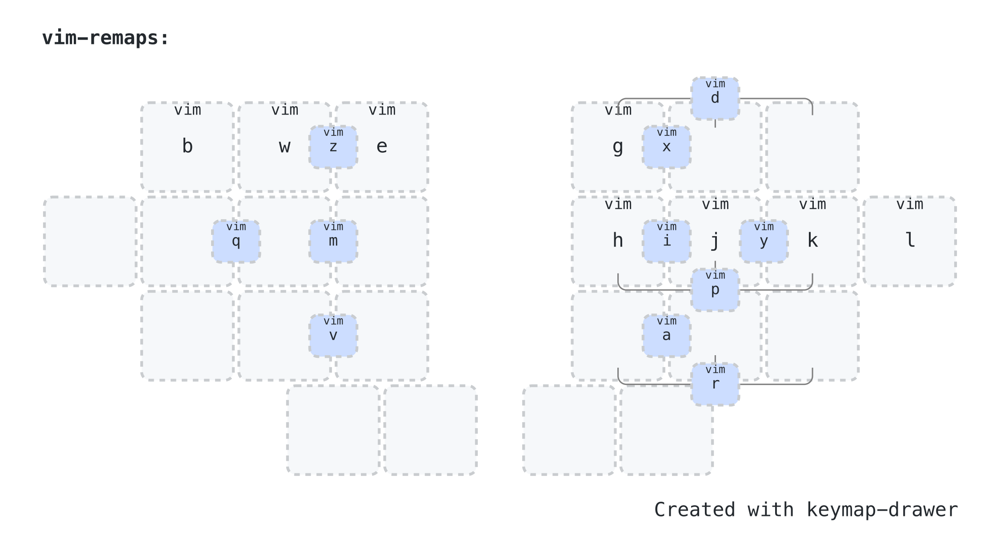

# rafaelromao's keyboard layout


## Navigation and Media
The Navigation and Media layer can be activated holding the outer left and right thumb keys, respectively.

### Navigation
- The Navigation layer gives access to [Standard Modifiers](modifiers.md), Enter, Tab, Insert, Delete, Home, End, Page Up, Page Down and VIM style navigation, as well as Esc and a Save shortcut.
- There are also shortcuts to some common actions in this layer, like searching browser tabs, opening files explorer, calculator or a terminal. This is implemented using Meh keys and software mapping.

### VIM Remaps



- In VIM, navigation with `hjkl` should be remapped to `raei`, to use the fingers in the home position. Some other bindings should be remapped as well:

```vim
noremap A J
noremap E K
noremap I L
noremap L G
noremap G E
noremap M W
noremap W M
noremap K Z
noremap J A
noremap Z I
noremap R H
noremap H R

noremap a j
noremap e k
noremap i l
noremap l g
noremap g e
noremap m w
noremap w m
noremap k z
noremap j a
noremap z i
noremap r h
noremap h r

noremap kk zz
noremap ll gg
```
        
#### One Shot Mods

- One Shot modifiers are available in Navigation the layer.
- Double tapping any of these modifiers will send a double tap instead of activating the one shot behavior. This is useful for some shortcuts like Shift+Shift or Ctrl+Ctrl in IntelliJ, for example.

### Media
- The Media layer gives access to [Standard Modifiers](modifiers.md#standard-modifiers), Media controls, Esc and a Save shortcut.

#### Mouse Keys
- In the left side of the Media layer, there are keys to control the mouse.

#### Fixed Navigation Layer
- A fixed version of the Navigation layer can be toggled on permanently using the Shortcuts layer.
- This clone works the same way as the original Navigation layer, but the outer right thumb key will activate the Media layer instead of the System layer.

### Panic Mode Combo
- All fixable layers have a Panic Mode combo that returns the keyboard to the base layer. This combo is formed by the top three keys in the left side of the keyboard.
