# rafaelromao's keyboard layout

## Romak

Romak is a new keyboard layout, inspired by [Colemak](https://colemak.org) and [BEAKL](https://ieants.cc/beakl), improved to remove load from pinkies and for typing in Portuguese and English, and for coding.

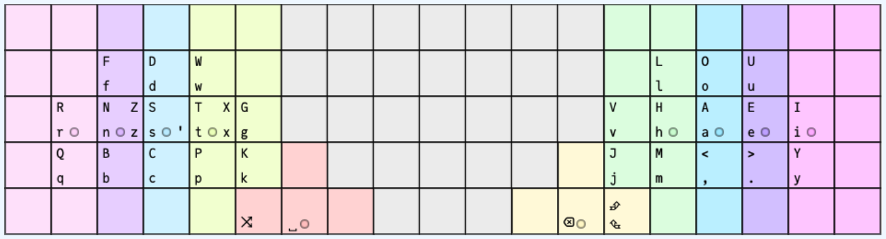

- Romak is the layout used in the base layer of my keyboards.
- The name Romak is a combination of my last name, **Rom**ão, and Dvor**ak**'s name.
- Romak has a higher SFB rate than Colemak, but lower than Workman, and most of this load goes to the stronger fingers.

### From Qwerty to Romak in 6 steps

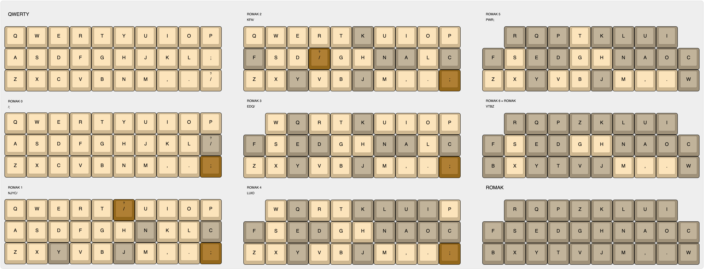

## Romak vs Colemak-DH
[Stevep99's Layout Analyzer Tool](https://stevep99.github.io/keyboard-layout-analyzer) was used to compare Romak with Colemak-DH and some other layouts, using the Magna Carta as text corpus, in [Portuguese](analysis/corpus.pt.txt) and [English](analysis/corpus.en.txt).
### General Performance
#### Portuguese

#### English
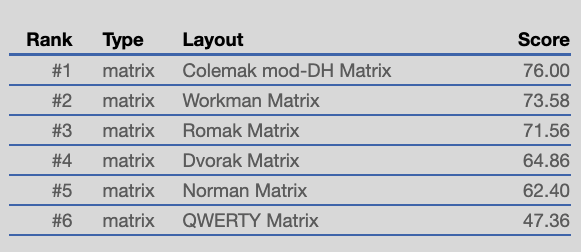

### Heatmaps
#### Portuguese

  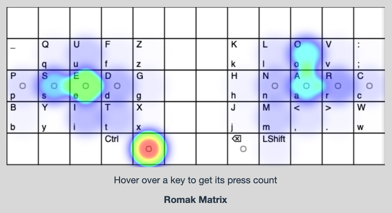
  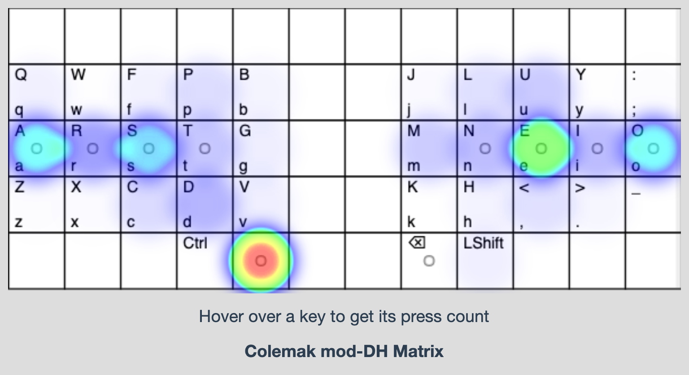 
  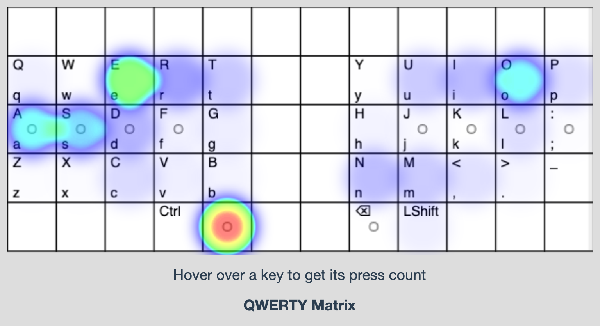 

#### English

  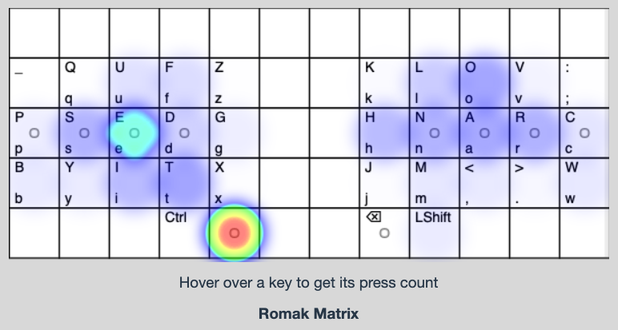
  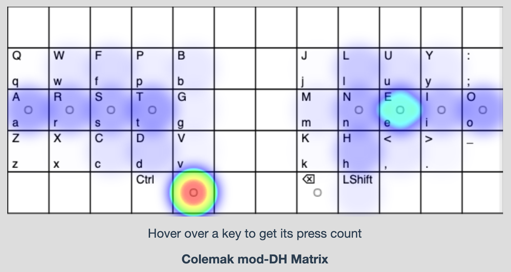 
  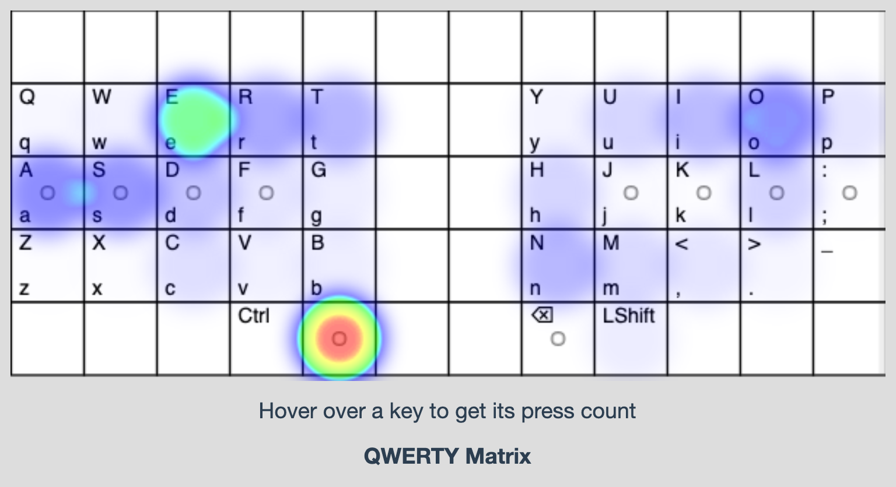 

Romak is more balanced for Portuguese than English, so if English is your primary language, it is recommended to swap two key pairs, HM and DT. This could be called Romak-DH then.

### Finger Usage
Pinkies will get less load in Romak, by design. This load will go to the ring and middle fingers.
#### Portuguese
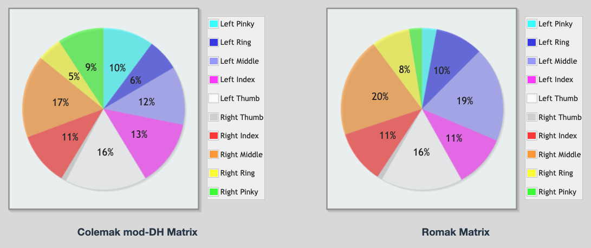
#### English
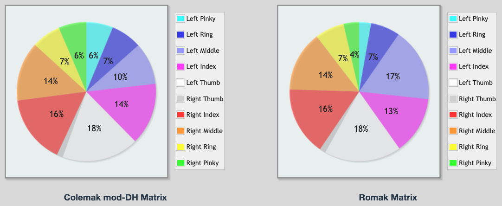

### Detailed Finger Analysis
The [Colemak mod-DH analysis tool](https://colemakmods.github.io/mod-dh/analyze.html) was also used to compare Romak against Colemak-DH and Workman (English text corpus only).

  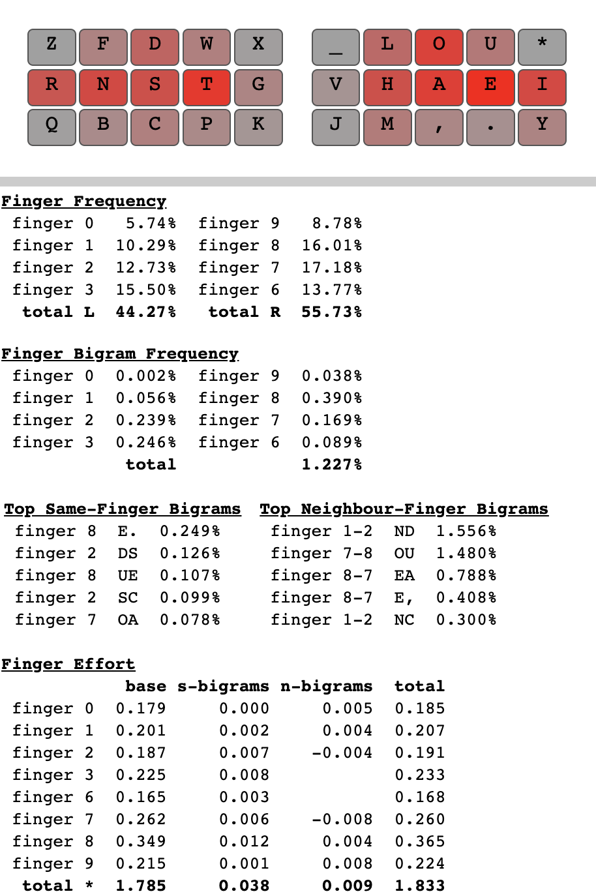
  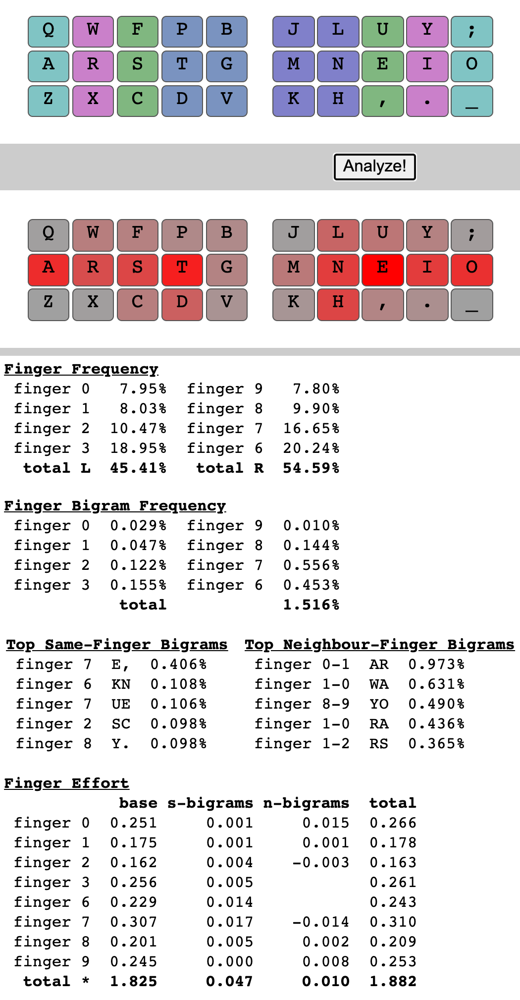
  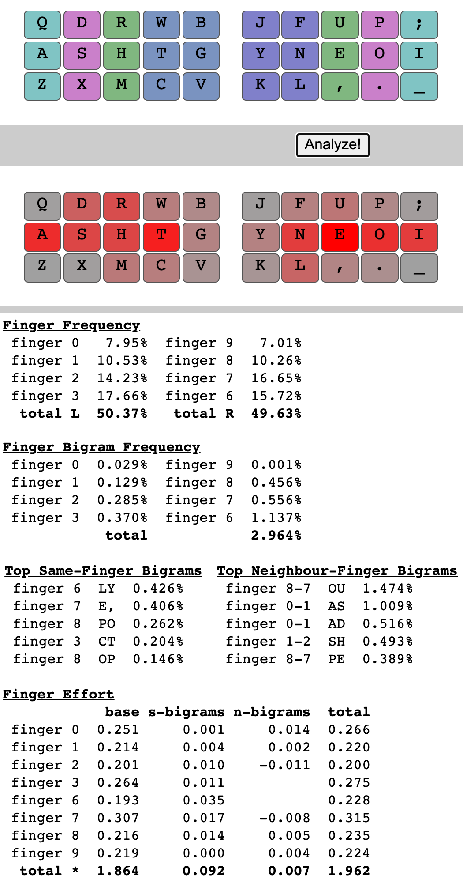

Despite the higher SFB rate, total finger effort is lesser in Romak than in Colemak-DH or Workman.

## Extentions

- The [N-Grams and Accents](macros.md#n-grams-and-accents) layer extend the Romak base layer to give easy access to common English and Portuguese n-grams and Portuguese accentuated characters. Getting used to this layer will avoid some uncomfortable bigrams.
- The [Lower and Raise](symbols.md) layers give access to function keys, symbols and numbers. The symbols are arranged to make them easy to use in software programming, with VIM, and math operations.
- The [Macros](macros.md) layer gives access to common programming macros and other useful macro related features.
- The [Numpad](symbols.md#numpad-layer) layer gives access to function keys and numbers, in the same layer, and is toogled on/off instead of temporarily activated.

##
[Home](../readme.md) | 
Base |
[Modifiers](modifiers.md) |
[N-Grams and Macros](macros.md) |
[Symbols and Numbers](symbols.md) |
[Navigation and Media](navigation.md) |
[Maintenance](maintenance.md)
