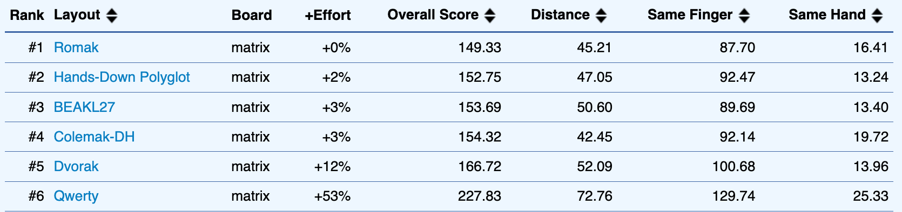
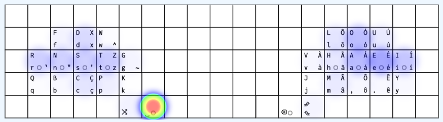
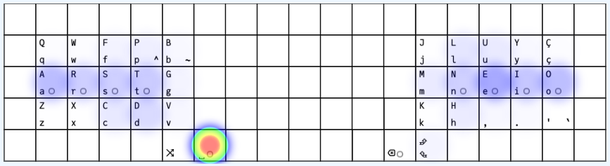
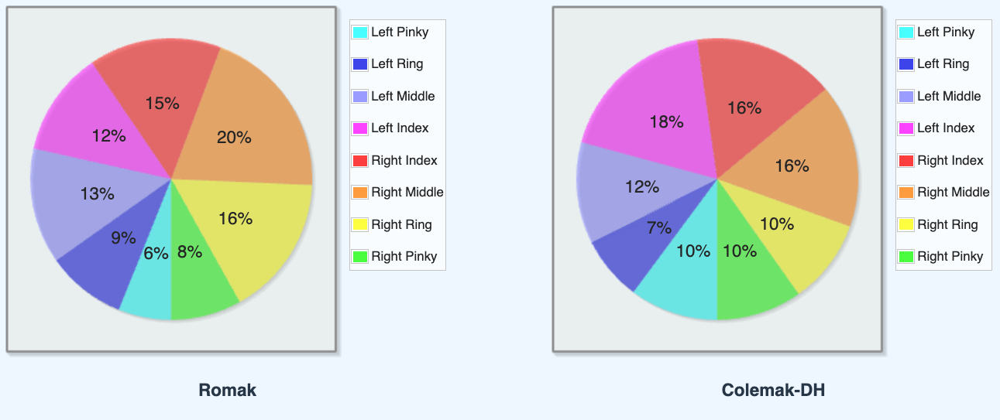

# rafaelromao's keyboard layout

## Romak

Romak is a new keyboard layout, inspired by [Colemak](https://colemak.org) and [BEAKL](https://ieants.cc/beakl), improved to remove load from pinkies and for typing in Portuguese and English.

- The name Romak is a combination of my last name, **Rom**ão, and Dvor**ak**'s name.
- Romak assumes the right hand as dominant so it puts vowels, H and R in that side.
- Romak is also designed to favor hand alternation more than rolls.

## Romak vs Colemak-DH
[KLA Next](https://klanext.keyboard-design.com/) was used to compare Romak with Colemak-DH and some other layouts, using the Universal Declaration of Human Rights as text corpus, combining [Portuguese and English](analysis/corpus.txt).
### General Performance

Romak scored as second best when compared to Colemak-DH, Dvorak, Workman and Qwerty.

### Heatmaps

Heatmaps show that Romak puts more load on middle and ring fingers and less load on index and pinky fingers, when compared to Colemak-DH.

  
   

### Finger Usage
In Romak, all fingers in the left hand will take less load than the equivalent fingers in the right hand.

### Detailed Finger Analysis
The [Colemak mod-DH analysis tool](https://colemakmods.github.io/mod-dh/analyze.html) was also used to compare Romak against Colemak-DH (English text corpus only).

The overall finger usage and SFB rate look better in Romak than in Colemak.

  
  

## Extentions

- The [N-Grams and Accents](macros.md#n-grams-and-accents) layer extend the Romak base layer to give easy access to common English and Portuguese n-grams and Portuguese accentuated characters.
- The [Lower and Raise](symbols.md) layers give access to function keys, symbols and numbers. The symbols are arranged to make them easy to use in software programming, with VIM, and math operations.

##
[Home](../readme.md) | 
Base |
[Modifiers](modifiers.md) |
[N-Grams and Macros](macros.md) |
[Symbols and Numbers](symbols.md) |
[Navigation and Media](navigation.md) |
[Maintenance](maintenance.md)
