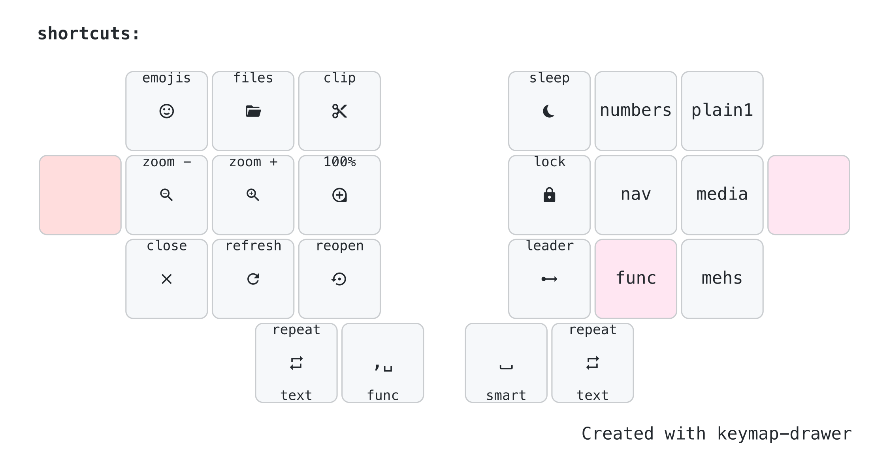

# rafaelromao's keyboard layout

## Shortcuts

- A Shortcuts layer can be activated holding any of the home row pinky keys.
- This layer gives access to some complex features, like Select Word and shortcuts to some commonly used applications and app shortcuts.
- Up and Down arrows, Enter and Esc are also available in the right side of this layer to make it easier to navigate in context menus.

### Select Word and Select Line
- These two macros selects the current word or line in the first press and extend the selection to the next ones in consecutive presses.
- These macros are also OS aware and works the same way on Windows, Linux and MacOS.
- The implementation was based on [Pascal's](https://github.com/getreuer/qmk-keymap) implementation, but it does not work the same way.

## Custom

The custom layer is dedicated to trigger custom shortcuts for specific apps using the Meh (Shift+Ctrl+Alt) and Hyper (Shift+Ctrl+Alt+Gui).
These custom shortcuts could be mapped to actions in softwares like VSCode, IntelliJ or Fusion-360, or intercepted by proxies like BetterTouchTool or Keyboard Maestro to trigger the shortcut sequences expected by this apps.
This layer can be fixed or momentarily activated using a single hand, either of them, which makes it an easy way to extend and customize this keymap without the need for new layers or a new version of the firmware. 

The custom layer will be mapped for VSCode/IntelliJ and Fusion 360 as follows:

