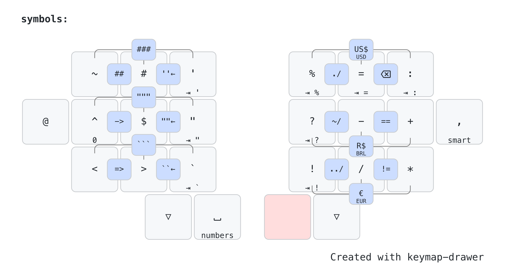

# rafaelromao's keyboard layout

## Symbols and Numbers
Symbols and Numbers are primarily available in the two classic Lower and Raise layers, activated holding the space and backspace thumb keys, respectively.

### Num Word (Auto-layer Lower)
- Num Word is a variation of Caps Word, but for numbers instead. A combo with ring and middle fingers in the left side bottom row will activate the Lower layer and it will stay active while numbers or symbols are typed, returning to the base layer otherwise.

### Pontuation Hold
- Holding a pontuation key (brackets, quotes, exclamation, etc) will add it to the end of the current line.

### Panic Mode Combo
- All fixable layers have a Panic Mode combo that returns the keyboard to the base layer. This combo is formed by the top three keys in the left side of the keyboard.
