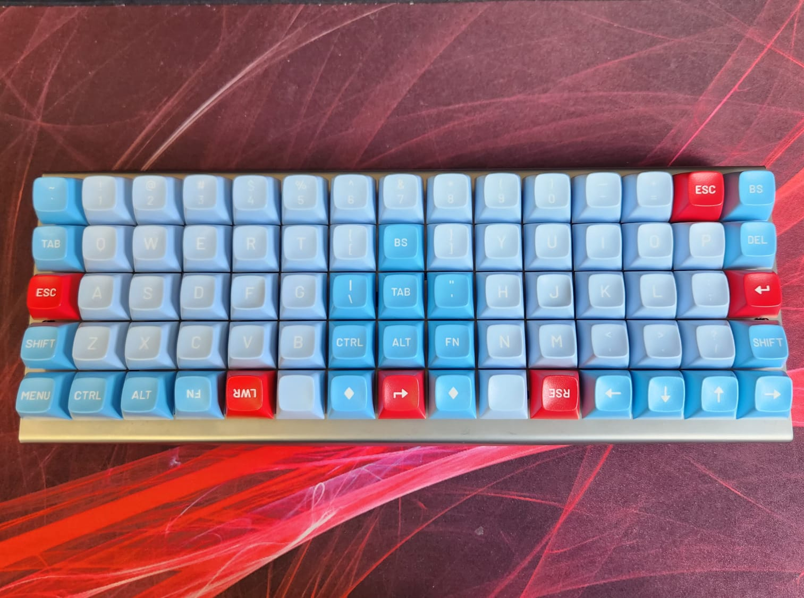

## xiudi/xd75

### A pseudo split keyboard, in a XD75 body.

The two hands of the 36-position keymap sit on the left and right blocks of the top three rows, the thumbs on the bottom row, and the middle columns and the fourth row are unused.



### Build

In the toolchain container (started with `./init.sh` from the repo root):

```bash
b xd75
```

Or from the repo root on the host, with podman and the QMK CLI image:

```bash
scripts/qmk.sh xd75
```

Or with a local QMK CLI pointed at this repo (`qmk config user.overlay_dir=qmk`):

```bash
qmk compile -kb xiudi/xd75 -km rafaelromao
qmk flash -kb xiudi/xd75 -km rafaelromao
```

## Keymap

This keymap extends [my userspace](../../../../../users/rafaelromao/readme.md) definitions.

## Resources

- [Home](https://github.com/rafaelromao/keyboards)
- [QMK Docs](https://docs.qmk.fm)
- [Keyboard Tester](https://config.qmk.fm/#/test)
