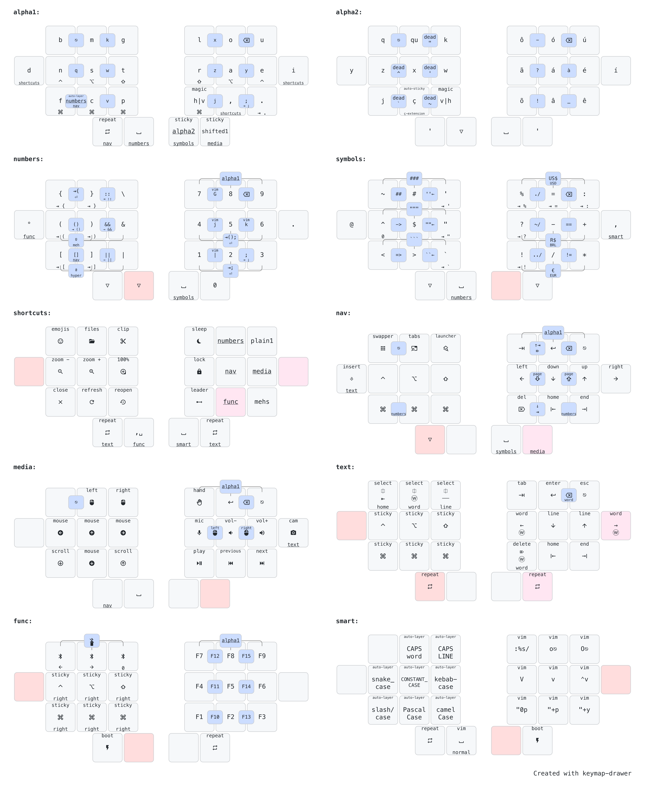

# rafaelromao's keyboard layout
 
## Overview

A split keyboard layout optimized for Portuguese, English, working with numbers and software programming with VIM plugins.



The image above shows just the most relevant layers. To see the full diagram, click [here]../img/diagrams/all.png).

## How this layout works?

The ratiaonale behind the decisions that led to this keymap can be found in [this page](docs/keymap.md), but here is a summary:

### Directives

What are the directives that drive most of my decisions?

- [Ergonomic, Split, Columnar Stagger](docs/keymap.md#ergonomic-split-columnar-stagger)
- [No lateral movements or uncomfortable stretches](docs/keymap.md#no-lateral-movements-or-uncomfortable-stretches)
- [Trackball in the left hand, heavy load in the right hand](docs/keymap.md#trackball-in-the-left-hand-heavy-load-in-the-right-hand)
- [English, but also Portuguese, plus VIM and Spreadsheets](docs/keymap.md#english-but-also-portuguese-plus-vim-and-spreadsheets)

### Workflows

What are the workflows that I need to execute with my keyboards?

- [Typing](docs/keymap.md#typing): The most basic and essential workflow.
- [Numbers](docs/keymap.md#numbers): How this keymap makes it easy to work with numbers.
- [Shortcuts](docs/keymap.md#shortcuts): How to work with so many shortcuts in such minimal keyboards.
- [Navigation](docs/keymap.md#navigation): Navigating in text, presentations, window management and mouse emulation.
- [Programming](docs/keymap.md#programming): Optimizations to make programming easier.

## Compatibility

This layout can be easily adapted to most ortholinear or column staggered keyboards with at least 24 keys, with 2 of them on each thumb.

#### My Keyboards

- [Diamond](https://github.com/rafaelromao/diamond)
- [Rommana-Remix](https://github.com/rafaelromao/rommana-remix)
- [Corne-ish Zen](https://lowprokb.ca/collections/keyboards/products/corne-ish-zen)

### ZMK

This keymap is implemented in ZMK, with the following external modules:
- [Auto Layer](https://github.com/urob/zmk-auto-layer)
- [Adaptive Key](https://github.com/urob/zmk-adaptive-key)
- [Leader Key](https://github.com/urob/zmk-leader-key)

#### Initializing the local build environment

The script [init.sh](init.sh) will clone [the ZMK firmware](https://github.com/rafaelromao/zmk) and configure the toolchain.
After [installing ZMK](https://zmk.dev/docs/development/setup) and running the init script above, [west cli](https://zmk.dev/docs/development/build-flash) should be working to compile and flash.

## Building

The script [build.sh](build.sh) can be used to build the firmware for any of my boards. Run `build --help` for more details.

## Diagram

The Diagram for my keymap was created using [Keymap Drawer](https://github.com/caksoylar/keymap-drawer). The source and config files can be found in the docs folder and the commands below can be used to generate an `svg` diagram and convert it to `png`, using Inkscape:

```
keymap -c keymap-drawer-config.yaml draw keymap-drawer.yaml > overview.svg
inkscape --export-type png --export-filename overview.png --export-dpi 300 --export-background=white overview.svg
```

The script [draw.sh](draw.sh) is used to draw all diagrams in my keymap using commands like the example above.

## References

Most features implemented here were based on the work referenced below.

### Layouts
- [Romak](https://github.com/rafaelromao/romak)
- [Colemak](https://colemak.org)
- [BEAKL](https://deskthority.net/wiki/BEAKL)
- [Hands Down](https://sites.google.com/alanreiser.com/handsdown/home)
- [Engram](https://engram.dev)
- [Miryoku](https://github.com/manna-harbour/miryoku)
- [Seniply](https://stevep99.github.io/seniply)
- [Thinqu](https://microexploitation.com/2018/06/04/thinqu/)
- [Suraj Kurapati](https://sunaku.github.io/moergo-glove80-keyboard.html)
- [bmijanovich](https://github.com/bmijanovich/zmk-config)
- [DreymaR](https://dreymar.colemak.org)
- [Ben Vallack](https://youtube.com/c/BenVallack)
- [Magic Sturdy](https://github.com/Ikcelaks/keyboard_layouts/blob/main/magic_sturdy/magic_sturdy.md)
- [Unity](https://lykt.xyz/uno)
- [Nordrassil](https://github.com/empressabyss/nordrassil)
- [Sartak](https://github.com/sartak/keyboard)

### QMK
- [Pascal Getreuer](https://github.com/getreuer/qmk-keymap)
- [Precondition](https://github.com/precondition/dactyl-manuform-keymap)
- [Drashna](https://github.com/drashna/qmk_userspace)
- [Callum Oakley](https://github.com/callum-oakley/qmk_firmware/tree/master/users/callum)
- [Andrew Rae](https://github.com/andrewjrae/kyria-keymap)
- [Weilbith](https://github.com/weilbith/keyboard_firmware)
- [Treeman](https://github.com/treeman/qmk_firmware/tree/master/keyboards/ferris/keymaps/treeman)
- [Thomas Baart](https://thomasbaart.nl/category/mechanical-keyboards/firmware/qmk)

### ZMK
- [Pete Johanson](https://github.com/petejohanson/)
- [Cem Aksoylar](https://github.com/caksoylar)
- [Nick Conway](https://github.com/nickconway)
- [Robert U](https://github.com/urob)
- [Sviatoslav Bulbakha](https://github.com/ssbb)
- [Alexander Krikun](https://github.com/krikun98)

### 3D Printing and Handwiring
- [Jan Lunge](https://m.youtube.com/@JanLunge)
- [Sadek Baroudi](https://github.com/sadekbaroudi)
- [Joe Scotto](https://github.com/joe-scotto)
- [Alaa Saad Mansour](https://github.com/AlaaSaadAbdo)
- [Peter Elliot](https://github.com/PJE66)

## Resouces
- [Keymap Drawer](https://github.com/caksoylar/keymap-drawer)
- [Keymap DB](https://keymapdb.com/keymaps/rafaelromao/)
- [QMK Docs](https://docs.qmk.fm)
- [ZMK Docs](https://zmk.dev/docs)
- [Keyboard Tester](https://config.qmk.fm/#/test)
- [Word Finder - English](https://www.merriam-webster.com/wordfinder/classic/contains/all/-1/th/1)
- [Word Finder - Portuguese](https://www.palavras.net/search.php?m=th&d=17)
- [r/olkb](https://www.reddit.com/r/olkb)
- [r/ErgoMechKeyboards](https://www.reddit.com/r/ErgoMechKeyboards)
