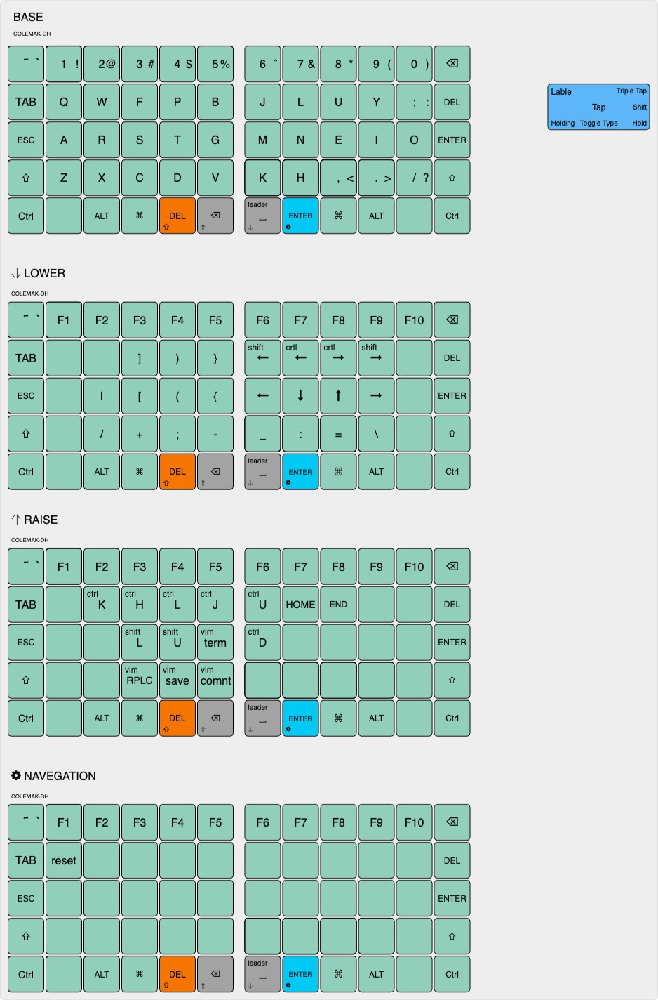

# arturgoms's keyboard layout
 
## Overview

A 75 keys keyboard layout, optimized for Portuguese, English, working with numbers and software programming with VIM plugins.

## How this layout works?

The following pages explain how this layout works and which features are implemented.

### Layers

WIP

## References

Most features implemented here were based on the work referenced below.

- [Miryoku](https://github.com/manna-harbour/miryoku)
- [Seniply](https://stevep99.github.io/seniply)
- [Colemak](https://colemak.org)
- [BEAKL](https://ieants.cc/beakl)
- [Hands Down](https://sites.google.com/alanreiser.com/handsdown/home)
- [Precondition](https://github.com/precondition/dactyl-manuform-keymap)
- [Pascal Getreuer](https://github.com/getreuer/qmk-keymap)
- [Drashna](https://github.com/qmk/qmk_firmware/tree/master/users/drashna)
- [Callum Oakley](https://github.com/callum-oakley/qmk_firmware/tree/master/users/callum)
- [Andrew Rae](https://github.com/andrewjrae/kyria-keymap)
- [Weilbith](https://github.com/weilbith/keyboard_firmware)
- [Treeman](https://github.com/treeman/qmk_firmware/tree/master/keyboards/ferris/keymaps/treeman)
- [DreymaR](https://dreymar.colemak.org)
- [Thomas Baart](https://thomasbaart.nl/category/mechanical-keyboards/firmware/qmk)
- [Ben Vallack](https://youtube.com/c/BenVallack)

## Resouces

- [KLE](http://www.keyboard-layout-editor.com/#/gists/1a36101d96c804188d2d104ab5296739)
- [QMK Docs](https://docs.qmk.fm)
- [Keyboard Tester](https://config.qmk.fm/#/test)

## Credits
- [rafaelromao](https://github.com/rafaelromao/keyboards)