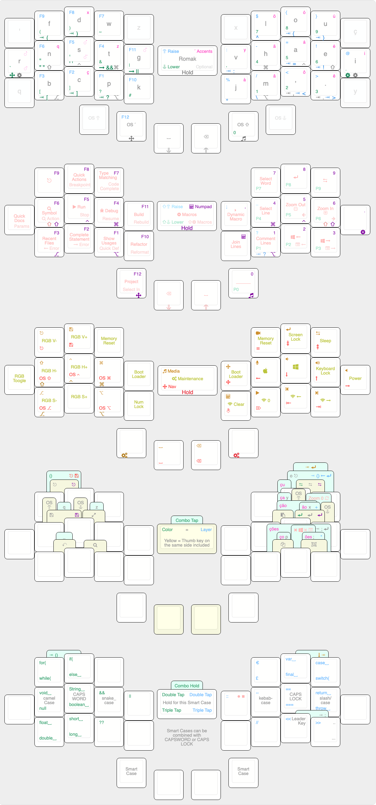

# rafaelromao's keyboard layout
 
## Overview

A split keyboard layout optimized for Portuguese, English, working with numbers and software programming with VIM plugins. The number of keys can vary from 28 to 36. Optional keys have bindings only in the base layer.

## How this layout works?

The following pages explain how this layout works and which features are implemented.

### Layers

- [Base](docs/base.md) and [Modifiers](docs/modifiers.md)
- [Accents and Macros](docs/macros.md)
- [Symbols and Numbers](docs/symbols.md)
- [Navigation and Media](docs/navigation.md)
- [Maintenance](docs/maintenance.md)

### Main Features

- [Home Block Mods](docs/modifiers.md#home-block-modifiers)
- [One Shot Mods](docs/modifiers.md#one-shot-modifiers)
- [Smart Thumb Keys](docs/base.md#smart-thumb-keys)
- [Smart Cases](docs/modifiers.md#smart-cases)
- [Shortcut Combos](docs/base.md#base-layer-combos)
- [Numpad Layer](docs/symbols.md#numpad)
- [Leader Key](docs/macros.md#leader-key)
- [Swapper](docs/macros.md#swapper)
- [Select Word](docs/macros.md#select-word)
- [Dynamic Macros](docs/macros.md#dynamic-macros)
- [Coding Shortcuts](docs/macros.md#coding-shortcuts)
- [Coding Dancing](docs/symbols.md#coding-dancing)

## About this repo

This repository contains the keymap files that are used to customize my keyboards. The firmware files are included as submodules or external references and symlinks are used to make them see the keymap files.

## Compatibility

This layout was tested with the keyboards listed below, but can be easily adapted to any ortholinear or column staggered keyboard with at least 28 keys, with 2 of them on each thumb.

### QMK

The reference implementation is done in QMK, so it has all features supported.

The qmk version recommended for this keymap is 0.18.1.

- [handwired/rafaelromao/fauxberry](src/qmk/keyboards/handwired/rafaelromao/fauxberry/readme.md)
- [handwired/rafaelromao/xiao](src/qmk/keyboards/handwired/rafaelromao/xiao/readme.md)
- [kprepublic/bm40hsrgb](src/qmk/keyboards/kprepublic/bm40hsrgb/keymaps/rafaelromao/readme.md)

Some features are not available on all keyboards though. For instance, the BM40 does not support Dynamic Macros, while the XD75 doesn't have per key RGB.

### ZMK

The zmk version used for this keymap is the one available in [this fork](https://github.com/rafaelromao/zmk/tree/rafaelromao/main), which contains some experimental code from [Nick Conway](https://github.com/nickconway/zmk-config), [Cem Aksoylar](https://github.com/caksoylar/zmk-config ) and [Robert U](https://github.com/urob/zmk-config), to implement features like `Swapper`, `Smart Cases` and `Leader Key`, among other small improvements.

- [lowprokb.ca/corneish-zen](src/zmk/keyboards/lowprokb.ca/corneish-zen/readme.md)

Some features might not be available in ZMK. [This readme file](src/zmk/config/rafaelromao/readme.md) will indicate what features are available.

## Building

### QMK

The scripts [init_bm40.sh](init_bm40.sh) and [init_xd75.sh](init_xd75.sh) will clone [the QMK firmware](https://github.com/qmk/qmk_firmware) and symlink these keyboard files on it.
After [installing QMK](https://docs.qmk.fm/#/newbs_getting_started) and running the init scripts above, [qmk cli](https://docs.qmk.fm/#/cli) should be working to compile and flash.

### ZMK

The script [init_zen.sh](init_zen.sh) will clone [the ZMK firmware](https://github.com/LOWPROKB/zmk) and configure the toolchain.
After [installing ZMK](https://zmk.dev/docs/development/setup) and running the init script above, [west cli](https://zmk.dev/docs/development/build-flash) should be working to compile and flash.

## References

Most features implemented here were based on the work referenced below.

### Layouts
- [Colemak](https://colemak.org)
- [BEAKL](https://ieants.cc/beakl)
- [Hands Down](https://sites.google.com/alanreiser.com/handsdown/home)
- [Miryoku](https://github.com/manna-harbour/miryoku)
- [Seniply](https://stevep99.github.io/seniply)
- [DreymaR](https://dreymar.colemak.org)
- [Ben Vallack](https://youtube.com/c/BenVallack)

### QMK
- [Pascal Getreuer](https://github.com/getreuer/qmk-keymap)
- [Precondition](https://github.com/precondition/dactyl-manuform-keymap)
- [Drashna](https://github.com/qmk/qmk_firmware/tree/master/users/drashna)
- [Callum Oakley](https://github.com/callum-oakley/qmk_firmware/tree/master/users/callum)
- [Andrew Rae](https://github.com/andrewjrae/kyria-keymap)
- [Weilbith](https://github.com/weilbith/keyboard_firmware)
- [Treeman](https://github.com/treeman/qmk_firmware/tree/master/keyboards/ferris/keymaps/treeman)
- [Thomas Baart](https://thomasbaart.nl/category/mechanical-keyboards/firmware/qmk)

### ZMK
- [Nick Conway](https://github.com/nickconway/zmk-config)
- [Cem Aksoylar](https://github.com/caksoylar/zmk-config )
- [Robert U](https://github.com/urob/zmk-config)

### 3D Printing and Handwiring
- [Jan Lunge](https://m.youtube.com/@JanLunge)
- [Sadek Baroudi](https://github.com/sadekbaroudi)
- [Joe Scotto](https://github.com/joe-scotto)
- [AlaaSaadAbdo](https://github.com/AlaaSaadAbdo)
- [Peter Elliot](https://github.com/PJE66)

## Resouces

- [KLE](http://www.keyboard-layout-editor.com/#/gists/38f4435ff9a10256d9a7e1a0645c2fec)
- [Keymap DB](https://keymapdb.com/rafaelromao/)
- [QMK Docs](https://docs.qmk.fm)
- [ZMK Docs](https://zmk.dev/docs)
- [Keyboard Tester](https://config.qmk.fm/#/test)
- [r/olkb](https://www.reddit.com/r/olkb)
- [r/ErgoMechKeyboards](https://www.reddit.com/r/ErgoMechKeyboards)
