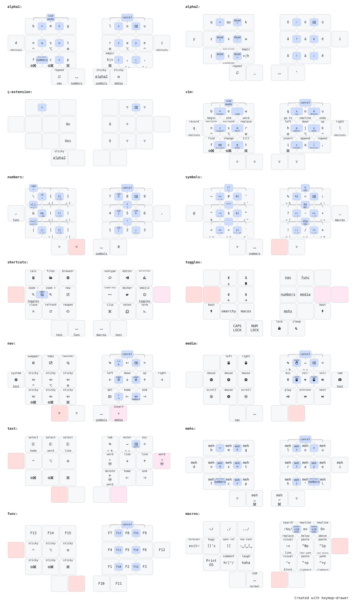
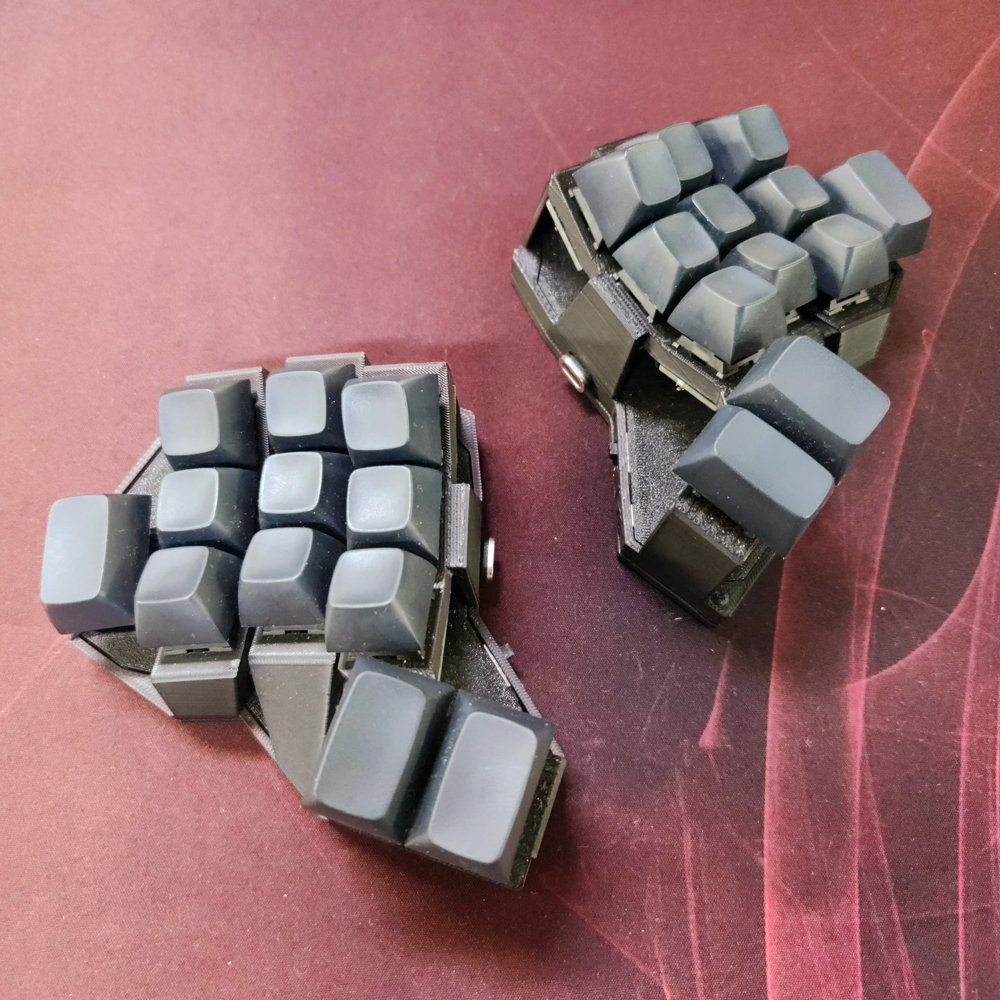
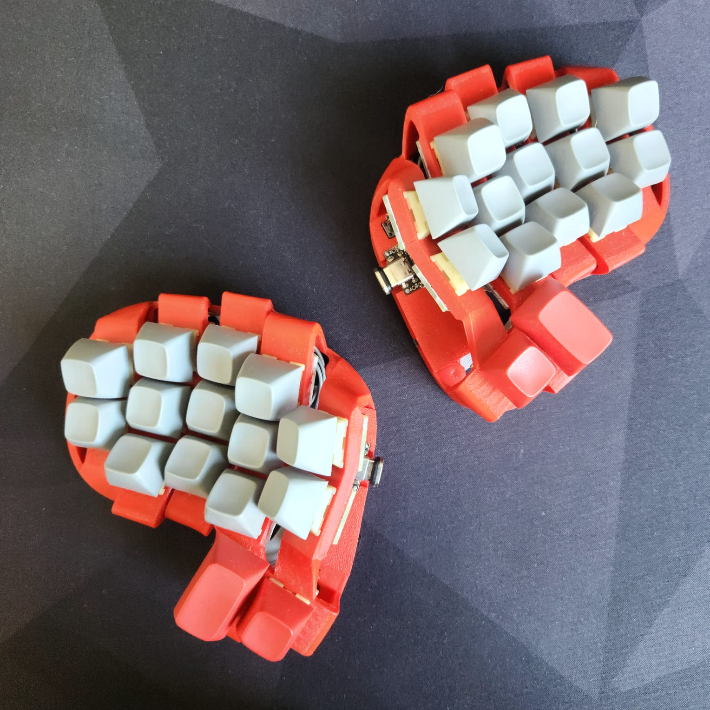
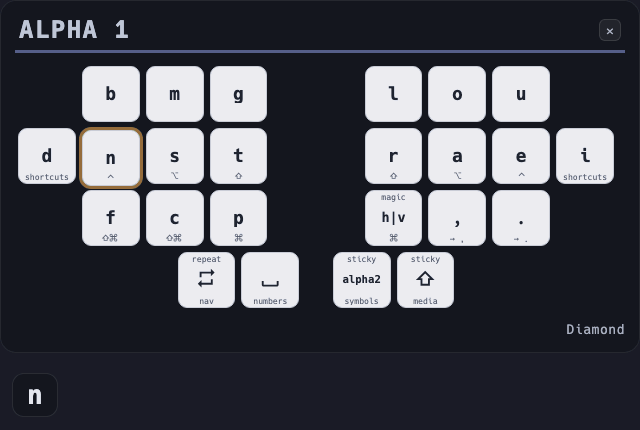

# rafaelromao's keyboard layout
 
## Overview

A split keyboard layout optimized for Portuguese, English, working with numbers and software programming with VIM plugins.



The image above shows just the most relevant layers. You can see the full diagram [here](docs/img/diagrams/all.png).

## How this layout works?

The ratiaonale behind the decisions that led to this keymap can be found in [this page](https://rafaelromao.github.io/keyboards), but here is a summary:

### Directives

What are the directives that drive most of my decisions?

- **Ergonomics**: Split and Columnar Stagger.
- **Finger Effort**: No lateral movements or uncomfortable stretches.
- **Easy of Use**: If it is frequent, it should be easy.
- **Handness**: Trackball in the left hand, heavy load in the right hand.
- **Workflows**: English, but also Portuguese, plus VIM and Spreadsheets.

### Workflows

What are the workflows that I need to execute with my keyboards?

- **Typing**: The most basic and essential workflow.
- **Numbers**: How this keymap makes it easy to work with numbers.
- **Shortcut**: How to work with so many shortcuts in such minimal keyboards.
- **Navigation**: Navigating in text, presentations, window management and mouse emulation.
- **Programming**: Optimizations to make programming easier.

## My Keyboards

<table>
  <tr>
    <td><a href="https://github.com/rafaelromao/diamond">Diamond</a></td>
    <td><a href="https://github.com/rafaelromao/diamond">Wired Diamond</a></td>
    <td><a href="https://github.com/rafaelromao/diamond">Choc Diamond</a></td>
  </tr>
  <tr>
    <td><a href="docs/img/builds/Diamond.jpeg"></a></td>
    <td><a href="docs/img/builds/Wired%20Diamond.jpeg"></a></td>
    <td><a href="docs/img/builds/Choc%20Diamond.jpeg"></a></td>
  </tr>
  <tr>
    <td><a href="https://github.com/rafaelromao/rommana-remix">Rommana Remix</a></td>
    <td><a href="https://github.com/AlaaSaadAbdo/Rommana">Wired Rommana</a></td>
    <td><a href="https://lowprokb.ca/collections/keyboards/products/corne-ish-zen">Corne-ish Zen</a></td>
  </tr>
  <tr>
    <td><a href="docs/img/builds/Rommana.jpeg"></a></td>
    <td><a href="docs/img/builds/Wired%20Rommana.jpeg"></a></td>
    <td><a href="docs/img/builds/Corne-ish%20Zen.jpeg"></a></td>
  </tr>
  <tr>
    <td><a href="https://github.com/dixls/Dilemma-3mod">Dilemma</a></td>
    <td><a href="https://github.com/qmk/qmk_firmware/tree/master/keyboards/kprepublic/bm40hsrgb">BM40 (QMK)</a></td>
    <td><a href="https://github.com/qmk/qmk_firmware/tree/master/keyboards/xiudi/xd75">XD75 (QMK)</a></td>
  </tr>
  <tr>
    <td><a href="docs/img/builds/Dilemma 26.jpeg"></a></td>
    <td><a href="docs/img/builds/BM40.jpg"></a></td>
    <td><a href="docs/img/builds/XD75.jpeg"></a></td>
  </tr>
</table>

## ZMK

This keymap is implemented using ZMK, with the following external modules:
- [Auto Layer](https://github.com/urob/zmk-auto-layer)
- [Adaptive Key](https://github.com/urob/zmk-adaptive-key)
- [Leader Key](https://github.com/urob/zmk-leader-key)
- [Layer Morph](https://github.com/rafaelromao/zmk-layer-morph)
- [Layer HUD](https://github.com/rafaelromao/zmk-layer-hud)
- [OS Detection](https://github.com/rafaelromao/zmk-os-detection)
- [Vim Mode](https://github.com/rafaelromao/zmk-vim-mode)

[Vim Mode](https://github.com/rafaelromao/zmk-vim-mode) is my own project, and it has three parts: a ZMK module that keeps the vim layers in sync with the editor, a daemon that runs on the host, and a NeoVim plugin. The editor state travels to the keyboard as a small number encoded in the HID LED indicator report. See [VIM Mode](https://rafaelromao.github.io/keyboards/#vim-mode) for the details.



## QMK

Two of my keyboards cannot run ZMK: the BM40 and the XD75 are wired ortholinear boards on an ATmega32U4. For them the same keymap is implemented in QMK, in [src/qmk](src/qmk), as a QMK [External Userspace](https://docs.qmk.fm/newbs_external_userspace) that reads the layout from the same 36 positions the ZMK keymap uses. QMK itself is a git submodule at `modules/qmk/qmk_firmware`, pinned to `0.34.4`, next to the ZMK one.

The two hands sit on the left and right blocks of the ortholinear grid, with the thumbs on the bottom row, so the extra columns and the fourth row of the XD75 are unused. Every layer, combo, tap-hold, macro, accent and adaptive key of the ZMK keymap is there, including vim mode, the MEHS layer and the MACROS layer. The layout needs the host on US-International with dead keys, like the ZMK one.

Build both with the [qmk](scripts/qmk.sh) script, which runs the official QMK CLI container through podman and shares the modules volume with the ZMK toolchain:

```bash
scripts/qmk.sh bm40   # kprepublic/bm40hsrgb/rev1
scripts/qmk.sh xd75   # xiudi/xd75
scripts/qmk.sh all    # both; -p for a pristine build
```

The `.hex` files land in `build/artifacts/`, ready for `qmk flash` or QMK Toolbox. Both firmwares fill about 90% of the 28 KB flash.

### What the QMK builds do not have

These are the parts of the ZMK keymap that have no counterpart in QMK, or that only make sense on the wireless boards:

- **Bluetooth, dongles and displays**: the toggles-layer Bluetooth keys are empty, and there is no battery reporting, deep sleep or dongle display.
- **Layer HUD**: nothing is signalled to the host over serial or Bluetooth, so the [layer HUD](https://github.com/rafaelromao/zmk-layer-hud) does not work with these boards.
- **Vim mode sync with the host**: the vim layers exist and the mode changes the keyboard infers from what it types (`i`, `a`, `o`, `v`, `:`, `Esc`, ...) all work, but the editor state is not read back from the host. Vim mode is turned on with the top-row ring+middle+index chord and off with the MACROS-layer chord, cancel or num word.
- **Leader key**: not ported; its slot on the shortcuts layer is empty.
- **Meh + comma / Meh + dot**: always `Ctrl+Alt+Shift+,` and `Ctrl+Alt+Shift+.`, without the macOS variants.
- **Persistent layers**: the OS mode chosen on the toggles layer is kept until the board is unplugged, not stored.

And a few things work differently:

- **OS detection** uses QMK's USB fingerprinting. Linux is the default, macOS is detected or forced from the toggles layer, and a forced choice survives a later detection.
- **Mouse emulation** uses QMK's mouse keys instead of the ZMK pointing module, with QMK's acceleration curve.
- **One-shot timing**: sticky shift lasts 1.5 s and the sticky layers 1 s, as in ZMK; a pending sticky shift is spent by the next key press, so rolled keys behave the same way.
- **Home-row mods**: tap-preferred with a 250 ms tapping term, no permissive hold, as in ZMK. The symbol tap-holds and the Meh mod-taps use QMK's Flow Tap for the ZMK `require-prior-idle` behaviour.

## Local Build

Unlike most ZMK users, I don't use GitHub Actions to build the firmware for my keyboards, and since I come from a legacy repo structure, from the time I used QMK and when they didn't even support external userspaces, I use git submodules to import ZMK and everything else I need into my repo, then I build the firmware using a custom script. 

To make the local build setup easier, I have a [Containerfile](Containerfile) that installs all the toolchain into a Ubuntu container. The [init](init.sh) script is then used to run this container.

Into the container, I can use my custom [build](scripts/build.sh) script to build the firmware for all my keyboards.

Here are some usage examples:

```bash
# Builds the central left side shield of the Rommana, assuming nice_nano_v2 as board
build mabroum/rommana cl

# Builds the left side shield of the Wired Diamond, specifying the board to be used instead of the default
build rafaelromao/wired_diamond l -b xiao_rp2040//zmk

# Builds the central dongle shield of the Choc Diamond, specifying an extra shield and an external module to handle the display
build rafaelromao/choc_diamond cd -e dongle_display -m englmaxi/zmk-dongle-display
```

To make it even simpler, I have a [b](scripts/b.sh) script that can be used to build the central sides using default configurations. 

Example:

```sh
b wd # builds the left side of the wired diamond keyboard, equivalent to the command below

build rafaelromao/wired_diamond l -b xiao_rp2040//zmk
```

The QMK boards are built from the host with [qmk](scripts/qmk.sh), see [QMK](#qmk) above.

## Editors

The MEHS layer emits Meh (`Ctrl+Alt+Shift`) and Hyper (`Ctrl+Alt+Shift+Gui`) chords whose meanings are IDE actions: go to symbol, toggle breakpoint, find usages. The firmware only sends the chords; something on the host has to bind them.

That is [`editors/`](editors), with one install script per editor:

```sh
cd editors
./vscode/install.sh
./intellij/install.sh
./nvim/install.sh
```

They symlink out of the repo, so editing a keymap here takes effect without reinstalling, and they work on macOS and Linux. [`editors/README.md`](editors/README.md) has the full mapping, the default shortcuts it takes over, and the places where VSCode has no equivalent.

## Diagram

The diagrams for my keymap were created using [Keymap Drawer](https://github.com/caksoylar/keymap-drawer).

Here are some examples of the commands I use to draw the `svg` files and convert them to `png`:

```bash
keymap -c keymap-drawer-config.yaml draw keymap-drawer.yaml > overview.svg
inkscape --export-type png --export-filename overview.png --export-dpi 300 --export-background=white overview.svg
```

## References

Most features implemented here were based on the work referenced below.

### Layouts

- [Romak](https://rafaelromao.github.io/romak)
- [Colemak](https://colemak.org)
- [BEAKL](https://web.archive.org/web/20210801204805/https://ieants.cc/beakl/)
- [Hands Down](https://sites.google.com/alanreiser.com/handsdown/home)
- [Engram](https://engram.dev)
- [Miryoku](https://github.com/manna-harbour/miryoku)
- [Seniply](https://stevep99.github.io/seniply)
- [Thinqu](https://web.archive.org/web/20230604081244/https://microexploitation.com/2018/06/04/thinqu/)
- [Suraj Kurapati](https://sunaku.github.io/moergo-glove80-keyboard.html)
- [bmijanovich](https://github.com/bmijanovich/zmk-config)
- [DreymaR](https://dreymar.colemak.org)
- [Ben Vallack](https://youtube.com/c/BenVallack)
- [Magic Sturdy](https://github.com/Ikcelaks/keyboard_layouts/blob/main/magic_sturdy/magic_sturdy.md)
- [Unity](https://lykt.xyz/uno)
- [Nordrassil](https://github.com/empressabyss/nordrassil)
- [Sartak](https://github.com/sartak/keyboard)

### QMK

- [Pascal Getreuer](https://github.com/getreuer/qmk-keymap)
- [Precondition](https://github.com/precondition/dactyl-manuform-keymap)
- [Drashna](https://github.com/drashna/qmk_userspace)
- [Callum Oakley](https://github.com/callum-oakley/qmk_firmware/tree/master/users/callum)
- [Andrew Rae](https://github.com/andrewjrae/kyria-keymap)
- [Weilbith](https://github.com/weilbith/keyboard_firmware)
- [Treeman](https://github.com/treeman/qmk_firmware/tree/master/keyboards/ferris/keymaps/treeman)
- [Thomas Baart](https://thomasbaart.nl/category/mechanical-keyboards/firmware/qmk)

### ZMK

- [Pete Johanson](https://github.com/petejohanson/)
- [Cem Aksoylar](https://github.com/caksoylar)
- [Nick Conway](https://github.com/nickconway)
- [Robert U](https://github.com/urob)
- [Sviatoslav Bulbakha](https://github.com/ssbb)
- [Alexander Krikun](https://github.com/krikun98)
- [ShiniNet](https://github.com/ShiniNet)

### 3D Printing and Handwiring

- [Jan Lunge](https://m.youtube.com/@JanLunge)
- [Sadek Baroudi](https://github.com/sadekbaroudi)
- [Joe Scotto](https://github.com/joe-scotto)
- [Alaa Saad Mansour](https://github.com/AlaaSaadAbdo)
- [Peter Elliot](https://github.com/PJE66)

## Resources

- [Keymap Drawer](https://github.com/caksoylar/keymap-drawer)
- [Keymap DB](https://keymapdb.com/keymaps/rafaelromao/)
- [QMK Docs](https://docs.qmk.fm)
- [ZMK Docs](https://zmk.dev/docs)
- [Keyboard Tester](https://config.qmk.fm/#/test)
- [Word Finder - English](https://www.merriam-webster.com/wordfinder/classic/contains/all/-1/th/1)
- [Word Finder - Portuguese](https://www.palavras.net/search.php?m=th&d=17)
- [r/olkb](https://www.reddit.com/r/olkb)
- [r/ErgoMechKeyboards](https://www.reddit.com/r/ErgoMechKeyboards)
