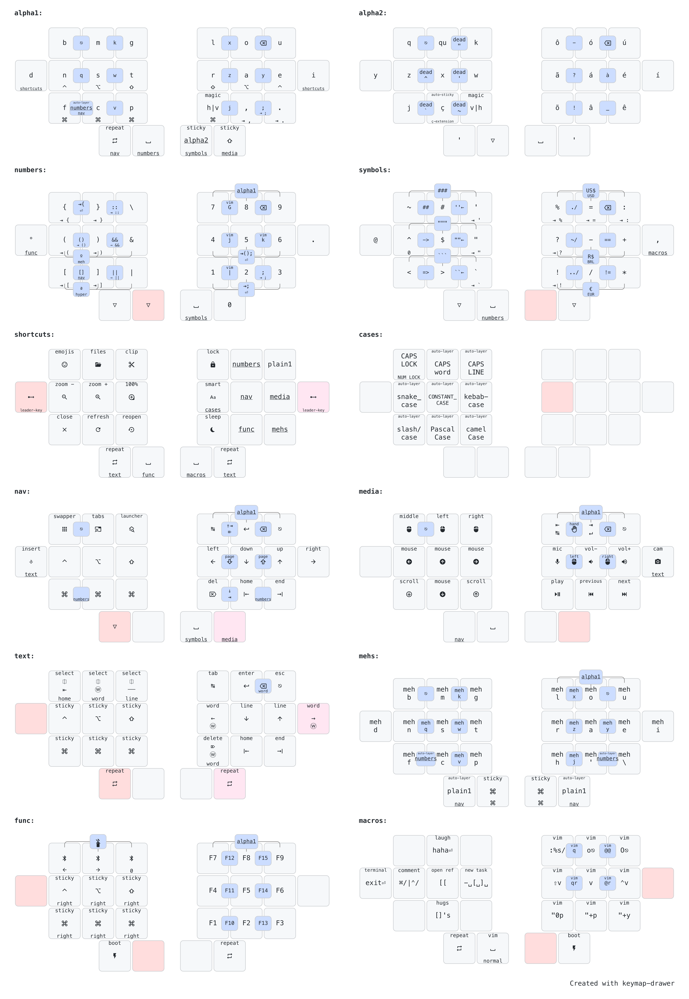
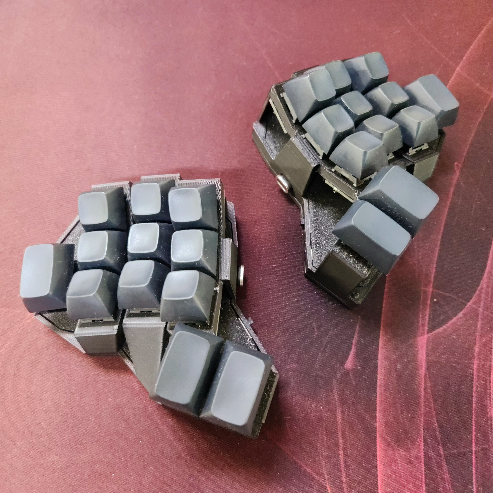

# rafaelromao's keyboard layout
 
## Overview

A split keyboard layout optimized for Portuguese, English, working with numbers and software programming with VIM plugins.



The image above shows just the most relevant layers. You can see the full diagram [here](docs/img/diagrams/all.png).

## How this layout works?

The ratiaonale behind the decisions that led to this keymap can be found in [this page](docs/index.md), but here is a summary:

### Directives

What are the directives that drive most of my decisions?

- [Ergonomics](docs/index.md#ergonomics): Split and Columnar Stagger.
- [Finger Effort](docs/index.md#finger-effort): No lateral movements or uncomfortable stretches.
- [Easy of Use](docs/index.md#easy-of-use): If it is frequent, it should be easy.
- [Handness](docs/index.md#handness): Trackball in the left hand, heavy load in the right hand.
- [Use Cases](docs/index.md#use-cases): English, but also Portuguese, plus VIM and Spreadsheets.

### Workflows

What are the workflows that I need to execute with my keyboards?

- [Typing](docs/index.md#typing): The most basic and essential workflow.
- [Numbers](docs/index.md#numbers): How this keymap makes it easy to work with numbers.
- [Shortcuts](docs/index.md#shortcuts): How to work with so many shortcuts in such minimal keyboards.
- [Navigation](docs/index.md#navigation): Navigating in text, presentations, window management and mouse emulation.
- [Programming](docs/index.md#programming): Optimizations to make programming easier.

## My Keyboards

<table>
  <tr>
    <td><a href="https://github.com/rafaelromao/diamond">Diamond</a></td>
    <td><a href="https://github.com/rafaelromao/diamond">Wired Diamond</a></td>
    <td><a href="https://github.com/rafaelromao/diamond">Choc Diamond</a></td>
  </tr>
  <tr>
    <td><a href="docs/img/builds/Diamond.jpeg"></a></td>
    <td><a href="docs/img/builds/Wired%20Diamond.jpeg"></a></td>
    <td><a href="docs/img/builds/Choc%20Diamond.jpeg"></a></td>
  </tr>
  <tr>
    <td><a href="https://github.com/rafaelromao/rommana-remix">Rommana Remix</a></td>
    <td><a href="https://github.com/AlaaSaadAbdo/Rommana">Wired Rommana</a></td>
    <td><a href="https://lowprokb.ca/collections/keyboards/products/corne-ish-zen">Corne-ish Zen</a></td>
  </tr>
  <tr>
    <td><a href="docs/img/builds/Rommana.jpeg"></a></td>
    <td><a href="docs/img/builds/Wired%20Rommana.jpeg"></a></td>
    <td><a href="docs/img/builds/Corne-ish%20Zen.jpeg"></a></td>
  </tr>
</table>

## ZMK

This keymap is implemented using ZMK, with the following external modules:
- [Auto Layer](https://github.com/urob/zmk-auto-layer)
- [Adaptive Key](https://github.com/urob/zmk-adaptive-key)
- [Leader Key](https://github.com/urob/zmk-leader-key)

## Local Build

Unlike most ZMK users, I don't use GitHub Actions to build the firmware for my keyboards, and since I come from a legacy repo structure, from the time I used QMK and when they didn't even support external userspaces, I use git submodules to import ZMK and everything else I need into my repo, then I build the firmware using a custom script. 

[This script](scripts/build.sh) will assume the [toolchain](https://zmk.dev/docs/development/setup) is already installed, but other than that, it will do its best to keep the build process as simple as possible.

Here are some usage examples:

```bash
# Builds the central left side shield of the Rommana, assuming nice_nano_v2 as board and MACOS as target operating system
build mabroum/rommana cl

# Builds the left side shield of the Wired Diamond, specifying the board and ZMK fork to be used instead of the default
build rafaelromao/wired_diamond l LINUX -b seeeduino_xiao_rp2040 -z rafaelromao/zmk

# Builds the central dongle shield of the Choc Diamond, specifying an extra shield and an external module to handle the display
build rafaelromao/choc_diamond cd MACOS -e dongle_display -m englmaxi/zmk-dongle-display
```

I also need to initialize my terminal with the following script before using the `build` command:

```bash
cd ~/keyboards ; source ./scripts/init.sh
```

## Diagram

The diagrams for my keymap were created using [Keymap Drawer](https://github.com/caksoylar/keymap-drawer).

Here are some examples of the commands I use to draw the `svg` files and convert them to `png`:

```bash
keymap -c keymap-drawer-config.yaml draw keymap-drawer.yaml > overview.svg
inkscape --export-type png --export-filename overview.png --export-dpi 300 --export-background=white overview.svg
```

## References

Most features implemented here were based on the work referenced below.

### Layouts

- [Romak](https://github.com/rafaelromao/romak)
- [Colemak](https://colemak.org)
- [BEAKL](https://deskthority.net/wiki/BEAKL)
- [Hands Down](https://sites.google.com/alanreiser.com/handsdown/home)
- [Engram](https://engram.dev)
- [Miryoku](https://github.com/manna-harbour/miryoku)
- [Seniply](https://stevep99.github.io/seniply)
- [Thinqu](https://microexploitation.com/2018/06/04/thinqu/)
- [Suraj Kurapati](https://sunaku.github.io/moergo-glove80-keyboard.html)
- [bmijanovich](https://github.com/bmijanovich/zmk-config)
- [DreymaR](https://dreymar.colemak.org)
- [Ben Vallack](https://youtube.com/c/BenVallack)
- [Magic Sturdy](https://github.com/Ikcelaks/keyboard_layouts/blob/main/magic_sturdy/magic_sturdy.md)
- [Unity](https://lykt.xyz/uno)
- [Nordrassil](https://github.com/empressabyss/nordrassil)
- [Sartak](https://github.com/sartak/keyboard)

### QMK

- [Pascal Getreuer](https://github.com/getreuer/qmk-keymap)
- [Precondition](https://github.com/precondition/dactyl-manuform-keymap)
- [Drashna](https://github.com/drashna/qmk_userspace)
- [Callum Oakley](https://github.com/callum-oakley/qmk_firmware/tree/master/users/callum)
- [Andrew Rae](https://github.com/andrewjrae/kyria-keymap)
- [Weilbith](https://github.com/weilbith/keyboard_firmware)
- [Treeman](https://github.com/treeman/qmk_firmware/tree/master/keyboards/ferris/keymaps/treeman)
- [Thomas Baart](https://thomasbaart.nl/category/mechanical-keyboards/firmware/qmk)

### ZMK

- [Pete Johanson](https://github.com/petejohanson/)
- [Cem Aksoylar](https://github.com/caksoylar)
- [Nick Conway](https://github.com/nickconway)
- [Robert U](https://github.com/urob)
- [Sviatoslav Bulbakha](https://github.com/ssbb)
- [Alexander Krikun](https://github.com/krikun98)

### 3D Printing and Handwiring

- [Jan Lunge](https://m.youtube.com/@JanLunge)
- [Sadek Baroudi](https://github.com/sadekbaroudi)
- [Joe Scotto](https://github.com/joe-scotto)
- [Alaa Saad Mansour](https://github.com/AlaaSaadAbdo)
- [Peter Elliot](https://github.com/PJE66)

## Resources

- [Keymap Drawer](https://github.com/caksoylar/keymap-drawer)
- [Keymap DB](https://keymapdb.com/keymaps/rafaelromao/)
- [QMK Docs](https://docs.qmk.fm)
- [ZMK Docs](https://zmk.dev/docs)
- [Keyboard Tester](https://config.qmk.fm/#/test)
- [Word Finder - English](https://www.merriam-webster.com/wordfinder/classic/contains/all/-1/th/1)
- [Word Finder - Portuguese](https://www.palavras.net/search.php?m=th&d=17)
- [r/olkb](https://www.reddit.com/r/olkb)
- [r/ErgoMechKeyboards](https://www.reddit.com/r/ErgoMechKeyboards)
