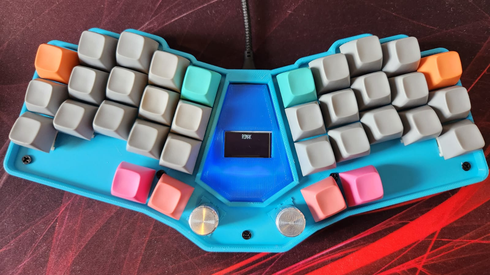

## FauxBerry
### A handwired split keyboard.

### Build Details

FauxBerry is a handwired board built using a [RP2040](https://pt.aliexpress.com/item/1005004096147070.html) in a [FFBK](https://fingerpunch.xyz/product/faux-fox-keyboard) case.

This board has two encoders, and a programmable LED, used for layer and other statuses indication.
Some build pictures can be found [here](../../../../../../img/fauxberry).

Parts:
- 30 Boba U4T + 4 Boba U4 Black.
- MT3 3277 Ergodox Set.
- 36 keys [FFBK](https://fingerpunch.xyz/product/faux-fox-keyboard) case.
- [RP2040](https://pt.aliexpress.com/item/1005004096147070.html).
- [1n4148 diodes](https://pt.aliexpress.com/item/1005003540554760.html).
- [Angled pins](https://pt.aliexpress.com/item/1005004427303224.html).
- [24 AWG Wires](https://pt.aliexpress.com/item/32904950428.html).
- [Dupont cables](https://pt.aliexpress.com/item/1005004155181609.html).
- [M3 screws and spacers](https://pt.aliexpress.com/item/1005002581025420.html).
- [Rotary Encoders](https://pt.aliexpress.com/item/1005003532687682.html).
- [Rotary Encoder caps](https://pt.aliexpress.com/item/1005003527482683.html).
- [Rotary Encoder adapter](https://www.thingiverse.com/thing:3770166).
- [Hotswap sockets](https://pt.aliexpress.com/item/1005003873653184.html).
- [Hotswap socket holders](https://www.thingiverse.com/thing:3117549).

### QMK

#### Compile

`qmk compile -kb handwired/rafaelromao/fauxberry -km rafaelromao`

#### Flash

`qmk flash -kb handwired/rafaelromao/fauxberry -km rafaelromao`

## Resources

- [Home](https://github.com/rafaelromao/keyboards)
- [QMK Docs](https://docs.qmk.fm)
- [Keyboard Tester](https://config.qmk.fm/#/test)
