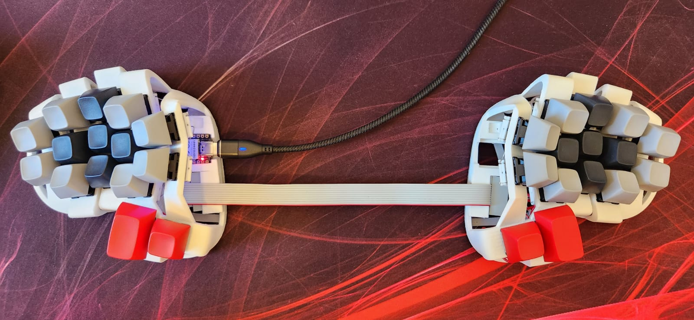

## Rommana
### A 30 keys handwired split keyboard.

### Build Details

Rommana, a handwired board built using a [Seeeduino Xiao RP2040](https://pt.aliexpress.com/item/4000131085893.html).

This board has a programmable LED, used for layer and other statuses indication.
Some build pictures can be found [here](../../../../../../docs/rommana.md).

### Rommana

Parts:
- 30 MX switches (Kailh BOX Jade).
- 28 1u MX keycaps (leftovers from a MT3 3277 Ergodox Set).
- 2 1.5u MX keycaps (leftovers from a MT3 3277 Engodox Set).
- Rommana 15 degree tent [case](https://github.com/AlaaSaadAbdo/Rommana).
- [Seeeduino Xiao RP2040](https://aliexpress.com/item/4000131085893.html).
- [1n4148 diodes](https://aliexpress.com/item/1005003540554760.html).
- [24 AWG Wires](https://aliexpress.com/item/32904950428.html).
- [Dupont cables](https://aliexpress.com/item/1005004155181609.html).
- [3D printed handwired hotswap sockets](https://www.printables.com/model/158559-handwire-hot-swap-socket-for-mechanical-keyboards).
- [Flat cables](https://www.aliexpress.com/item/1005003277577555.html)

### QMK

#### Compile

`qmk compile -kb handwired/rafaelromao/rommana -km rafaelromao`

#### Flash

`qmk flash -kb handwired/rafaelromao/rommana -km rafaelromao`

## Resources

- [Home](https://github.com/rafaelromao/keyboards)
- [QMK Docs](https://docs.qmk.fm)
- [Keyboard Tester](https://config.qmk.fm/#/test)
