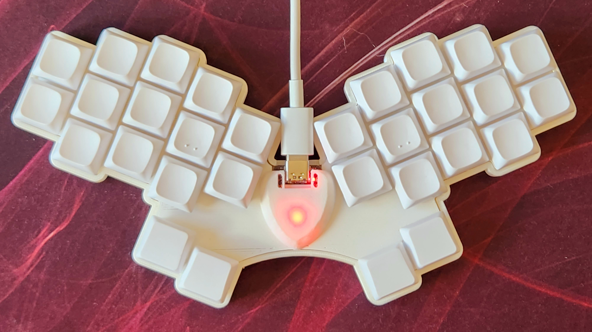

## Rommana and Hummingbird
### 30 keys handwired split keyboards.

### Build Details

Rommana and Hummingbird, two handwired boards built using a [Seeeduino Xiao RP2040](https://pt.aliexpress.com/item/4000131085893.html).

These boards have a programmable LED, used for layer and other statuses indication.
Some build pictures can be found [here](../../../../../../docs/xiao.md).

### Rommana

Parts:
- 28 MX switches (Kailh BOX Jade).
- 24 1u MX keycaps (leftovers from a MT3 3277 Ergodox Set).
- 4 1.5u MX keycaps (leftovers from a MT3 3277 Engodox Set).
- Rommana 15 degree tent [case](https://github.com/AlaaSaadAbdo/Rommana).
- [Seeeduino Xiao RP2040](https://pt.aliexpress.com/item/4000131085893.html).
- [1n4148 diodes](https://pt.aliexpress.com/item/1005003540554760.html).
- [24 AWG Wires](https://pt.aliexpress.com/item/32904950428.html).
- [Dupont cables](https://pt.aliexpress.com/item/1005004155181609.html).
- [3D printed handwired hotswap sockets](https://www.printables.com/model/158559-handwire-hot-swap-socket-for-mechanical-keyboards).

### Hummingbird

Parts:
- 30 choc switches (Lowprokb Sunsets).
- 26 1u choc keycaps (Lowprokb LDSA).
- 2 1u choc thumb keycaps (Lowprokb LDSA).
- 2 1.5u choc thumb keycaps (Lowprokb LDSA).
- Hummingbird [case](https://github.com/PJE66/hummingbird).
- [Seeeduino Xiao RP2040](https://pt.aliexpress.com/item/4000131085893.html).
- [1n4148 diodes](https://pt.aliexpress.com/item/1005003540554760.html).
- [24 AWG Wires](https://pt.aliexpress.com/item/32904950428.html).
- [Dupont cables](https://pt.aliexpress.com/item/1005004155181609.html).

### QMK

#### Compile

`qmk compile -kb handwired/rafaelromao/xiao -km rafaelromao`

#### Flash

`qmk flash -kb handwired/rafaelromao/xiao -km rafaelromao`

## Resources

- [Home](https://github.com/rafaelromao/keyboards)
- [QMK Docs](https://docs.qmk.fm)
- [Keyboard Tester](https://config.qmk.fm/#/test)
