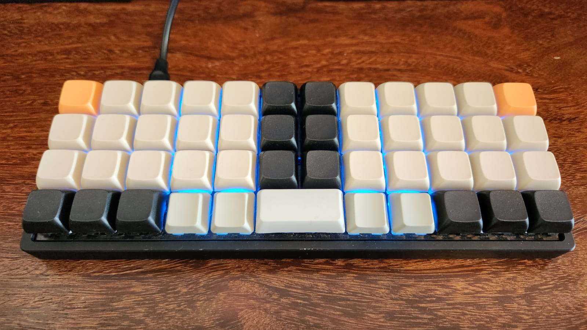

## bm40hsrgb/rafaelromao
### A 32 keys split keyboard layout, optimized for programmers.

The keyboard in the picture below is a BM40, used to design and test this layout.

### QMK

The qmk version recommended for this keyboard is 0.18.1, with dynamic macros disabled.

#### Compile

`qmk compile -kb bm40hsrgb -km rafaelromao`

#### Flash

`qmk flash -kb bm40hsrgb -km rafaelromao`

## Keymap

This keymap extends [my userspace](../../../../../users/rafaelromao/readme.md) definitions.

## Resources

- [Home](https://github.com/rafaelromao/keyboards)
- [QMK Docs](https://docs.qmk.fm)
- [Keyboard Tester](https://config.qmk.fm/#/test)
