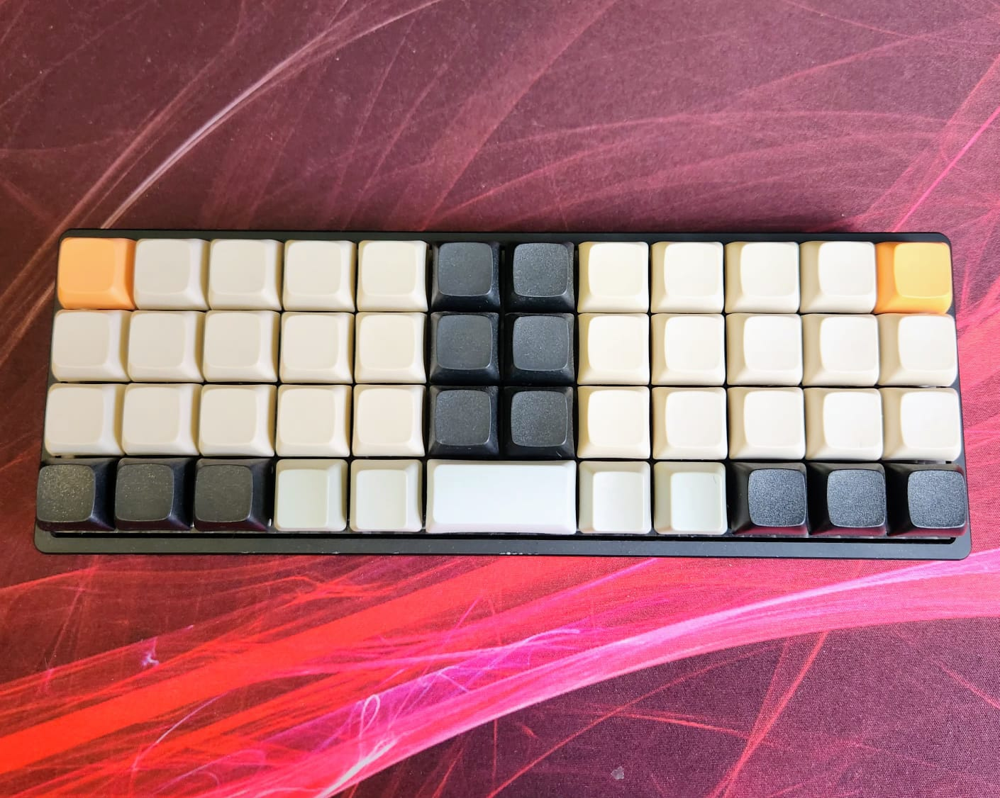

## kprepublic/bm40hsrgb/rev1

### A pseudo split keyboard, in a BM40 body.

The two hands of the 36-position keymap sit on the left and right blocks of the grid, the thumbs on the bottom row, and the middle columns and the 2u key are unused.



### Build

From the repo root, with podman:

```bash
scripts/qmk.sh bm40
```

Or with a local QMK CLI pointed at this repo (`qmk config user.overlay_dir=src/qmk`):

```bash
qmk compile -kb kprepublic/bm40hsrgb/rev1 -km rafaelromao
qmk flash -kb kprepublic/bm40hsrgb/rev1 -km rafaelromao
```

## Keymap

This keymap extends [my userspace](../../../../../users/rafaelromao/readme.md) definitions.

## Resources

- [Home](https://github.com/rafaelromao/keyboards)
- [QMK Docs](https://docs.qmk.fm)
- [Keyboard Tester](https://config.qmk.fm/#/test)
