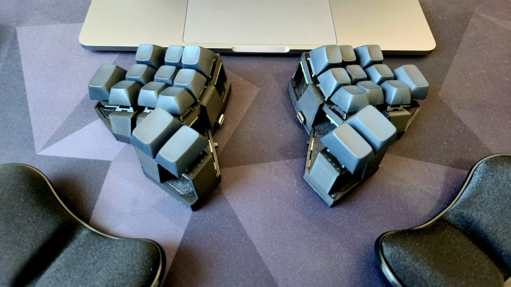

## Diamond
### A 24 keys handwired split keyboard.

### Build Details

Diamond is a handwired board originally designed by me but heavily inspired by the [Rommana](https://github.com/AlaaSaadAbdo/Rommana) and using the switch holders of the [Dactyl Cygnus](https://github.com/juhakaup/keyboards).

### Diamond

Parts:
- 24 MX switches (Boba U4).
- 18 1u MX keycaps (MT3 Blanks).
- 6 1.5u MX keycaps (MT3 Blanks).
- Diamond [case](../../../../../../../stls/diamond).
- [3 Supermini NRF52840](https://www.aliexpress.com/item/1005006035267231.html).
- [3 500mAh 3.7v battery - 752035](https://www.aliexpress.com/item/1005005984848543.html)
- [24 Single Switch PCBs](https://keycapsss.com/keyboard-parts/pcbs/173/mxledbit-single-switch-pcb-mx-choc-hot-swap-socket).
- [Dupont Cables](https://aliexpress.com/item/1005004155181609.html).
- [28 AWG Wires](https://www.aliexpress.com/item/1005006249194665.html).
- [1n4148 diodes + diode legs](https://pt.aliexpress.com/item/1005003540554760.html).

[Here](../../../../../../../docs/diamond.md) you can see some build images.

### ZMK

#### Compile

- Run the script `build_diamond` to build the firmware for the central left side (use it without a dongle) and the dongle only.
- Run the script `build_diamond_all` to build the firmware for both sides and the dongle.

#### Flash

- Connect the central dongle, put it in bootloader mode and copy the file `build/artifacts/diamond_dongle-zmk.uf2` to the drive NICENANO. Wait for the drive to be disconnected.
- Connect the left half, put it in bootloader mode and copy the file `build/artifacts/diamond_left-zmk.uf2` to the drive NICENANO. Wait for the drive to be disconnected.
- Connect the right half, put it in bootloader mode and copy the file `build/artifacts/diamond_right-zmk.uf2` to the drive NICENANO. Wait for the drive to be disconnected.

## Keymap

- The list of supported features in this keymap can be found [here](../../../../../readme.md).

## Resources

- [Home](https://github.com/rafaelromao/keyboards)
- [ZMK Docs](https://zmk.dev/docs)
- [Keyboard Tester](https://config.qmk.fm/#/test)
