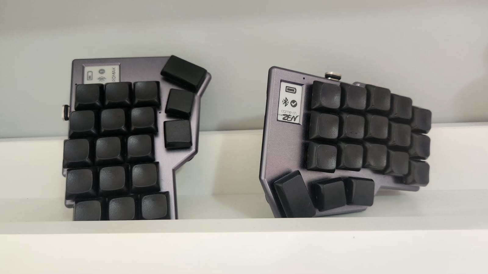

## lowprokb.ca/corneish-zen
### A premium split keyboard, based on the Corne

### Tenting Base

- The tenting base can be built using the items bellow:
  - 2x [3D printed frames](ZenTent.stl).
  - 2x [45x65mm magnetic stickers](https://www.aliexpress.com/item/4000152137062.html).
  - 4x [45x65mm metal plates](https://www.aliexpress.com/item/1005005883276929.html).
    - 2 of them must be superglued to the back of the Zen (a single drop in the center of the metal plate, to make it possible to remove if necessary).
    - 2 of them must be glued to the adhesive side of the magnet, to give it stability (the built in adhesive is enough).
  - 4x [Nillkin laptop stands](https://www.aliexpress.com/item/1005004603358207.html).
  - More details can be found [here](https://imgur.com/gallery/ktgfP37).

### ZMK

#### Compile

- Run the script `build_zen` to build the firmware for the left side only.
- Run the script `build_zen_all` to build the firmware for the left and right sides.

#### Flash

- Connect the left half, put it in bootloader mode and copy the file `build/artifacts/corneish_zen_v2_left-zmk.uf2` to the drive CORNEISHZEN. Wait for the drive to be disconnected.
- Connect the right half, put it in bootloader mode and copy the file `build/artifacts/corneish_zen_v2_right-zmk.uf2` to the drive CORNEISHZEN. Wait for the drive to be disconnected.

## Keymap

- The list of supported features in this keymap can be found [here](../../../readme.md).

## Resources

- [Home](https://github.com/rafaelromao/keyboards)
- [ZMK Docs](https://zmk.dev/docs)
- [Keyboard Tester](https://config.qmk.fm/#/test)
