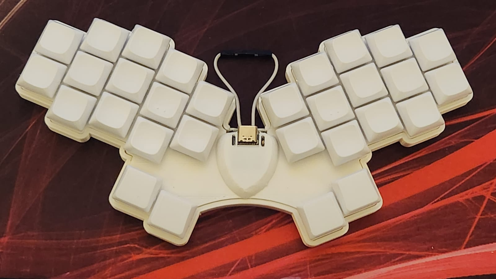

## Aellopos
### A 30 keys handwired unibody split keyboard.

### Build Details

Aellopos is a handwired board built using a [Seeeduino Xiao BLE](https://wiki.seeedstudio.com/XIAO_BLE) and the plate and case of a Hummingbird.

### Aellopos

Parts:
- 30 choc switches (Kailh Silver).
- 26 1u choc keycaps (Lowprokb LDSA).
- 4 1u choc thumb keycaps (Lowprokb LDSA).
- Hummingbird [case](https://github.com/PJE66/hummingbird).
- [Seeeduino Xiao BLE](https://wiki.seeedstudio.com/XIAO_BLE).
- [50mAh 3.7v battery - 360821](https://a.aliexpress.com/_mNW9t6a)
- [Dupont cables](https://aliexpress.com/item/1005004155181609.html).
- [1n4148 diodes](https://pt.aliexpress.com/item/1005003540554760.html).
- [24 AWG Wires](https://pt.aliexpress.com/item/32904950428.html).
- [DIP40 Pin Wide Socket](https://a.aliexpress.com/_msloS7e).

### ZMK

#### Compile

- Run the script `build_aellopos`.

#### Flash

- Connect the keyboard, put it in bootloader mode and copy the file `build/artifacts/aellopos-zmk.uf2` to the drive XIAO-SENSE. Wait for the drive to be disconnected.

## Keymap

- The list of supported features in this keymap can be found [here](../../../../../readme.md).

## Resources

- [Home](https://github.com/rafaelromao/keyboards)
- [ZMK Docs](https://zmk.dev/docs)
- [Keyboard Tester](https://config.qmk.fm/#/test)
