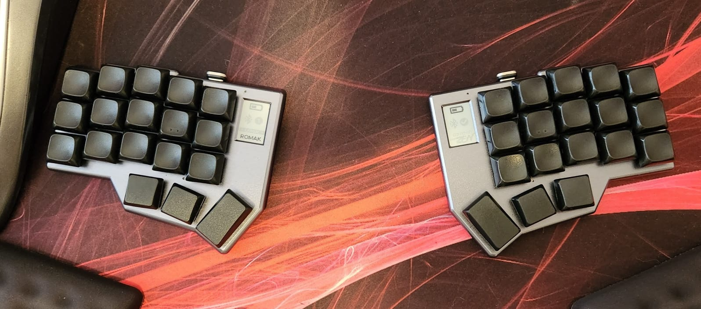

## lowprokb.ca/corneish-zen
### A premium split keyboard, based on the Corne keyboard

### ZMK

#### Compile

- Run the script `build_zen`.

#### Flash

- Connect the left half, put it in bootloader mode and copy the file `build/artifacts/corneish_zen_v2_left-zmk.uf2` to the drive CORNEISHZEN. Wait for the drive to be disconnected.
- Connect the right half, put it in bootloader mode and copy the file `build/artifacts/corneish_zen_v2_right-zmk.uf2` to the drive CORNEISHZEN. Wait for the drive to be disconnected.

## Keymap

- The list of supported features in this keymap can be found [here](../../../../readme.md).

## Resources

- [Home](https://github.com/rafaelromao/keyboards)
- [ZMK Docs](https://zmk.dev/docs)
- [Keyboard Tester](https://config.qmk.fm/#/test)
