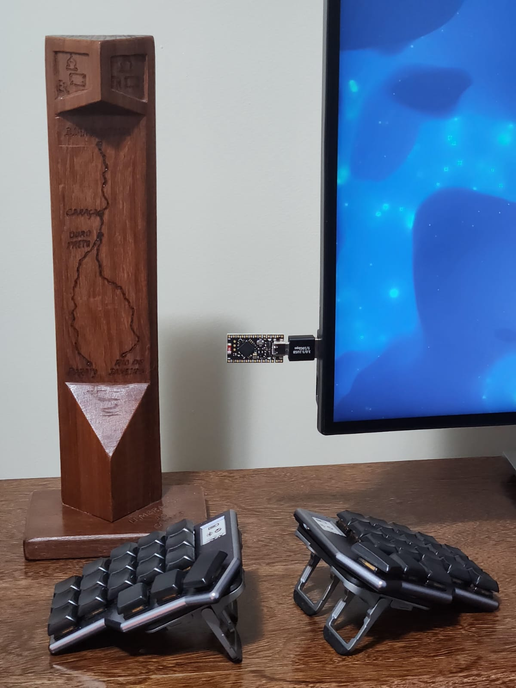

## lowprokb.ca/corneish-zen
### A premium split keyboard, based on the Corne, with a dongle

For more details, see my main [Corne-ish Zen](../corneish-zen/readme.md) build.

### ZMK

#### Compile

- Run the script `build_zen_with_dongle` to build the firmware for the dongle only.
- Run the script `build_zen_with_dongle_all` to build the firmware for both sides and the dongle.

#### Flash

- Connect the central dongle, put it in bootloader mode and copy the file `build/artifacts/corneish_zen_dongle-zmk.uf2` to the drive NICENANO. Wait for the drive to be disconnected.
- Connect the left half, put it in bootloader mode and copy the file `build/artifacts/corneish_zen_v2_peripheral_left-zmk.uf2` to the drive CORNEISHZEN. Wait for the drive to be disconnected.
- Connect the right half, put it in bootloader mode and copy the file `build/artifacts/corneish_zen_v2_peripheral_right-zmk.uf2` to the drive CORNEISHZEN. Wait for the drive to be disconnected.